# Indice

- [Gestión de la iteración](#gestión-de-la-iteración)
  - [Definición del marco de trabajo](#definición-del-marco-de-trabajo)
  - [Planificación de la iteración](#planificación-de-la-iteración)
  - [Seguimiento de la iteración](#seguimiento-de-la-iteración)
  - [Inspección y adaptación del proceso](#inspección-y-adaptación-del-proceso)
- [Identificar y definir el problema a resolver](#identificar-y-definir-el-problema-a-resolver)
  - [Identificación del problema a resolver](#identificación-del-problema-a-resolver)
  - [Definición del problema/solución](#definición-del-problema/solución)

# Gestión de la iteración

## Definición del marco de trabajo

Al comienzo establecimos los roles con la intención de que en las siguientes iteraciones se roten, favoreciendo así la participación y el aprendizaje de todos.

- **Product Owner**: Emiliano Reyes

- **Scrum Master**: Juan Croquis

- **Developer**: Juan Ferreira

### Artefactos principales

En el presente Sprint definimos que los eventos se establecerán de la siguiente forma:

- **Sprint Planning**: 2 días (29/09/2025 y 02/10/2025)
- **Daily Scrum**: 3 días (04/10/2025, 06/10/2025 y 10/10/2025)
- **Sprint Review**: 1 día (11/10/2025)
- **Sprint Retrospective**: 1 día (11/10/2025)

# Definition of Done y Definition of Ready – Carpool Universitario

## Definition of Done (DoD)

Un entregable (historia de usuario, funcionalidad o tarea) se considera **terminado** cuando:

- **Funcionalidad implementada**  
  Ejemplo: el registro de usuario permite crear cuenta como conductor o pasajero.  

- **Funcionalidad testeada**  
  Pruebas unitarias y funcionales confirman que el login, búsqueda de viajes, reserva y publicación funcionan según lo esperado.  

- **Criterios de aceptación cumplidos**  
  Cada historia de usuario cuenta con criterios claros (ejemplo:  
  *“Como pasajero quiero buscar un viaje por horario y zona, para elegir la mejor opción”*),  
  y deben cumplirse en su totalidad.  

---

## Definition of Ready (DoR)

Una historia de usuario o tarea se considera **lista para entrar en un Sprint** cuando:

- **Estimación de esfuerzo confirmada**  
  El equipo acordó una estimación en puntos de historia o tiempo, y está alineada con la capacidad disponible del Sprint.  

- **Recursos disponibles**  
  El equipo cuenta con acceso a las herramientas necesarias 

- **Conocimientos/capacitación suficiente**  
  Los miembros tienen claro cómo implementar la historia

- **Diseño de UI aprobado**  
  Las pantallas necesarias para la historia (ejemplo: formulario de *Publicar viaje*, vista de *Reservar lugar*) están definidas y detalladas.  

- **Criterios de aceptación definidos**  
  Cada historia de usuario tiene escenarios claros que permitan saber cuándo está “hecha”.  

## Planificación de la iteración

### Minuta 1: Planning 1 (29/09/2025)

El lunes 29 de septiembre, tuvimos la primera instancia de reunión para este proyecto. El objetivo de esta reunión fue conocer más el sistema a desarrollar y planificar que íbamos a realizar esta iteración (Sprint). Hicimos la lectura del obligatorio, designamos roles y discutimos la rotación de ellos entre cada iteración, validamos las herramientas a utilizar, definimos el objetivo de la iteración, buscamos consenso sobre cómo aplicar el marco de trabajo SCRUM al contexto del proyecto y que corresponde a cada rol y definimos un **Product Backlog inicial**. La reunión se dio en clases duró 1 hora y concluimos que la siguiente reunión continuaremos con la siguiente parte del planning.

### Minuta 2: Planning 2 (02/10/2025)

El jueves 02 de octubre, continuamos con la segunda parte de la planning, finalizando. El objetivo de esta reunión fue continuar con la investigación, ambientar el backlog generando las épica y sus correspondientes features, categorizamos a cada una de ellas en orden de prioridad donde 1 es más prioritario y 4 menos prioritario. Creamos una encuesta con la cual recaudaremos información, que nos servirá a modo de guía para nuestro producto, asignamos las tareas que iremos trabajando en esta iteración. Se definio la herramienta de Clockify para el conteo de las horas de trabajo.
La reunión duró un total de 3 horas y culminamos que nos juntaremos en la próxima reunión para compartir avances de lo asignado.

### Sprint Backlog

#### Historias de usuario
- **Historia de usuario 1**: Identificación de interesados
  - **Como**: Equipo de desarrollo
  - **Quiero**: Identificar a los distintos interesados en el proyecto.
  - **Para**: Comprender sus necesidades, expectativas y prioridades, y así definir funcionalidades que aporten valor a cada uno.
  - **Criterios de aceptación**:
    - Se identifican todos los interesados del proyecto con su rol y nivel de relevancia documentados.
    - Para cada interesado se define una lista de funcionalidades o requerimientos clave que reflejan sus necesidades.

- **Historia de usuario 2**: Lista de funcionalidades por tipo de usuario
  - **Como**: Scrum Master
  - **Quiero**: Crear una lista de funcionalidades específicas para cada tipo de usuario del sistema (conductor, pasajero y administrador).
  - **Para**: Asegurarme de que el producto cubra las expectativas y necesidades particulares de cada rol.
  - **Criterios de aceptación**:
    - Se define al menos una funcionalidad principal y secundaria para cada tipo de usuario (conductor, pasajero y administrador).
    - Las funcionalidades están alineadas con las necesidades reales y los objetivos de cada tipo de usuario dentro del sistema.
  
- **Historia de usuario 3**: Análisis comparativo de apps similares
  - **Como**: Product Owner
  - **Quiero**: Analizar y comparar aplicaciones similares existentes en el mercado.
  - **Para**: Identificar oportunidades de mejora y diferenciación que aporten valor a nuestro producto.
  - **Criterios de aceptación**:
    - Se identifican y analizan al menos tres aplicaciones similares del mercado, documentando sus funcionalidades, fortalezas y debilidades.
    - Se elabora un cuadro comparativo que evidencie coincidencias, diferencias y oportunidades de mejora frente a las apps existentes.

- **Historia de usuario 4**: Identificación del “viaje típico” como escenario base
  - **Como:** Equipo de Desarrollo  
  - **Quiero:** Identificar y documentar el “viaje típico” que realizan los usuarios dentro de la aplicación.  
  - **Para:** Contar con un escenario base que sirva como referencia para el diseño de funcionalidades y la validación de futuras iteraciones.  
  - **Criterios de aceptación:**
    - Se debe describir un flujo completo de viaje, desde la búsqueda hasta la finalización del trayecto.  
    - El escenario debe contemplar al menos un perfil de **conductor** y uno de **pasajero**.  
    - El “viaje típico” debe quedar registrado como documento de referencia en el repositorio del proyecto.  

- **Historia de usuario 5**: Definición de políticas iniciales
  - **Como**: Product Owner  
  - **Quiero**: Definir las políticas iniciales de uso, privacidad y comportamiento dentro de la plataforma.  
  - **Para**: Garantizar un marco de funcionamiento claro y seguro para todos los usuarios.  
  - **Criterios de aceptación**:
      - Las políticas deben incluir al menos los aspectos de **cancelaciones** y **uso responsable de la aplicación**.
      - Deben estar redactadas en lenguaje claro y publicadas en el apartado de información de la app.  
      - El equipo debe validar las políticas con los roles de usuario (conductor, pasajero, administrador).

- **Historia de usuario 6**: Creación del Product Backlog inicial
  - **Como**: Equipo de desarrollo
  - **Quiero**: Definir un Product Backlog inicial que incluya las épicas principales y sus respectivas historias de usuario.
  - **Para**: Contar con una base organizada y priorizada de trabajo que sirva como punto de partida para las próximas iteraciones.
  - **Criterios de aceptación**:
    - El Product Backlog debe contener al menos las épicas principales con sus historias de usuario asociadas.
    - Cada historia de usuario debe estar redactada en el formato “Como…”, “Quiero…”, “Para…”.

- **Historia de usuario 7**: Definición de criterios de aceptación
  - **Como:** Equipo de Desarrollo  
  - **Quiero:** Conocer los criterios de aceptación para cada historia de usuario.  
  - **Para:** Asegurarme de que los requerimientos sean claros y verificables.  

  - **Criterios de aceptación:**
    - Cada historia de usuario debe contar con criterios de aceptación redactados en un lenguaje claro, verificable y comprensible para todos los integrantes del equipo.  
    - Todas las historias de usuario deben incluir como mínimo **un criterio de aceptación**; si este no logra explicar completamente el requerimiento, deberán incluirse **al menos dos criterios de aceptación bien definidos**.  

- **Historia de usuario 8**: Creación del Story Map

  - **Como:** Equipo de Desarrollo  
  - **Quiero:** Crear un Story Map de alto nivel.  
  - **Para:** Visualizar de manera clara el flujo de usuario y priorizar las funcionalidades de cada iteración.  

  - **Criterios de aceptación:**
    - Cada épica debe tener asociadas al menos dos o más historias de usuario.  
    - El Story Map debe mostrar claramente las actividades y tareas principales de los usuarios.  
    - El Story Map debe incluir las épicas principales identificadas en el Product Backlog inicial.

### Tareas asociadas

En esta iteración no se definieron tareas específicas para cada historia de usuario, ya que se consideran suficientemente claras y autoexplicativas por sí mismas.

## Seguimiento de la iteración

### Minuta 3: Daily 1 (04/10/2025)

El Sábado 04 de octubre, realizamos la primer daily con el objetivo coordinar el trabajo del equipo y revisar el avance de la iteración, presentamos avance de la investigación. Se construyeron y redactaron las historias de usuario de los casos de esta iteración, se analizaron los resultados de la encuesta para proporcionar más información para el producto que vamos a construir, avances en el listado de información para cada tipo de usuario (Stakeholders). Se mostró cómo íbamos a dividir los casos (Story Map) para todas las iteraciones. También definimos los story points al cual equivaldrían las tareas.

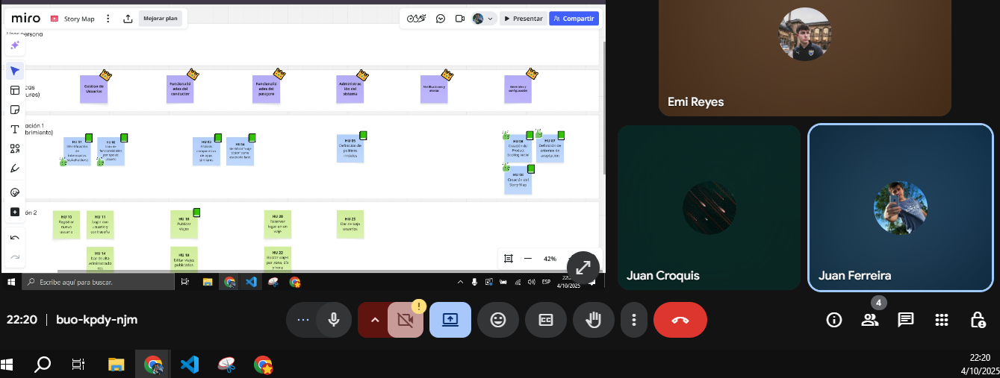

### Minuta 4: Daily 2 (06/10/2025)

El Lunes 06 de octubre, realizamos la segunda daily con el objetivo coordinar el trabajo del equipo y revisar el avance de la iteración, presentamos avance de la investigación. Mostramos avances como la construcción final del Story Map, se mostró un avance del análisis comparando otras apps similares, se definió la estimación de los casos restantes y se documentó sobre ello, también se registraron las épicas y sus correspondientes Historias de Usuarios en el documento.
Nos queda pendiente para la proxima y ultima daily; la de definir cómo sería un viaje típico, definir las políticas iniciales y terminar la parte de Definición del problema/solución.

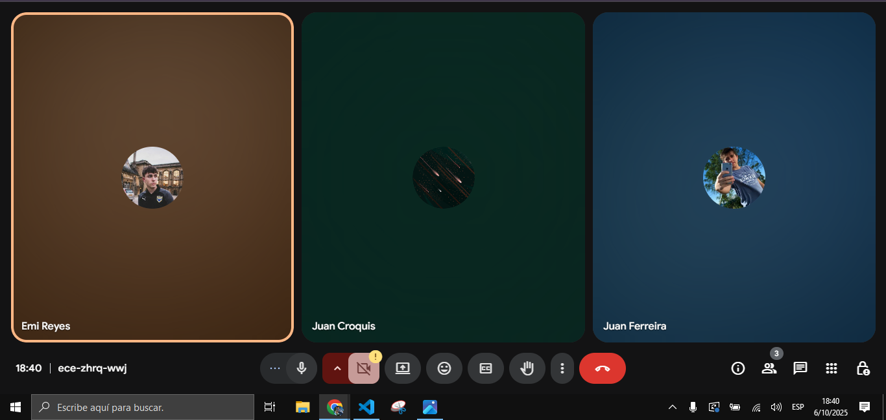

### Minuta 5: Daily 3 (10/10/2025)

El Viernes 10 de octubre, realizamos la última daily con el objetivo coordinar el trabajo del equipo y revisar los ultimos detalles antes de finalizar la iteración 1. Se definio la Epica 6 con detalles que serán realizados en la iteración 4, se hicieron las politicas iniciales las cuales iban estar representadas en el funcionamiento del prototipo y reglas generales. Queda también registrado en el backlog las historias de usuario de las cards correspondientes a esta sprint.
Nos queda pendiente la definición de viaje típico y una conclusión final de análisis de competidores.

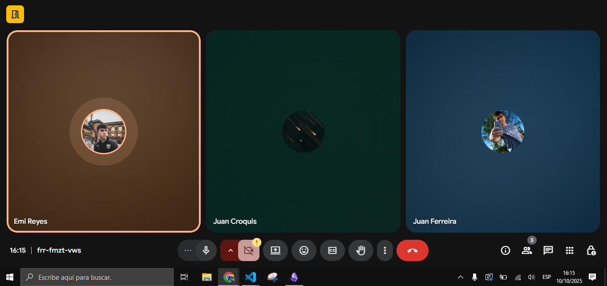

## Inspección y adaptación del proceso

### Minuta 6: Review (11/10/2025)

### Minuta 7: Retrospective (11/10/2025)

_[Existe evidencia sobre la inspección del proceso con aprendizajes principales y acciones de mejora implementadas durante el desarrollo del proyecto.]_

### Artefactos principales

- Minuta de la retrospectiva con la dinámica utilizada y sus principales resultados.
- Planificación y seguimiento de las acciones de mejora.

# Identificar y definir el problema a resolver

## Investigación y definición del público objetivo

Para poder satisfacer las necesidades de los usuarios y generar un producto que realmente aporte valor, consideramos fundamental investigar el contexto del transporte universitario, analizar a los posibles competidores y comprender el perfil de nuestros futuros usuarios.  
Con este propósito realizamos una encuesta dirigida a estudiantes de distintas universidades (Universidad ORT, UDELAR, Universidad de Montevideo, entre otras), con el fin de identificar sus hábitos de transporte, disposición a compartir viajes y las principales motivaciones para utilizar una aplicación de carpooling.

### Identificación de posibles usuarios

A partir de los resultados obtenidos, determinamos que nuestro público objetivo se compone principalmente de:

- Personas entre **18 y 33 años**.  
- Estudiantes universitarios que **asisten de forma presencial** varias veces por semana.  
- Usuarios que **utilizan principalmente ómnibus o auto** para desplazarse hacia la facultad.  
- Estudiantes que **ya han compartido viajes ocasionalmente** y estarían dispuestos a hacerlo con mayor frecuencia si existiera una plataforma confiable.  
- Individuos interesados en **ahorrar dinero, reducir tiempos de viaje y conocer nuevas personas**.  
- Conductores que buscan **compartir gastos de combustible y estacionamiento**.  
- Pasajeros que valoran la **comodidad, la seguridad y la previsibilidad del trayecto**.  

Este perfil de usuario nos permitió validar la necesidad de una **aplicación de carpooling universitario** que conecte conductores y pasajeros dentro de una misma institución, promoviendo la colaboración, la eficiencia y la sostenibilidad en los traslados diarios.

> **Nota:** En la carpeta de "Encuestas Resultados" se adjuntan unas imagenes de las respuestas de la encuesta que realizamos.

###  Stakeholders

Entendemos por *stakeholders* a todos aquellos individuos o grupos que se vean de alguna manera afectados por el progreso y desarrollo de nuestra aplicación de viajes compartidos.  
Dada la naturaleza de nuestro proyecto, consideramos los siguientes grupos de interés:

####  Conductores
Los conductores constituyen uno de los grupos de stakeholders más relevantes para nuestra plataforma. Son los usuarios que ofrecen viajes y comparten sus rutas con otros pasajeros. Su experiencia y nivel de confianza en el sistema son fundamentales para garantizar la continuidad del servicio. Es clave comprender sus necesidades en cuanto a seguridad, flexibilidad de horarios y transparencia en los pagos, para así ofrecer una experiencia confiable y competitiva.

####  Pasajeros
Los pasajeros son el núcleo de nuestra comunidad de usuarios. Utilizan la aplicación para encontrar viajes convenientes, seguros y accesibles, compartiendo trayectos con otros usuarios. Satisfacer sus necesidades de puntualidad, confianza y comodidad es esencial para asegurar su participación continua y fomentar la recomendación del servicio.

####  Administradores y Equipo de Soporte
El equipo administrativo y de soporte técnico es responsable de mantener la plataforma en funcionamiento, gestionar incidencias y garantizar el cumplimiento de las políticas de seguridad y convivencia. Este grupo también supervisa los reportes de usuarios, evalúa comportamientos y gestiona las alertas del sistema para mantener un entorno seguro y ordenado.

### Lista de funcionalidades por cada interesado.
Se crearon las funcionalidades en formato “Como… Quiero… Para…”, considerando los tres perfiles principales del sistema: conductor, pasajero y administrador:

- **Como conductor**  
  1. Quiero poder publicar viajes indicando origen, destino, día, hora, costo compartido y cupos disponibles.  
     Para ofrecer lugares en mi vehículo a otros estudiantes y optimizar mis gastos de traslado.
  2. Quiero poder editar o cancelar mis viajes publicados.  
     Para mantener la información actualizada y evitar confusiones con los pasajeros.
  3. Quiero recibir notificaciones cuando un pasajero reserve o cancele su lugar.  
     Para estar informado en tiempo real sobre la ocupación del viaje.
  4. Quiero poder calificar a los pasajeros luego de cada viaje.  
     Para contribuir al sistema de reputación y promover un ambiente de confianza.
  5. Quiero poder marcarme como “demorado” o “en camino”.  
     Para que mis pasajeros reciban información actualizada sobre el estado del viaje.
  6. Quiero tener un historial de mis viajes realizados.  
     Para consultar mi actividad pasada y estadísticas de uso (por ejemplo, kilómetros recorridos o pasajeros transportados).

- **Como pasajero**  
  1. Quiero poder buscar viajes disponibles por zona, día y horario.  
     Para encontrar opciones que se ajusten a mis horarios y ubicación.
  2. Quiero reservar un lugar en un viaje publicado.  
     Para asegurar mi asiento y confirmar mi participación.
  3. Quiero recibir notificaciones sobre el estado del viaje (recordatorios, demoras o cancelaciones).  
     Para mantenerme informado y poder reaccionar ante cambios.
  4. Quiero poder cancelar mi reserva con antelación.  
     Para liberar el lugar y evitar penalizaciones.
  5. Quiero poder calificar al conductor después de un viaje.  
     Para aportar al sistema de reputación y mejorar la experiencia de futuros usuarios.
  6. Quiero ver mi historial de viajes y calificaciones previas.  
     Para tener un registro de mis viajes realizados y conductores con los que viajé.

- **Como administrador**
  1. Quiero poder gestionar usuarios del sistema (altas, bajas y suspensiones).  
     Para mantener la plataforma segura y evitar comportamientos inapropiados.
  2. Quiero arbitrar discrepancias o conflictos entre usuarios en las evaluaciones.  
     Para resolver disputas y mantener un entorno justo y confiable.
  3. Quiero recibir reportes de la comunidad (por ejemplo, sobre comportamiento inapropiado o problemas en los viajes).  
     Para tomar acciones correctivas y preservar la calidad del servicio.
  4. Quiero poder revisar las estadísticas generales de uso (cantidad de viajes, reservas, calificaciones promedio).  
     Para analizar el funcionamiento del sistema y detectar oportunidades de mejora.
  5. Quiero establecer políticas o reglas del sistema (por ejemplo, penalizaciones por inasistencia o demoras).  
     Para asegurar un comportamiento responsable entre todos los usuarios.

### Análisis comparativo de apps similares

Para analizar los posibles competidores tomamos a los demás proyectos que brindan un servicio de transporte personalizado y a través de una aplicación móvil. Con este primer criterio, el principal candidato en nuestro país podría ser Uber, tanto por popularidad en el mercado local como por su presencia a nivel internacional. 
Luego quisimos filtrar aún más la búsqueda añadiendo como segundo criterio que el proyecto también se base en la modalidad de carpooling. Sin duda que en nuestro contexto un proyecto que está generando una gran repercusión es Viatik.
Sin embargo, quisimos encontrar un proyecto que se asemeje lo más posible al nuestro para poder realizar una comparación lo más precisa posible. Justamente, al buscar con tal especificidad, dimos con una aplicación que dice ser un servicio de carpooling pensado especialmente para estudiantes universitarios. Esta aplicación se llama The Ridely App. La misma es parte de un proyecto personal de un estudiante universitario egresado de University of South Florida.

El análisis de los distintos sistemas es el siguiente:

**Uber:**
Es una aplicación gratuita cuyo principal objetivo es facilitar el alcance de un medio de transporte no masivo agilizando la conexión entre el conductor y el/los pasajero/s. Como mencionamos anteriormente, la aplicación posee un gran flujo de usuarios, ya que es de las opciones más populares del segmento. Este flujo de usuarios no solo abarca a pasajeros, sino a conductores.
Tras analizar la aplicación más detenidamente podemos señalar como principales funcionalidades la integración con PayPal como método de pago, la función de compartir viaje en vivo, ver autos de conductores cercanos en vivo en el mapa y un sistema de calificación tanto para el conductor como para el pasajero.

**Viatik:**
Al igual que Uber, Viatik es una aplicación gratuita. En este caso, el sistema funciona como un intermediario entre los conductores los cuales tienen espacio disponible y los pasajeros que buscan lugar en un transporte que los lleve al destino deseado. Si bien este proyecto es bastante reciente en comparación a Uber, ya cuenta con una considerable base de usuarios la cual está en continuo crecimiento.
En el caso de Viatik, comparte algunas de las funcionalidades principales de Uber, como contar con una pasarela de pago propia y un sistema de puntuación para conductores y pasajeros. Además, Viatik cuenta con un chat entre usuarios y una interfaz para poder recargar una tarjeta STM.

**The Ridely App:**
Este proyecto también fue lanzado como una aplicación gratuita. A diferencia de Uber y Viatik, The Ridely App es un proyecto personal poco desarrollado, por lo cual la versión publicada evidencia una calidad inferior en cuanto a su diseño y funcionalidad. Aun así, este proyecto tiene las funcionalidades básicas de una aplicación de carpooling universitario, por lo que es el proyecto que mas se asemeja al nuestro.
Como prinicpales funcionalidades, incorpora un sistema de puntuacion tanto para conductores como para pasajeros, muestra informacion del conductor con el cual el pasajero conecta y permite a cualquier usuario funcionar tanto como conductor o como pasajero.

|Aplicación|Fortalezas|Debilidades|
|-|-|-|
|**Uber**|Integracion con metodos de pago seguros y conocidos, seguimiento de viaje para terceros, gran disponibilidad de conductores.|Precios un poco elevados.|
|**Viatik**|Precios a decidir por los conductores (accesibles), chat entre usuarios independiente del viaje, no hay limites de distancia ni de jurisdicciones al viajar|No hay regulaciones para los conductores|
|**The Ridely App**|Especialmente pensado para estudiantes.|No integra pasarela de pago, proyecto pequeño.|

En conclusión observamos que, si bien hay plataformas que son alternativas a nuestro servicio, tampoco hay un caso en el que se haya intentado llevar a cabo la misma idea. Además, el hecho tener un ejemplo de lo que fue un intento de proyecto como lo es The Ridely App, hace que partamos con una gran base desde donde podemos obtener tanto ejemplos de funcionamiento como de diseño. También creemos que este último caso nos es útil para analizar el por qué existiendo ya un producto que parece ocupar el mismo sector que el nuestro no ha funcionado o al menos no se ha promovido su uso. Más allá de las diferencias de contexto, creemos que es una buena referencia para poder crear un proyecto que compita con las alternativas actuales.

## Definición del problema/solución

### Definición de Políticas iniciales

1. Políticas de seguridad y autenticación
- Todo usuario debe registrarse con un correo electrónico válido y único.
- Se exige una contraseña segura (mínimo 8 caracteres, con mayúsculas, minúsculas y números).
- Se mantiene la sesión activa solo por un tiempo limitado de inactividad.
- Los datos sensibles (contraseñas, correos) se almacenan de forma cifrada.

2. Políticas de roles y permisos
- Existen tres roles principales: Conductor, Pasajero y Administrador.
- Cada usuario puede tener más de un rol, pero solo uno activo por sesión.
- Los administradores tienen permisos exclusivos para suspender usuarios, arbitrar disputas y gestionar reportes.
- Los conductores pueden publicar, editar o cancelar viajes.
- Los pasajeros pueden buscar, reservar o cancelar viajes.

3. Políticas de comunicación y notificaciones
- Las notificaciones se envían cuando:
    - Un conductor cancela un viaje reservado.
    - Un conductor marca “demorado”.
    - Un viaje está próximo a comenzar (15 minutos antes).
- Las notificaciones pueden ser push o internas en la app.
- No se envían notificaciones publicitarias ni mensajes no solicitados.

4. Políticas de reputación y evaluaciones
- Luego de cada viaje, conductores y pasajeros deben evaluarse mutuamente.
- El sistema calcula una reputación promedio basada en las últimas calificaciones.
- Los usuarios con calificaciones reiteradamente bajas pueden ser reportados o suspendidos.
- Las evaluaciones deben mantener un tono respetuoso y constructivo.

5. Políticas de reportes y sanciones
- Cualquier usuario puede reportar comportamientos inapropiados (falta de puntualidad, cancelaciones reiteradas, lenguaje ofensivo, etc.).
- Los reportes son revisados por un administrador, quien puede emitir advertencias o suspender temporalmente al usuario.
- Los usuarios sancionados recibirán una notificación con el motivo de la acción tomada.

6. Políticas de privacidad y uso responsable
- Los datos personales solo se utilizan con fines funcionales de la aplicación.
- No se comparten con terceros ajenos al sistema.
- Se promueve un ambiente de respeto y colaboración entre los usuarios.
- No se toleran conductas discriminatorias ni mensajes inapropiados.

### Viaje Típico

- Pasajero:
  - El primer paso sería logearse en la aplicación. Una vez dentro, el usuario se encuentra en la pantalla principal. Para poder buscar el viaje que necesita, el usuario debe especificar en los filtros que aparecen en pantalla el punto de partida y el destino al cual desea llegar. Una vez establecidos los parámetros mencionados, oprime buscar. Ahora aparece un listado de todos los viajes que inician o pasan por el punto de partida y que terminan o pasan por el destino seleccionado. Una vez seleccionado el viaje acorde a los horarios del usuario, aparecen los datos especifcos del viaje, donde aparece información básica del conductor. En esta vista, el usuario selecciona la cantidad de asientos que prevee ocupar (pudiendo seleccionar como máximo la cantidad de asientos disponibles) y seguido de esto seleccionar el boton de "Reservar lugares". Al hacer esto, se le devuelve a la pagina principal y ahora en la sección de viajes pendientes aparece el viaje a espera de la aprobación del conductor. Una vez se le aprueba su solicitud de participar en el viaje, le llega una notificación. Accediendo a esta, se otorga la opción de pagar. Hasta que el usuario no abone el viaje, este no le aparecerá en la seccion de viajes activos. El usuario tiene un plazo máximo de tiempo (definido por el conductor) para completar el pago. Una vez paga, el viaje pasa a la sección de viajes activos. El usuario tiene la posibilidad de contactarse con el conductor a traves de un chat. Una vez el conductor esta en el lugar, el pasajero recibe una notificación. Una vez completado el viaje, al acceder a la aplicación se dirigirá al usuario a una pantalla de puntuacion para otorgar una valoración al conductor. Una vez presionado el botón "Enviar", se envía tanto la puntuación como el feedback brindado por el usuario (en caso de haber escrito una reseña). Luego de esto la aplicación queda lista para iniciar el proceso de viaje nuevamente.

- Conductor
  - Al igual que el pasajero, el primer paso es logearse en la aplicación. Una vez logueado, el conductor selecciona la opción de ver sus viajes y luego crear viaje (botones visibles solo para usuarios registrados como conductores). Luego se le ridirige a una ventana donde debe rellenar datos relevantes del viaje, como destino, origen, lugares disponibles, precio, plazo de pago, etc. Cuando termina, selecciona la opción pulicar viaje y se le redirecciona a la pantalla principal. Para ver o editar datos de su viaje, el conducctor debe dirigirse a la vista de sus viajes, mencionada anteriormente. Cada vez que recibe una solicitud de un pasajero, le llega una notificacion, la cual al seleccionar lo dirige a una pantalla con información basica del pasajero y la cantidad de asientos que necesita el mismo. Una vez aceptado o rechazado se vuleve a la vista principal. En caso de aceptar la solicitud, el usuario aparece listado en los detalles del viaje. Al igual que el pasajero, el conductor tiene la posibilidad de contactarse con cada pasajero que forme parte de su viaje a traves de un chat. Una vez iniciado el viaje se notifica a los pasajeros correspondientes y al llegar a cada punto de encuentro se notifica ahora la precencia del conductor en el mismo al usuario que corresponda. Una vez finalizado el viaje, al acceder a la aplicación, se dirigira al conductor a una pantalla de puntuación para otorgar una valoración a cada pasajero (mientras el mismo no sea acompañante de uno que haya reservado mas de un asiento). Una vez presionado el botón "Enviar", se envía tanto la puntuación como el feedback brindado por el conductor (en caso de haber escrito una reseña). Luego de esto la aplicación queda lista para iniciar el proceso de viaje nuevamente.

### Story map

### Iteración 1
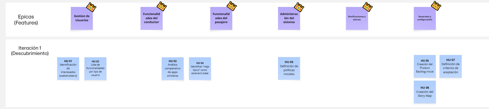

### Iteración 2 y 3
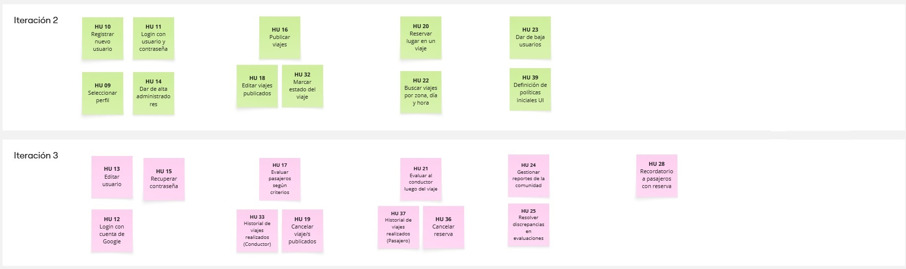

### Iteración 4
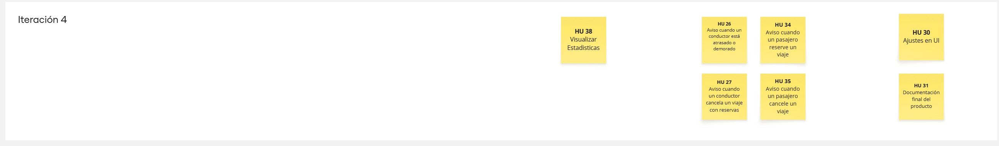

### Estimación y priorización

Para la estimación del esfuerzo, se definió una escala en la cual **1 Story Point equivale aproximadamente a media hora de trabajo**.  
Como referencia base, se tomó la **tarea con ID 22**, a la cual se le asignó un valor de **7 Story Points (≈3 horas)**, considerando su complejidad y duración estimada.  
El resto de las tareas fueron evaluadas en función de esta referencia, ajustando los puntos de historia según el nivel de esfuerzo relativo requerido.

La **priorización** se realizó considerando el **valor que cada funcionalidad aporta al usuario final**, así como las **dependencias y relaciones de precedencia** entre las distintas tareas, buscando optimizar la secuencia de desarrollo y maximizar el impacto en cada iteración.

### Tareas de la Iteración 1 y las estimaciones asignadas
En base al criterio anterior estos fueron los **Story Points** asignados a cada una de las Historias de Usuarios de este sprint:

- **Historia de usuario 1**: Identificación de interesados (stakeholders)
  - 1 SP
- **Historia de usuario 2**: Lista de funcionalidades por tipo de usuario
  - 1 SP
- **Historia de usuario 3**: Análisis comparativo de apps similares
  - 4 SP
- **Historia de usuario 4**: Identificar “viaje típico” como escenario base
  - 2 SP
- **Historia de usuario 5**: Definición de políticas iniciales
  - 2 SP
- **Historia de usuario 6**: Creación del Product Backlog inicial
  - 6 SP
- **Historia de usuario 7**: Definición de criterios de aceptación
  - 2 SP
- **Historia de usuario 8**: Creación del Story Map
  - 2 SP

### Estimacion de esfuerzo en las siguientes HU

**Id:** Corresponde al identificador asignado automáticamente por **Azure Boards** para cada historia de usuario.  
La siguiente imagen muestra los **IDs asociados** a cada historia dentro del Product Backlog:

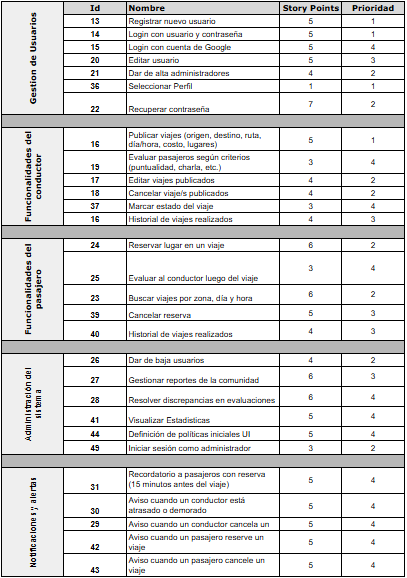

### 🗂️ Product Backlog

A continuación se presenta el **Product Backlog** del proyecto, estructurado en **épicas** e **historias de usuario**, de acuerdo con los principios de la **gestión ágil**.  
Este backlog fue desarrollado y priorizado en función del valor que cada funcionalidad aporta al usuario final y se gestiona utilizando la herramienta **Azure Boards**, lo que permite mantener trazabilidad, transparencia y control sobre el avance de cada iteración.

#### 🟦 ÉPICA 1: Gestión de usuarios
Todo lo relacionado con el registro, inicio de sesión y administración de cuentas dentro de la aplicación.

| ID  | Historia de Usuario |
|-----|----------------------|
| HU10 | Como nuevo usuario, quiero registrarme con mi correo, nombre de usuario y contraseña para crear mi cuenta en la aplicación. |
| HU11 | Como usuario, quiero iniciar sesión con mi nombre de usuario y contraseña para acceder a mi perfil y mis viajes. |
| HU12 | Como usuario, quiero poder iniciar sesión con mi cuenta de Google para acceder de forma rápida y segura. |
| HU13 | Como usuario, quiero editar mi perfil para actualizar mis datos personales y preferencias. |
| HU14 | Como administrador, quiero poder dar de alta a otros administradores para gestionar la comunidad. |
| HU15 | Como usuario, quiero recuperar mi contraseña si la olvido para poder volver a ingresar a la aplicación. |
| HU09 | Como usuario, quiero seleccionar mi tipo de perfil (conductor o pasajero) para definir cómo usaré la aplicación. |

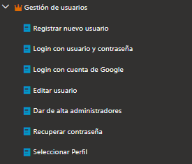
---

#### 🟩 ÉPICA 2: Funcionalidades del conductor
Incluye todas las acciones relacionadas con los usuarios que ofrecen viajes dentro de la plataforma.

| ID  | Historia de Usuario |
|-----|----------------------|
| HU16 | Como conductor, quiero publicar mis viajes (origen, destino, ruta, día, horario, costo y lugares disponibles) para que otros estudiantes puedan unirse. |
| HU18 | Como conductor, quiero editar los viajes publicados para modificar la información si hay cambios. |
| HU19 | Como conductor, quiero cancelar un viaje publicado en caso de imprevistos o cambios de horario. |
| HU17 | Como conductor, quiero evaluar a mis pasajeros según criterios como puntualidad y actitud para mantener la calidad de la comunidad. |
| HU32 | Como conductor, quiero marcar el estado de mi viaje (pendiente, en curso o finalizado) para informar a los pasajeros. |
| HU33 | Como conductor, quiero acceder a un historial de viajes realizados para consultar mis trayectos anteriores. |

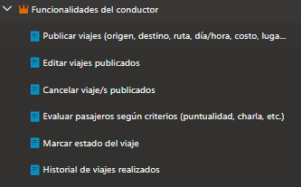
---

#### 🟧 ÉPICA 3: Funcionalidades del pasajero
Agrupa las funcionalidades destinadas a los usuarios que buscan y reservan viajes.

| ID  | Historia de Usuario |
|-----|----------------------|
| HU22 | Como pasajero, quiero buscar viajes disponibles según zona, día y hora para encontrar la opción más conveniente. |
| HU20 | Como pasajero, quiero reservar un lugar en un viaje publicado para asegurar mi traslado. |
| HU21 | Como pasajero, quiero evaluar al conductor luego del viaje para contribuir a la reputación de la comunidad. |
| HU36 | Como pasajero, quiero cancelar mi reserva en caso de que ya no pueda realizar el viaje. |
| HU37 | Como pasajero, quiero acceder a un historial de viajes realizados para consultar mis trayectos anteriores. |

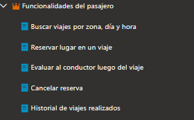
---

#### 🟥 ÉPICA 4: Administración del sistema
Incluye las funcionalidades que permiten a los administradores mantener el orden, la seguridad y la calidad de la plataforma.

| ID  | Historia de Usuario |
|-----|----------------------|
| HU23 | Como administrador, quiero dar de baja a usuarios que incumplan las políticas de la comunidad. |
| HU24 | Como administrador, quiero gestionar los reportes realizados por los usuarios para resolver conflictos. |
| HU25 | Como administrador, quiero resolver discrepancias en las evaluaciones para garantizar la transparencia. |
| HU38 | Como administrador, quiero visualizar estadísticas generales de uso para analizar el desempeño de la plataforma. |
| HU39 | Como administrador, quiero definir las políticas iniciales de uso y comportamiento para establecer las reglas de la comunidad. |
| HU29 | Como administrador, quiero poder iniciar sesión con mis credenciales para acceder a las herramientas de gestión del sistema. |

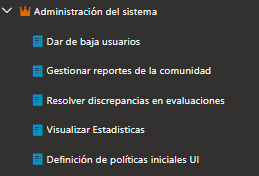
---

#### 🟨 ÉPICA 5: Notificaciones y alertas
Reúne todas las notificaciones que mejoran la comunicación entre usuarios y el seguimiento de los viajes.

| ID  | Historia de Usuario |
|-----|----------------------|
| HU27 | Como pasajero, quiero recibir una alerta cuando un conductor cancele un viaje reservado para poder buscar otra opción. |
| HU26 | Como pasajero, quiero recibir una notificación cuando el conductor esté demorado para poder reorganizarme. |
| HU28 | Como pasajero, quiero recibir un recordatorio cuando falten 15 minutos para mi viaje reservado para no llegar tarde. |
| HU34 | Como conductor, quiero recibir una notificación cuando un pasajero reserve un viaje para confirmar su lugar. |
| HU35 | Como conductor, quiero recibir una notificación cuando un pasajero cancele su reserva para mantener actualizada la disponibilidad del viaje. |

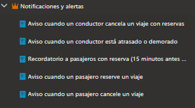
---

#### 🟪 ÉPICA 6: Generales y configuración
Incluye tareas y funcionalidades relacionadas con los ajustes visuales y la documentación necesaria para la finalización del proyecto (Serán realizadas en la iteración final).

| ID  | Historia de Usuario |
|-----|----------------------|
| HU30 | Como equipo de desarrollo, quiero realizar ajustes en la interfaz de usuario (UI) para mejorar la experiencia y coherencia visual de la aplicación. |
| HU31 | Como equipo, queremos elaborar la documentación final del producto para dejar registro del funcionamiento, decisiones de diseño y entregables del proyecto. |

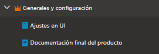
 

> **Nota:** La asignación de historias de usuario a cada sprint se definirá durante las sesiones de **Sprint Planning**.  
> Actualmente, todas las historias se encuentran **priorizadas en el Product Backlog** y **organizadas por épicas** dentro de **Azure Boards**, lo que permite una gestión clara y trazable del progreso del proyecto.

## ⌛ Registro de Horas del equipo