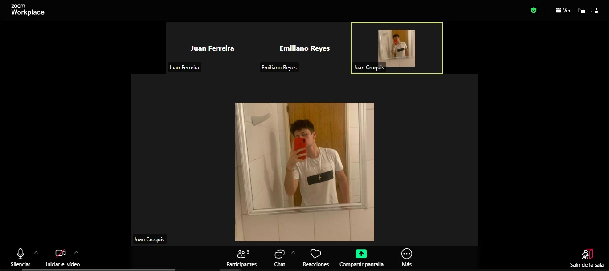
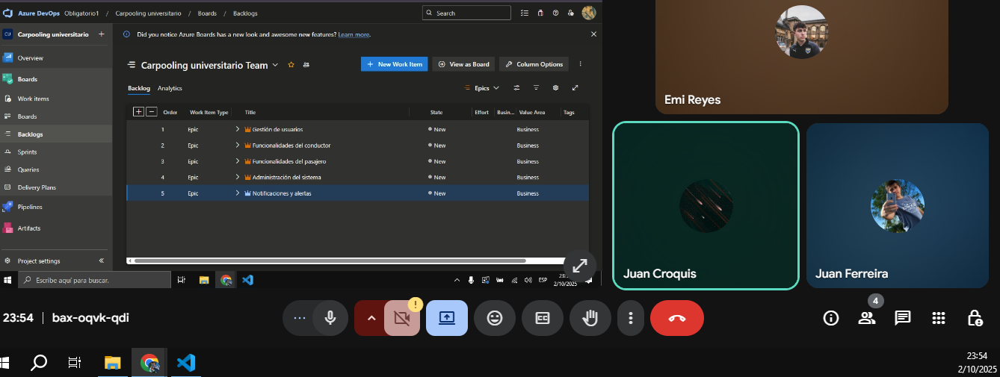
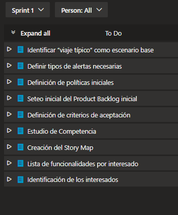

# Indice

- [Gestión de la iteración](#gestión-de-la-iteración)
  - [Definición del marco de trabajo](#definición-del-marco-de-trabajo)
  - [Planificación de la iteración](#planificación-de-la-iteración)
  - [Seguimiento de la iteración](#seguimiento-de-la-iteración)
  - [Inspección y adaptación del proceso](#inspección-y-adaptación-del-proceso)
- [Identificar y definir el problema a resolver](#identificar-y-definir-el-problema-a-resolver)
  - [Identificación del problema a resolver](#identificación-del-problema-a-resolver)
  - [Definición del problema/solución](#definición-del-problema/solución)

# Gestión de la iteración

## Definición del marco de trabajo

Al comienzo establecimos los roles con la intención de que en las siguientes iteraciones se roten, favoreciendo así la participación y el aprendizaje de todos.

- **Product Owner**: Emiliano Reyes

- **Scrum Master**: Juan Croquis

- **Developer**: Juan Ferreira

### Artefactos principales

En el presente Sprint definimos que los eventos se establecerán de la siguiente forma:

- **Sprint Planning**: 2 días (29/09/2025 y 02/10/2025)
- **Daily Scrum**: 3 días (04/10/2025, 06/10/2025 y 08/10/2025)
- **Sprint Retrospective**: 1 día (10/10/2025)

# Definition of Done y Definition of Ready – Carpool Universitario

## Definition of Done (DoD)

Un entregable (historia de usuario, funcionalidad o tarea) se considera **terminado** cuando:

- **Funcionalidad implementada**  
  Ejemplo: el registro de usuario permite crear cuenta como conductor o pasajero.  

- **Funcionalidad testeada**  
  Pruebas unitarias y funcionales confirman que el login, búsqueda de viajes, reserva y publicación funcionan según lo esperado.  

- **Criterios de aceptación cumplidos**  
  Cada historia de usuario cuenta con criterios claros (ejemplo:  
  *“Como pasajero quiero buscar un viaje por horario y zona, para elegir la mejor opción”*),  
  y deben cumplirse en su totalidad.  

---

## Definition of Ready (DoR)

Una historia de usuario o tarea se considera **lista para entrar en un Sprint** cuando:

- **Estimación de esfuerzo confirmada**  
  El equipo acordó una estimación en puntos de historia o tiempo, y está alineada con la capacidad disponible del Sprint.  

- **Recursos disponibles**  
  El equipo cuenta con acceso a las herramientas necesarias 

- **Conocimientos/capacitación suficiente**  
  Los miembros tienen claro cómo implementar la historia

- **Diseño de UI aprobado**  
  Las pantallas necesarias para la historia (ejemplo: formulario de *Publicar viaje*, vista de *Reservar lugar*) están definidas y detalladas.  

- **Criterios de aceptación definidos**  
  Cada historia de usuario tiene escenarios claros que permitan saber cuándo está “hecha”.  

## Planificación de la iteración

### Minuta 1: Planning 1 (29/09/2025)

El lunes 29 de septiembre, tuvimos la primera instancia de reunión para este proyecto. El objetivo de esta reunión fue conocer más el sistema a desarrollar y planificar que íbamos a realizar esta iteración (Sprint). Hicimos la lectura del obligatorio, designamos roles y discutimos la rotación de ellos entre cada iteración, validamos las herramientas a utilizar, definimos el objetivo de la iteración, buscamos consenso sobre cómo aplicar el marco de trabajo SCRUM al contexto del proyecto y que corresponde a cada rol y definimos un **Product Backlog inicial**. La reunión se dio en clases duró 1 hora y concluimos que la siguiente reunión continuaremos con la siguiente parte del planning.

### Minuta 2: Planning 2 (02/10/2025)

El jueves 02 de octubre, continuamos con la segunda parte de la planning, finalizando. El objetivo de esta reunión fue continuar con la investigación, ambientar el backlog generando las épica y sus correspondientes features, categorizamos a cada una de ellas en orden de prioridad donde 1 es más prioritario y 4 menos prioritario. Creamos una encuesta con la cual recaudaremos información, que nos servirá a modo de guía para nuestro producto, asignamos las tareas que iremos trabajando en esta iteración.
La reunión duró un total de 3 horas y culminamos que nos juntaremos en la próxima reunión para compartir avances de lo asignado.

### Sprint Backlog

#### Historias de usuario
- **Historia de usuario 1**: Identificación de interesados
  - **Como**: Equipo de desarrollo
  - **Quiero**: Identificar a los distintos interesados en el proyecto.
  - **Para**: Comprender sus necesidades, expectativas y prioridades, y así definir funcionalidades que aporten valor a cada uno.
  - **Criterios de aceptación**:
    - Se identifican todos los interesados del proyecto con su rol y nivel de relevancia documentados.
    - Para cada interesado se define una lista de funcionalidades o requerimientos clave que reflejan sus necesidades.

- **Historia de usuario 2**: Lista de funcionalidades por tipo de usuario
  - **Como**: Scrum Master
  - **Quiero**: Crear una lista de funcionalidades específicas para cada tipo de usuario del sistema (conductor, pasajero y administrador).
  - **Para**: Asegurarme de que el producto cubra las expectativas y necesidades particulares de cada rol.
  - **Criterios de aceptación**:
    - Se define al menos una funcionalidad principal y secundaria para cada tipo de usuario (conductor, pasajero y administrador).
    - Las funcionalidades están alineadas con las necesidades reales y los objetivos de cada tipo de usuario dentro del sistema.
  
  - **Historia de usuario 3**: Análisis comparativo de apps similares
  - **Como**: Product Owner
  - **Quiero**: Analizar y comparar aplicaciones similares existentes en el mercado.
  - **Para**: Identificar oportunidades de mejora y diferenciación que aporten valor a nuestro producto.
  - **Criterios de aceptación**:
    - Se identifican y analizan al menos tres aplicaciones similares del mercado, documentando sus funcionalidades, fortalezas y debilidades.
    - Se elabora un cuadro comparativo que evidencie coincidencias, diferencias y oportunidades de mejora frente a las apps existentes.

- **Historia de usuario 7**: Creación del Product Backlog inicial
  - **Como**: Equipo de desarrollo
  - **Quiero**: Definir un Product Backlog inicial que incluya las épicas principales y sus respectivas historias de usuario.
  - **Para**: Contar con una base organizada y priorizada de trabajo que sirva como punto de partida para las próximas iteraciones.
  - **Criterios de aceptación**:
    - El Product Backlog debe contener al menos las épicas principales con sus historias de usuario asociadas.
    - Cada historia de usuario debe estar redactada en el formato “Como…”, “Quiero…”, “Para…”.

- **Historia de usuario 8**: Definición de criterios de aceptación

    **Como:** Equipo de Desarrollo  
    **Quiero:** Conocer los criterios de aceptación para cada historia de usuario.  
    **Para:** Asegurarme de que los requerimientos sean claros y verificables.  

    **Criterios de aceptación:**
    - Cada historia de usuario debe contar con criterios de aceptación redactados en un lenguaje claro, verificable y comprensible para todos los integrantes del equipo.  
    - Todas las historias de usuario deben incluir como mínimo **un criterio de aceptación**; si este no logra explicar completamente el requerimiento, deberán incluirse **al menos dos criterios de aceptación bien definidos**.  

- **Historia de usuario 9**: Creación del Story Map

  **Como:** Equipo de Desarrollo  
  **Quiero:** Crear un Story Map de alto nivel.  
  **Para:** Visualizar de manera clara el flujo de usuario y priorizar las funcionalidades de cada iteración.  

  **Criterios de aceptación:**
  - Cada épica debe tener asociadas al menos dos o más historias de usuario.  
  - El Story Map debe mostrar claramente las actividades y tareas principales de los usuarios.  
  - El Story Map debe incluir las épicas principales identificadas en el Product Backlog inicial.

### Tareas asociadas

En esta iteración no se definieron tareas específicas para cada historia de usuario, ya que se consideran suficientemente claras y autoexplicativas por sí mismas.

## Seguimiento de la iteración

_[Existe evidencia sobre el registro de actividades y horas de cada integrante del equipo con el seguimiento general de cada iteración del proyecto sobre lo planificado inicialmente.]_

### Artefactos principales

- Minuta de daily scrum describiendo la coordinación del trabajo de cada integrante del equipo.
  - ¿Que logramos hacer?
  - ¿Qué planificamos hacer?
  - ¿Qué impedimentos tenemos?
- Registro y reporte de horas de cada integrante del equipo con sus actividades principales.
- Seguimiento visual de la iteración con burndown y/o burnup charts.

## Inspección y adaptación del proceso

_[Existe evidencia sobre la inspección del proceso con aprendizajes principales y acciones de mejora implementadas durante el desarrollo del proyecto.]_

### Artefactos principales

- Minuta de la retrospectiva con la dinámica utilizada y sus principales resultados.
- Planificación y seguimiento de las acciones de mejora.

# Identificar y definir el problema a resolver

## Identificación del problema a resolver

_[Entendimiento claro del problema del negocio a resolver con la identificación de los usuarios y escenarios principales con su valor de negocio asociado. Existe a su vez evidencia que se analiza y compara aplicaciones similares existentes del mercado.]_

### Artefactos principales

- Identificación de interesados con sus perfiles asociados.
- Lista de funcionalidades por cada interesado.
- Análisis y estudio de competidores.

## Definición del problema/solución

_[Existe un Product Backlog definido con su jerarquía de épicas e historias de usuario con sus criterios de aceptación asociados. Existe una priorización de los prototipos principales que se buscarán idear, construir y validar como parte del ciclo de descubrimiento.]_

### Artefactos principales

- Product backlog con épicas e historias de usuario para prototipar.
- Historias de usuario cumpliendo el Definition of Ready con sus criterios de aceptación.
- Propuesta de valor diferenciadora de la competencia.
- Story map del roadmap inicial del proyecto.
