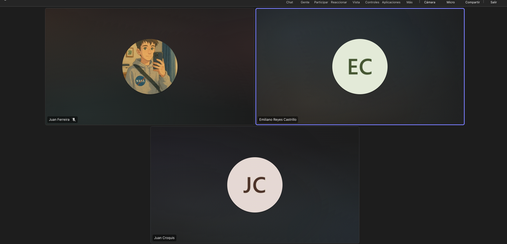
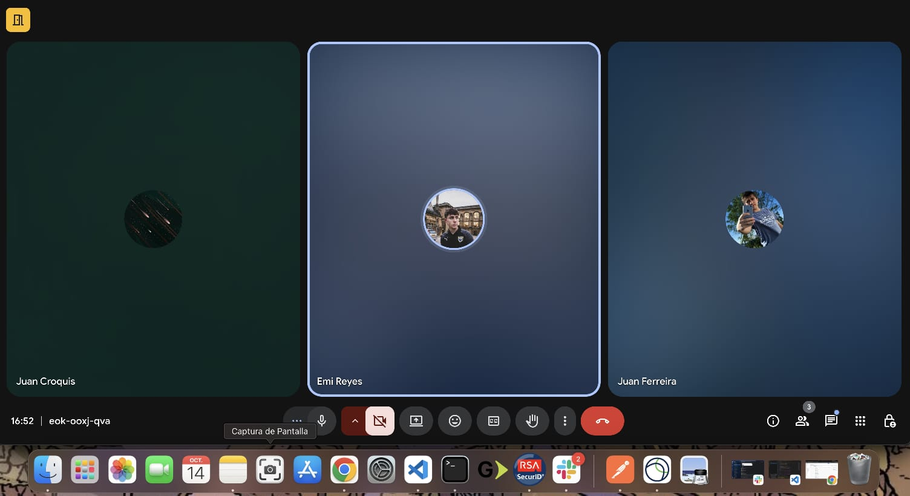
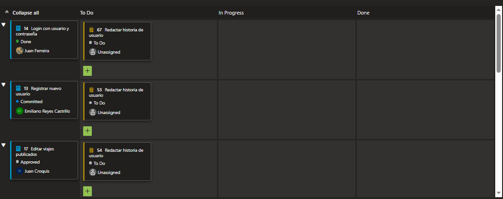
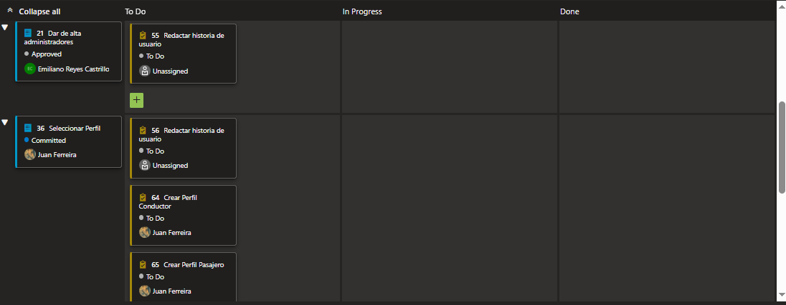
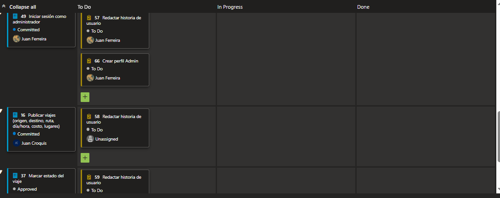
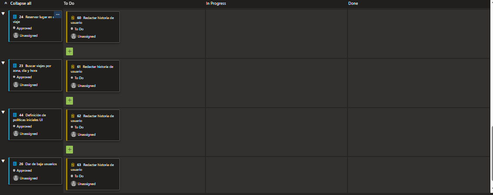
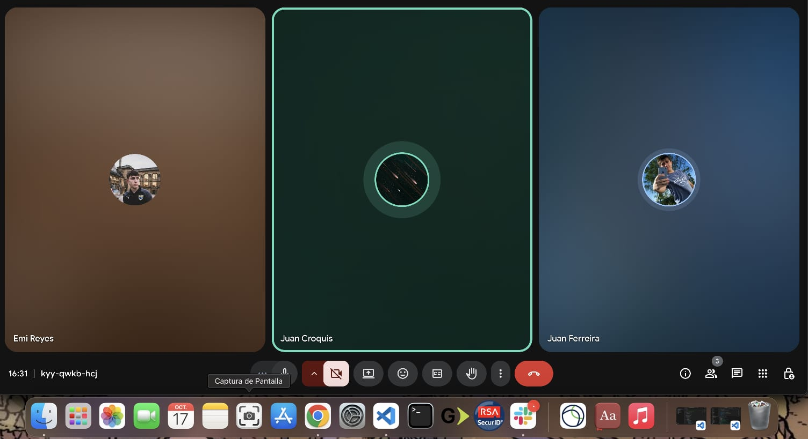
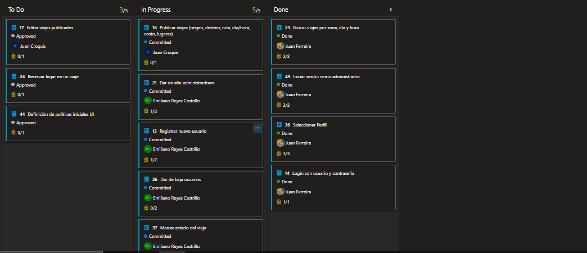

# Indice

- [Gestión de la iteración](#gestión-de-la-iteración)
  - [Definición del marco de trabajo](#definición-del-marco-de-trabajo)
  - [Planificación de la iteración](#planificación-de-la-iteración)
  - [Seguimiento de la iteración](#seguimiento-de-la-iteración)
  - [Inspección y adaptación del proceso](#inspección-y-adaptación-del-proceso)
- [Construir y validar posibles soluciones del MVP a través de prototipos](#construir-y-validar-posibles-soluciones-del-mvp-a-través-de-prototipos)
  - [Prototipos con posibles soluciones](#prototipos-con-posibles-soluciones)
  - [Inspección y adaptación del producto](#inspección-y-adaptación-del-producto)

# Gestión de la iteración

## Definición del marco de trabajo

Siguiendo como habiamos establecido los roles con la intención de que en las siguientes iteraciones se roten, favoreciendo así la participación y el aprendizaje de todos.

- **Product Owner**: Juan Ferreira

- **Scrum Master**: Emiliano Reyes

- **Developer**:  Juan Croquis

### Artefactos principales

En el presente Sprint definimos que los eventos se establecerán de la siguiente forma:

- **Sprint Planning**: 2 días (13/10/2025 y 14/10/2025)
- **Daily Scrum**: 3 días (17/10/2025, 22/10/2025 y 24/10/2025)
- **Sprint Review**: 1 día (25/10/2025)
- **Sprint Retrospective**: 1 día (25/10/2025)

# Definition of Done y Definition of Ready – Carpool Universitario

## Definition of Done (DoD)

Un entregable (historia de usuario, funcionalidad o tarea) se considera **terminado** cuando:

- **Funcionalidad implementada**  
  Ejemplo: el registro de usuario permite crear cuenta como conductor o pasajero.  

- **Funcionalidad testeada**  
  Pruebas unitarias y funcionales confirman que el login, búsqueda de viajes, reserva y publicación funcionan según lo esperado.  

- **Criterios de aceptación cumplidos**  
  Cada historia de usuario cuenta con criterios claros (ejemplo:  
  *“Como pasajero quiero buscar un viaje por horario y zona, para elegir la mejor opción”*),  
  y deben cumplirse en su totalidad.  

---

## Definition of Ready (DoR)

Una historia de usuario o tarea se considera **lista para entrar en un Sprint** cuando:

- **Estimación de esfuerzo confirmada**  
  El equipo acordó una estimación en puntos de historia o tiempo, y está alineada con la capacidad disponible del Sprint.  

- **Recursos disponibles**  
  El equipo cuenta con acceso a las herramientas necesarias 

- **Conocimientos/capacitación suficiente**  
  Los miembros tienen claro cómo implementar la historia

- **Diseño de UI aprobado**  
  Las pantallas necesarias para la historia (ejemplo: formulario de *Publicar viaje*, vista de *Reservar lugar*) están definidas y detalladas.  

- **Criterios de aceptación definidos**  
  Cada historia de usuario tiene escenarios claros que permitan saber cuándo está “hecha”. 

## Planificación de la iteración

### Minuta 1: Planning 1 (13/10/2025)

Lunes 13 de Octubre, realizamos la primera reunion para preparar el ambiente para la iteración 2. El objetivo de esta reunión fue avanzar y planificar que íbamos a realizar esta iteración (Sprint). Designamos roles, validamos las herramientas a utilizar, definimos el objetivo de la iteración, buscamos consenso sobre cómo aplicar el marco de trabajo SCRUM al contexto del proyecto y que corresponde a cada rol y dejamos preparado el **Product Backlog**. La reunión se dio en clases duró 30 minutos y concluimos que la siguiente reunión continuaremos con la siguiente parte del planning.

### Minuta 2: Planning 2 (14/10/2025)

Martes 14 de Octubre, continuamos con la segunda parte de la planning, finalizando. El objetivo de esta reunión fue continuar con el scope para esta iteración, ambientar el backlog asignandonos las tareas para esta sprint, creamos el proyecto en **Framer** (la herramienta la cual haríamos el prototipo). Creamos algunas tasks para hacer en cada Historia de usuario. También definimos fechas para las siguientes reuniones.
La reunión duró un total de 1 hora y media y culminamos que nos juntaremos en la próxima reunión para compartir avances de lo asignado.

---

### Sprint Backlog

---

#### Historias de usuario

- **Historia de usuario 09**: Seleccionar Perfil
  - **Como**: Como usuario registrado (conductor o pasajero)
  - **Quiero**: Poder seleccionar con qué perfil deseo ingresar (conductor o pasajero).
  - **Para**: Acceder solo a las funciones correspondientes a mi rol en cada sesión (publicar viajes o reservarlos).
  - **Criterios de aceptación**:
    - Al iniciar sesión, el sistema debe mostrar una pantalla o modal que permita elegir entre los perfiles "Conductor" y "Pasajero"
    - El cambio de perfil debe actualizar las funcionalidades disponibles (ejemplo: "Publicar viaje" solo visible para conductores).

- **Historia de usuario 11**: Login con usuario y contraseña
  - **Como**: Como usuario registrado (conductor o pasajero)
  - **Quiero**: Iniciar sesión con mi usuario y contraseña para acceder a mis viajes y reservas.
  - **Para**: Poder acceder a mis viajes publicados, reservas o busqueda de viajes y perfil personal.
  - **Criterios de aceptación**:
    - Al iniciar sesión correctamente, se redirige al usuario a su pantalla principal donde seleccionará su perfil (conductor o pasajero).
    - Debe haber una opción visible de Crear cuenta si no se ha registrado aún.
    - Debe haber una opción de iniciar sesión con Google.
    - Debe haber una opción visible para “Recordar contraseña” o “Recuperar contraseña”.

- **Historia de usuario 22**: Buscar viajes por zona, día y hora
  - **Como**: Pasajero
  - **Quiero**: Poder buscar viajes disponibles filtrando por zona de origen o destino, día y hora deseada.
  - **Para**: Encontrar opciones de viaje que se ajusten mejor a mi ubicación y disponibilidad horaria.
  - **Criterios de aceptación**:
      - El pasajero puede ingresar o seleccionar la zona de origen y/o destino.
      - El pasajero puede elegir el día y la hora en la que desea viajar.
      - El sistema muestra una lista de viajes disponibles que cumplan con los filtros seleccionados.

- **Historia de usuario 29**: Iniciar sesión como administrador
  - **Como**: Administrador del sistema
  - **Quiero**: Poder iniciar sesión en la aplicación utilizando mis credenciales de administrador.
  - **Para**: Acceder al panel de control y gestionar usuarios, estadisticas de viajes, notificaciones y configuraciones generales del sistema.
  - **Criterios de aceptación**:
    - Si las credenciales son válidas, se debe redirigir al panel de administración.
    - El acceso al panel de administración debe estar restringido a perfiles no administradores.

> **Nota:** Se añadieron las tasks de redacción de historias de usuarios correspondientes a las cards que vamos a trabajar durante esta Iteración 2, además de la creación de pantallas intermedias necesarias para conectar las pantallas creadas.

---

#### 🧮 Estimación del esfuerzo

Para estimar el esfuerzo de las historias seleccionadas aplicamos la técnica **Planning Poker** basada en **Story Points**.

Tomamos en cuenta los siguientes factores:
- **Complejidad técnica**
- **Volumen de trabajo**
- **Nivel de incertidumbre**

Utilizamos el **estimador integrado en Azure DevOps** para asignar valores dentro de la **escala de Fibonacci** a cada historia elegida para el sprint.  
En los casos donde hubo diferencias de criterio, el equipo **debatió las estimaciones** y se realizó **una nueva votación** hasta llegar a un consenso.

A continuación se redactan las estimaciónes puestas por el equipo correspondientes a estas Historias de Usuarios (Como definimos antes 1 SP corresponde a 30 minutos).

- **Historia de usuario 9**: Seleccionar perfil
  - 1 SP
- **Historia de usuario 10**: Registrar nuevo usuario
  - 5 SP
- **Historia de usuario 11**: Login con usuario y contraseña
  - 5 SP
- **Historia de usuario 14**: Dar de alta administradores
  - 4 SP
- **Historia de usuario 16**: Publicar viajes
  - 5 SP
- **Historia de usuario 18**: Editar viajes publicados
  - 4 SP
- **Historia de usuario 20**: Reservar lugar en un viaje
  - 6 SP
- **Historia de usuario 22**: Buscar viajes por zona, día y hora
  - 6 SP
- **Historia de usuario 23**: Dar de baja usuarios
  - 4 SP
- **Historia de usuario 29**: Iniciar sesión como administrador
  - 3 SP
- **Historia de usuario 32**: Marcar estado del viaje
  - 3 SP
- **Historia de usuario 39**: Definición de políticas iniciales UI
  - 5 SP

### 👥 Asignación de tareas

Durante la **planificación** asumimos distintos roles según la necesidad, pero en la etapa de **desarrollo** trabajaremos los tres de forma colaborativa.  
Repartimos las tareas de manera **equitativa**, asegurando que cada integrante comience con una **tarea de prioridad 1**.

Luego del proceso de **priorización**, **estimación** y **asignación**, las **historias de usuario seleccionadas para el sprint** fueron las siguientes:

### Artefactos principales

- Minuta de la sprint planning con su agenda, actividades y resultados.
- Objetivos de la iteración.
- Sprint backlog con historias de usuarios y tareas asociadas.
- Planificación de acuerdo a la capacidad del equipo.
- Técnicas de priorización y estimación utilizadas.
- Uso de métricas relevantes para la planificación como la velocidad y productividad.

## Seguimiento de la iteración

_[Existe evidencia sobre el registro de actividades y horas de cada integrante del equipo con el seguimiento general de cada iteración del proyecto sobre lo planificado inicialmente.]_

### Minuta 3: Daily 1 (17/10/2025)

El Viernes 17 de octubre, realizamos la primera daily de esta iteración 2, con el objetivo coordinar el trabajo del equipo y revisar el avance, presentamos avances en cuanto a la creación de pantallas en la web de **Framer**, de las cuales llegamos a completar 6 de las 12 propuestas para esta sprint, 4 de las 12 historias de usuarios. Continuamos con el objetivo de crear las pantallas faltantes además de las Historias de Usuario pendientes.
Actualmente el equipo pasa por el período de pruebas de parciales, examenes y entregas. Lo cual afecta un poco la velocidad de esta iteración.

### Minuta 4: Daily 2 (22/10/2025)

### Minuta 5: Daily 3 (24/10/2025)

### Artefactos principales

- Minuta de daily scrum describiendo la coordinación del trabajo de cada integrante del equipo.
  - ¿Que logramos hacer?
  - ¿Qué planificamos hacer?
  - ¿Qué impedimentos tenemos?
- Registro y reporte de horas de cada integrante del equipo con sus actividades principales.
- Seguimiento visual de la iteración con burndown y/o burnup charts.

## Inspección y adaptación del proceso

_[Existe evidencia sobre la inspección del proceso con aprendizajes principales y acciones de mejora implementadas durante el desarrollo del proyecto.]_

### Artefactos principales

- Minuta de la retrospectiva con la dinámica utilizada y sus principales resultados.
- Planificación y seguimiento de las acciones de mejora.

# Construir y validar posibles soluciones del MVP a través de prototipos

## Prototipos con posibles soluciones

_[Existen diferentes propuestas de solución para entregar valor y resolver el problema identificado implementado a través de prototipos. Los prototipos deberán ser exportados en algún formato de imagen (como png o jpg) a efectos de poder ser visualizados fácilmente dentro del propio repo de github.]_

### Artefactos principales

- Prototipos interactivos para ser navegados.
- Prototipos asociados como bocetos a las historias de usuario.

## Inspección y adaptación del producto

_[Existe evidencia de instancias de inspección y validación del producto con usuarios y la recolección de su feedback con ajustes finales a los prototipos.]_

### Artefactos principales

- Minutas de sprint review.
- Evidencia de los usability testing con usuarios finales.
  - Descripción de las tareas propuestas a los usuarios finales.
  - Cobertura obtenida de validación de los usuarios de la aplicación.
- Feedback recibido de los usuarios finales con la priorización de las propuestas de cambio.
