# Indice

- [Gestión de la iteración](#gestión-de-la-iteración)
  - [Definición del marco de trabajo](#definición-del-marco-de-trabajo)
  - [Planificación de la iteración](#planificación-de-la-iteración)
  - [Seguimiento de la iteración](#seguimiento-de-la-iteración)
  - [Inspección y adaptación del proceso](#inspección-y-adaptación-del-proceso)
- [Construir y validar posibles soluciones del MVP a través de prototipos](#construir-y-validar-posibles-soluciones-del-mvp-a-través-de-prototipos)
  - [Prototipos con posibles soluciones](#prototipos-con-posibles-soluciones)
  - [Inspección y adaptación del producto](#inspección-y-adaptación-del-producto)

# Gestión de la iteración

## Definición del marco de trabajo

Siguiendo como habíamos establecido los roles con la intención de que en las siguientes iteraciones se roten, favoreciendo así la participación y el aprendizaje de todos.

- **Product Owner**: Juan Ferreira

- **Scrum Master**: Emiliano Reyes

- **Developer**:  Juan Croquis

### Artefactos principales

En el presente Sprint definimos que los eventos se establecerán de la siguiente forma:

- **Sprint Planning**: 2 días (13/10/2025 y 14/10/2025)
- **Daily Scrum**: 3 días (17/10/2025, 22/10/2025 y 24/10/2025)
- **Sprint Review**: 1 día (25/10/2025)
- **Sprint Retrospective**: 1 día (25/10/2025)

# Definition of Done y Definition of Ready – Carpool Universitario

## Definition of Done (DoD)

Un entregable (historia de usuario, funcionalidad o tarea) se considera **terminado** cuando:

- **Funcionalidad implementada**  
  Ejemplo: el registro de usuario permite crear cuenta como conductor o pasajero.  

- **Funcionalidad testeada**  
  Pruebas unitarias y funcionales confirman que el login, búsqueda de viajes, reserva y publicación funcionan según lo esperado.  

- **Criterios de aceptación cumplidos**  
  Cada historia de usuario cuenta con criterios claros (ejemplo:  
  *“Como pasajero quiero buscar un viaje por horario y zona, para elegir la mejor opción”*),  
  y deben cumplirse en su totalidad.  

---

## Definition of Ready (DoR)

Una historia de usuario o tarea se considera **lista para entrar en un Sprint** cuando:

- **Estimación de esfuerzo confirmada**  
  El equipo acordó una estimación en puntos de historia o tiempo, y está alineada con la capacidad disponible del Sprint.  

- **Recursos disponibles**  
  El equipo cuenta con acceso a las herramientas necesarias.

- **Conocimientos/capacitación suficiente**  
  Los miembros tienen claro cómo implementar la historia.

- **Diseño de UI aprobado**  
  Las pantallas necesarias para la historia (ejemplo: formulario de *Publicar viaje*, vista de *Reservar lugar*) están definidas y detalladas.  

- **Criterios de aceptación definidos**  
  Cada historia de usuario tiene escenarios claros que permitan saber cuándo está “hecha”. 

## Planificación de la iteración

### Minuta 1: Planning 1 (13/10/2025)

Lunes 13 de Octubre, realizamos la primera reunión para preparar el ambiente para la iteración 2. El objetivo de esta reunión fue avanzar y planificar qué íbamos a realizar en esta iteración (Sprint). Designamos roles, validamos las herramientas a utilizar, definimos el objetivo de la iteración, buscamos consenso sobre cómo aplicar el marco de trabajo SCRUM al contexto del proyecto y qué corresponde a cada rol y dejamos preparado el **Product Backlog**. La reunión se dio en clases, duró 30 minutos y concluimos que en la siguiente reunión continuaremos con la siguiente parte del planning.

### Minuta 2: Planning 2 (14/10/2025)

Martes 14 de Octubre, continuamos con la segunda parte de la planning, finalizando. El objetivo de esta reunión fue continuar con el scope para esta iteración, ambientar el backlog asignándonos las tareas para esta sprint, creamos el proyecto en **Framer** (la herramienta la cual haríamos el prototipo). Creamos algunas tasks para hacer en cada Historia de usuario. También definimos fechas para las siguientes reuniones.
La reunión duró un total de 1 hora y media y culminamos que nos juntaremos en la próxima reunión para compartir avances de lo asignado.

---

### Sprint Backlog

---

#### 👥 Asignación de tareas

Durante la **planificación** asumimos distintos roles según la necesidad, pero en la etapa de **desarrollo** trabajaremos los tres de forma colaborativa.  
Repartimos las tareas de manera **equitativa**, asegurando que cada integrante comience con una **tarea de prioridad 1**.

#### 📚 Historias de usuario

- **Historia de usuario 09**: Seleccionar Perfil
  - **Como**: Como usuario registrado (conductor o pasajero)
  - **Quiero**: Poder seleccionar con qué perfil deseo ingresar (conductor o pasajero).
  - **Para**: Acceder solo a las funciones correspondientes a mi rol en cada sesión (publicar viajes o reservarlos).
  - **Criterios de aceptación**:
    - Al iniciar sesión, el sistema debe mostrar una pantalla o modal que permita elegir entre los perfiles "Conductor" y "Pasajero"
    - El cambio de perfil debe actualizar las funcionalidades disponibles (ejemplo: "Publicar viaje" solo visible para conductores).

- **Historia de usuario 10**: Registrar nuevo usuario
  - **Como**: Como usuario sin cuenta creada
  - **Quiero**: Crear una cuenta ingresando mi nombre de usuario, correo electrónico y contraseña.
  - **Para**: Poder acceder a la aplicación, iniciar sesión y utilizar las funciones según mi perfil (conductor o pasajero).
  - **Criterios de aceptación**:
    - El formulario de registro debe solicitar al menos: nombre de usuario, correo electrónico, contraseña y confirmación de contraseña.
    - El sistema debe validar que el correo no esté registrado previamente.
    - Las contraseñas deben coincidir y cumplir con los requisitos mínimos definidos en las políticas del sistema.
    - Al registrarse correctamente, se muestra un mensaje de confirmación y el usuario es redirigido a la pantalla de selección de perfil.
    - Debe existir una opción visible para “Iniciar sesión” si el usuario ya tiene cuenta.
    - Debe ofrecer la opción de registrarse con Google como alternativa rápida.

- **Historia de usuario 11**: Login con usuario y contraseña
  - **Como**: Como usuario registrado (conductor o pasajero)
  - **Quiero**: Iniciar sesión con mi usuario y contraseña para acceder a mis viajes y reservas.
  - **Para**: Poder acceder a mis viajes publicados, reservas o búsqueda de viajes y perfil personal.
  - **Criterios de aceptación**:
    - Al iniciar sesión correctamente, se redirige al usuario a su pantalla principal donde seleccionará su perfil (conductor o pasajero).
    - Debe haber una opción visible de Crear cuenta si no se ha registrado aún.
    - Debe haber una opción de iniciar sesión con Google.
    - Debe haber una opción visible para “Recordar contraseña” o “Recuperar contraseña”.

- **Historia de usuario 14**: Dar de alta administradores
  - **Como**: Administrador principal del sistema
  - **Quiero**: Registrar nuevos administradores ingresando sus datos de acceso.
  - **Para**: Delegar tareas de gestión y permitir que otros administradores supervisen usuarios, viajes y políticas del sistema.
  - **Criterios de aceptación**:
    - El formulario de alta debe solicitar al menos: nombre, correo electrónico y contraseña del nuevo administrador.
    - El sistema debe validar que el correo no esté registrado previamente en el sistema.
    - Solo un administrador autenticado puede acceder a la opción de alta de nuevos administradores.
    - Al completar correctamente el registro, se muestra un mensaje confirmando la creación del nuevo administrador.
    - El nuevo administrador debe poder iniciar sesión de inmediato con las credenciales asignadas.
    - Debe existir una opción visible para cancelar o volver sin realizar cambios.

- **Historia de usuario 16**: Publicar viajes
  - **Como**: Como conductor
  - **Quiero**: Poder publicar un viaje ingresando el origen, destino, ruta, fecha, hora, costo y cantidad de lugares disponibles.
  - **Para**: Compartir mi vehículo con otros estudiantes que realicen el mismo recorrido y así reducir costos de transporte.
  - **Criterios de aceptación**:
    - El formulario debe permitir ingresar todos los campos obligatorios: lugar de salida, destino, ruta, fecha, hora, costo y cantidad de lugares.
    - Al presionar “Post Trip”, el sistema valida los datos y muestra un mensaje confirmando la publicación.
    - No se puede publicar un viaje si hay campos vacíos o datos inválidos (por ejemplo, fecha pasada o número de lugares 0).
    - El viaje publicado queda disponible en la lista de viajes visibles para los pasajeros.

- **Historia de usuario 18**: Editar viajes publicados
  - **Como**: Como conductor
  - **Quiero**: Poder editar los detalles de un viaje que ya publiqué (como hora, costo o cantidad de lugares disponibles).
  - **Para**: Actualizar la información del viaje si surgieron cambios o ajustes de último momento.
  - **Criterios de aceptación**:
    - El sistema debe mostrar los datos actuales del viaje en el formulario “Edit Trip”.
    - Se deben poder modificar uno o varios campos y guardar los cambios al presionar “Edit Trip”.
    - Al guardar, el sistema debe validar los datos actualizados y confirmar la modificación con un mensaje visible.
    - Si el conductor cambia la fecha u hora, los pasajeros con reserva deben recibir una notificación del cambio.

- **Historia de usuario 20**: Reservar lugar en un viaje
  - **Como**: Usuario pasajero registrado
  - **Quiero**: Reservar uno o varios asientos en un viaje disponible.
  - **Para**: Asegurar mi lugar en el recorrido seleccionado y poder compartir el viaje con otros usuarios.
  - **Criterios de aceptación**:
    - Solo se pueden mostrar viajes que tengan al menos un asiento disponible y coincidan con los filtros aplicados en la búsqueda.
    - La pantalla de reserva debe permitir seleccionar la cantidad de asientos disponibles mediante un menú desplegable.
    - El sistema debe validar que haya asientos disponibles al momento de confirmar la reserva.
    - Al presionar el botón “Book Trip”, el sistema registra la reserva y muestra un mensaje de confirmación.
    - En caso de que se agoten los lugares mientras el usuario visualiza la información del viaje, debe mostrarse un mensaje de error indicando que el viaje está completo.
    - Una vez confirmada, la reserva debe quedar registrada en la sección “My Trips” del usuario.

- **Historia de usuario 22**: Buscar viajes por zona, día y hora
  - **Como**: Pasajero
  - **Quiero**: Poder buscar viajes disponibles filtrando por zona de origen o destino, día y hora deseada.
  - **Para**: Encontrar opciones de viaje que se ajusten mejor a mi ubicación y disponibilidad horaria.
  - **Criterios de aceptación**:
      - El pasajero puede ingresar o seleccionar la zona de origen y/o destino.
      - El pasajero puede elegir el día y la hora en la que desea viajar.
      - El sistema muestra una lista de viajes disponibles que cumplan con los filtros seleccionados.

- **Historia de usuario 23**: Dar de baja usuarios
  - **Como**: Administrador del sistema
  - **Quiero**: Eliminar usuarios registrados que incumplan las políticas o ya no utilicen la aplicación.
  - **Para**: Mantener la base de datos actualizada y garantizar un correcto funcionamiento del sistema sin cuentas inactivas o indebidas.
  - **Criterios de aceptación**:
      - Solo un administrador autenticado puede acceder a la sección de gestión de usuarios.
      - En la vista Registered Users, debe mostrarse una lista con los usuarios activos y un botón visible “Delete” junto a cada uno.
      - Al presionar el botón Delete, debe abrirse una ventana modal de confirmación que pregunte si se desea eliminar el usuario seleccionado.
      - Si se confirma la acción, el sistema elimina al usuario y muestra un mensaje de éxito (“User deleted successfully!”).
      - Si se cancela la acción, el sistema debe cerrar la ventana sin realizar cambios.

- **Historia de usuario 29**: Iniciar sesión como administrador
  - **Como**: Administrador del sistema
  - **Quiero**: Poder iniciar sesión en la aplicación utilizando mis credenciales de administrador.
  - **Para**: Acceder al panel de control y gestionar usuarios, estadísticas de viajes, notificaciones y configuraciones generales del sistema.
  - **Criterios de aceptación**:
    - Si las credenciales son válidas, se debe redirigir al panel de administración.
    - El acceso al panel de administración debe estar restringido a perfiles no administradores.

- **Historia de usuario 32**: Marcar estado del viaje
  - **Como**: Conductor de la aplicación
  - **Quiero**: Poder marcar el estado actual de mi viaje (en camino, demorado o finalizado).
  - **Para**: Mantener informados a los pasajeros sobre el progreso del viaje y mejorar la coordinación.
  - **Criterios de aceptación**:
      - En la vista de detalle del viaje, el conductor debe contar con botones visibles para cambiar el estado del viaje: “Start Trip”, “Delayed” y “Finish Trip”.
      - Al marcar el viaje como “Start Trip”, el sistema debe notificar automáticamente a los pasajeros que el viaje ha comenzado.
      - Si se marca como “Delayed”, se debe enviar una notificación a los pasajeros indicando el motivo del retraso.
      - Al marcar el viaje como “Finish Trip”, el sistema debe actualizar el estado a finalizado y moverlo a la sección de “Recent Trips” del conductor y de los pasajeros.
      - No se debe permitir cambiar el estado nuevamente una vez que el viaje fue finalizado.
      - Las notificaciones deben enviarse en tiempo real a todos los pasajeros con reserva activa.

- **Historia de usuario 39**: Definición de políticas iniciales UI
  - **Como**: Administrador del sistema
  - **Quiero**: Configurar, desde una única pantalla, las políticas base del sistema (Cancelaciones, Seguridad, Precios/Comisiones y Notificaciones).
  - **Para**: Establecer el comportamiento inicial de la plataforma con control, trazabilidad y consistencia.
  - **Criterios de aceptación**:
    - La pantalla muestra las secciones Cancelations, Security, Prices/Commissions y Notifications
    - Cada sección contiene su botón Set para guardar solo esa sección
    - Acceso restringido a rol Admin

> **Nota:** Se añadieron las tasks de redacción de historias de usuarios correspondientes a las cards que vamos a trabajar durante esta Iteración 2, además de la creación de pantallas intermedias necesarias para conectar las pantallas creadas.

---

#### 🧮 Estimación del esfuerzo

Para estimar el esfuerzo de las historias seleccionadas aplicamos la técnica **Planning Poker** basada en **Story Points**.

Tomamos en cuenta los siguientes factores:
- **Complejidad técnica**
- **Volumen de trabajo**
- **Nivel de incertidumbre**

Utilizamos el **estimador integrado en Azure DevOps** para asignar valores dentro de cada historia elegida para el sprint.  
En los casos donde hubo diferencias de criterio, el equipo **debatió las estimaciones** y se realizó **una nueva votación** hasta llegar a un consenso.

A continuación se redactan las estimaciones puestas por el equipo correspondientes a estas Historias de Usuarios (Como definimos antes 1 SP corresponde a 30 minutos).

- **Historia de usuario 9**: Seleccionar perfil
  - 1 SP
- **Historia de usuario 10**: Registrar nuevo usuario
  - 5 SP
- **Historia de usuario 11**: Login con usuario y contraseña
  - 5 SP
- **Historia de usuario 14**: Dar de alta administradores
  - 4 SP
- **Historia de usuario 16**: Publicar viajes
  - 5 SP
- **Historia de usuario 18**: Editar viajes publicados
  - 4 SP
- **Historia de usuario 20**: Reservar lugar en un viaje
  - 6 SP
- **Historia de usuario 22**: Buscar viajes por zona, día y hora
  - 6 SP
- **Historia de usuario 23**: Dar de baja usuarios
  - 4 SP
- **Historia de usuario 29**: Iniciar sesión como administrador
  - 3 SP
- **Historia de usuario 32**: Marcar estado del viaje
  - 3 SP
- **Historia de usuario 39**: Definición de políticas iniciales UI
  - 5 SP

### Artefactos principales

- Minuta de la sprint planning con su agenda, actividades y resultados.
- Objetivos de la iteración.
- Sprint backlog con historias de usuarios y tareas asociadas.
- Planificación de acuerdo a la capacidad del equipo.
- Técnicas de priorización y estimación utilizadas.
- Uso de métricas relevantes para la planificación como la velocidad y productividad.

## Seguimiento de la iteración

### Minuta 3: Daily 1 (17/10/2025)

El Viernes 17 de octubre, realizamos la primera daily de esta iteración 2, con el objetivo de coordinar el trabajo del equipo y revisar el avance, presentamos avances en cuanto a la creación de pantallas en la web de **Framer**, de las cuales llegamos a completar 6 de las 12 propuestas para esta sprint, 4 de las 12 historias de usuarios. Continuamos con el objetivo de crear las pantallas faltantes además de las Historias de Usuario pendientes.
Actualmente el equipo pasa por el período de pruebas de parciales, exámenes y entregas. Lo cual afecta un poco la velocidad de esta iteración.

### Minuta 4: Daily 2 (22/10/2025)

El Miércoles 22 de octubre, nos reunimos para la segunda daily de esta iteración 2, con el objetivo de compartir avances del trabajo realizado,  presentamos avances en cuanto a la creación de pantallas en la web de **Framer**, añadimos 4 pantallas más y escribimos otro par de Historias de Usuario. Compartimos técnicas y diseños posibles para las pantallas restantes. Para la próxima nos propusimos en cerrar todas las pantallas que quedaban sin terminar, además de coordinar probar un prototipo y sacar feedback.
Actualmente el equipo pasa por el período de pruebas de parciales, exámenes y entregas. Lo cual afecta un poco la velocidad de esta iteración.

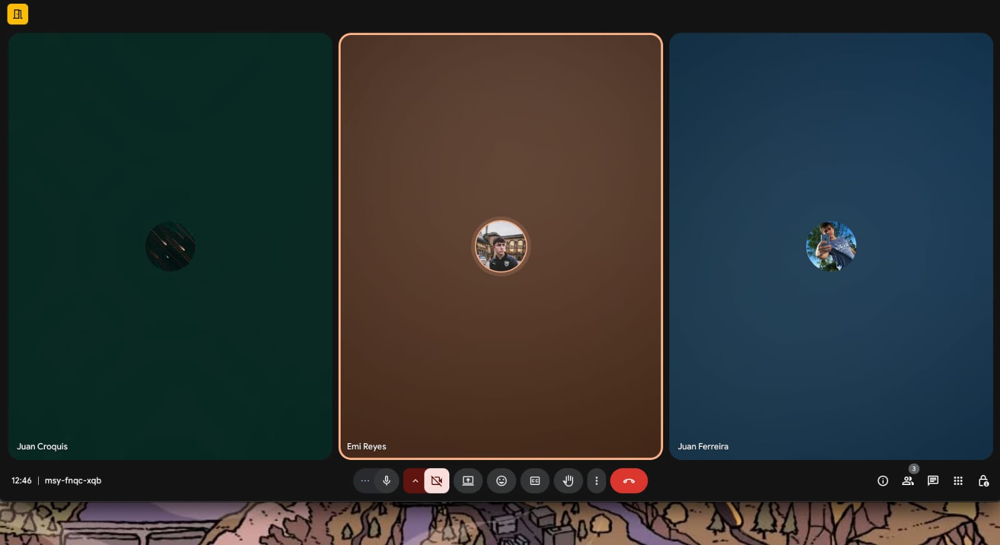

### Minuta 5: Daily 3 (24/10/2025)

El Viernes 24 de octubre, nos reunimos para la tercera y última daily de esta iteración 2, con el objetivo de compartir avances del trabajo realizado, presentamos los avances de las restantes pantallas de **Framer**. Ya solo nos queda perfeccionar las Historias de Usuario restantes y describir las pantallas. También presentamos el avance en cuanto a la validación con usuarios que discutiremos mañana en la Review.
Cerraremos la instancia 2 mañana con la Retrospective y setear las bases para la iteración 3.

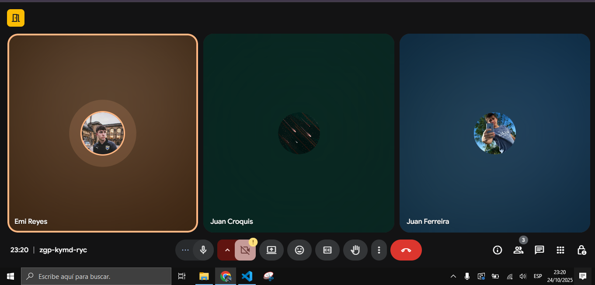

## Inspección y adaptación del proceso

### Minuta 6: Retrospective (25/10/2025)

### Artefactos principales

- Minuta de la retrospectiva con la dinámica utilizada y sus principales resultados.
- Planificación y seguimiento de las acciones de mejora.

# Construir y validar posibles soluciones del MVP a través de prototipos

## Prototipos con posibles soluciones

Para explorar rápidamente el MVP (Minimum Viable Product), optamos por **Framer** como herramienta de prototipado. Con ella construimos un primer prototipo funcional de la app móvil de carpool universitario. Trabajamos íntegramente con el formato de "Mobile" para asegurar desde el inicio una experiencia 100% mobile-first (iOS/Android), manteniendo consistencia en tamaños, tipografías y patrones de navegación.

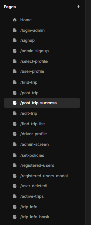

El prototipo de esta segunda iteración incluye doce historias de usuario implementadas y 3 pantallas auxiliares (estas corresponden al menú del usuario: pasajero, conductor o admin) que conectan otras pantallas, pensadas para cubrir el flujo mínimo extremo a extremo:

### Seleccionar perfil HU 9:

En la pantalla se permite elegir el tipo de usuario con el que se usará la app: Driver (conductor) o Passenger (pasajero). Cada opción se presenta como un botón circular con ilustración y estado de selección visual (borde resaltado). En la parte superior se muestra el título "Select user type" y una breve descripción de ayuda.

Una vez seleccionado el perfil, el usuario puede continuar con el flujo correspondiente. Esta decisión define el modo de navegación y las funcionalidades visibles en el resto del sistema (por ejemplo, crear/gestionar viajes para Driver, o buscar/reservar viajes para Passenger).

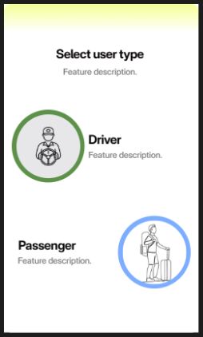

---

### Registrar nuevo usuario HU 10:

En esta pantalla se permite el registro de un usuario sin permisos de administrador. Para completar el registro se deben rellenar todos los campos, los cuales son: username, password, repeated password y email. Una vez completos dichos campos, se crea el usuario interactuando con el botón "Create account".

Las validaciones a realizar en este caso son la utilización de un email que no esté registrado previamente y que la contraseña coincida en los dos campos en los que se ingresa.

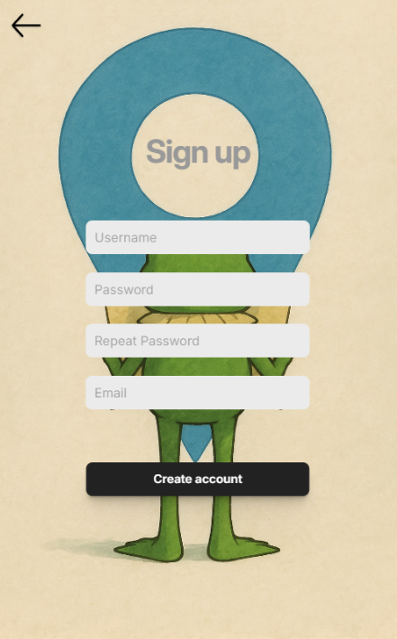

---
### Login con usuario y contraseña HU 11: 

La pantalla permite iniciar sesión en la app de carpool. Sobre un fondo ilustrado se presentan dos campos de entrada (Username y Password), el botón de "Sign in", enlaces auxiliares (Sign up, Forgot your password?) que aplican a los flujos de registro, recuperar contraseña o inicio alternativo, un separador "OR" y el botón "Continue with Google" para acceso alterno.

Como validaciones en este caso las casillas no deben ser vacías, se ingresa con nickname o email (escrito correctamente @ y dominio). Validaciones que verifican que el usuario está registrado. Completando este flujo al presionar "Sign in" inició sesión correctamente.

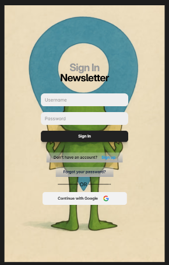

---
### Dar de alta administradores HU 14:

En el caso de esta pantalla, se utiliza una interfaz un tanto diferente a la de registro de usuario normal, ya que si bien la base es la misma, esta viene a partir de una acción específica del administrador.
La funcionalidad de la pantalla es igual a la del registro de usuario, a diferencia de que esta genera un usuario con permisos de administrador.

De la mano de una interfaz compartida con el registro de usuario, las validaciones de los campos en esta pantalla son las mismas mencionadas anteriormente.

---
### Publicar viajes HU 16:

En esta pantalla, el conductor tiene la posibilidad de crear y publicar un nuevo viaje dentro de la aplicación.
El objetivo principal de esta vista es permitirle al usuario conductor definir todos los datos necesarios para ofrecer un trayecto a otros pasajeros.

La pantalla presenta un formulario compuesto por distintos campos que deben completarse: lugar de partida, destino, ruta, fecha, hora, costo por asiento y cantidad de lugares disponibles.

En la parte inferior, se incluye un botón principal “Post Trip”, el cual, al ser presionado, registra el viaje en el sistema y lo publica para que otros usuarios puedan visualizarlo y reservar asientos.
En caso de que el formulario esté incompleto o contenga datos inválidos (como un costo negativo o una fecha anterior al día actual), la aplicación notifica al conductor para que corrija los campos antes de confirmar la publicación.

Una vez completado correctamente, el sistema muestra un mensaje de confirmación indicando que el viaje fue creado con éxito.
Desde este punto, el nuevo trayecto pasa a estar disponible en la lista de viajes activos del conductor y visible para los pasajeros en las búsquedas.

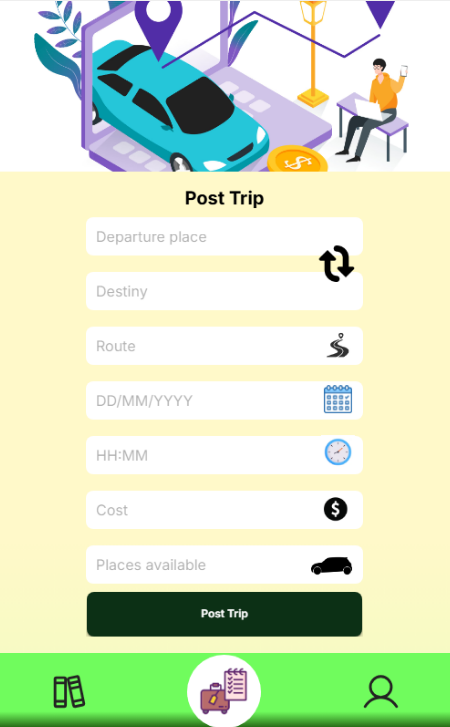

---
### Editar viajes publicados HU 18:

Esta pantalla permite al conductor modificar la información de un viaje que ya fue publicado previamente, ya sea para ajustar la hora de salida, el costo, la ruta u otros detalles importantes.

La interfaz es prácticamente idéntica a la de publicación, manteniendo los mismos campos de entrada: origen, destino, ruta, fecha, hora, costo y cantidad de lugares disponibles, aunque en este caso, los valores aparecen pre-cargados con la información actual del viaje.

El conductor puede cambiar uno o varios de estos datos y luego confirmar los cambios presionando el botón “Edit Trip” ubicado al final del formulario.
Cuando el viaje es editado correctamente, la aplicación muestra un mensaje indicando que la actualización se realizó con éxito.

Como medida de control, el sistema valida que los nuevos valores sean coherentes (por ejemplo, que la fecha no haya pasado o que los asientos no sean menores a los ya reservados).
Una vez confirmados los cambios, los pasajeros que tenían reserva en ese viaje reciben una notificación automática informando sobre la actualización de los datos.

Esta pantalla busca mantener una experiencia fluida y familiar para el conductor, reutilizando la estructura visual de la creación de viaje, pero adaptada al contexto de edición.

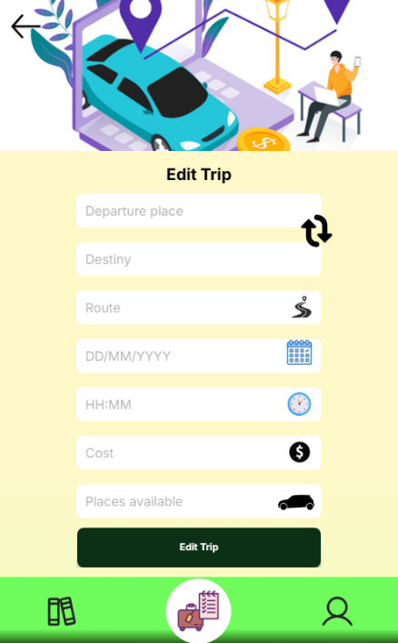

---
### Reservar lugar en un viaje HU 20:

En este caso, se listan todos los viajes en los cuales aún hay al menos un asiento disponible y que concuerdan con los filtros aplicados en la búsqueda.
En esta pantalla, el usuario selecciona el viaje para el cual desea reservar un lugar. Una vez seleccionado, se le redirige a la pantalla donde se realiza la reserva.

Para esta acción, la pantalla muestra los detalles básicos del viaje, que son relevantes para el pasajero. En la parte inferior de la pantalla, se muestra constantemente un menú desplegable, en el cual se puede seleccionar la cantidad de asientos que se desean reservar (variando esto según la cantidad de asientos disponibles). Al lado de este menú, se ubica un botón el cual realiza la reserva de los asientos.

En este caso la validación que se realiza es que se haya seleccionado una opción del menú desplegable y a su vez se verifica que no se hayan agotado los lugares mientras se veía la información del viaje.

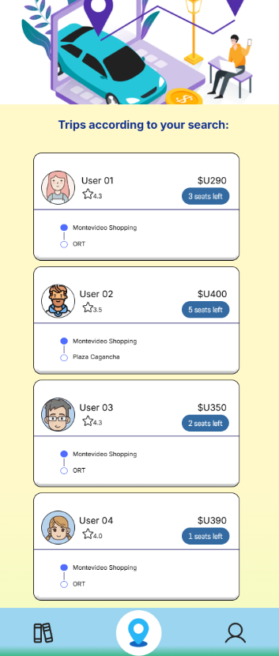
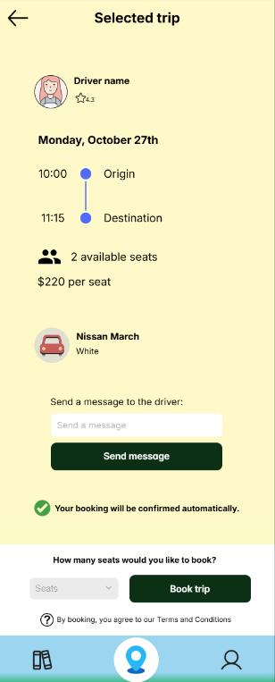

---
### Buscar viajes por zona, día y hora HU 22:

Pantalla para buscar viajes ingresando origen, destino, fecha y hora. Incluye:

  - Inputs: Departure place, Destiny, DD/MM/YYYY (picker), HH:MM (time picker).
  - Acción principal Find Trip.
  - Atajo para invertir origen/destino (ícono ↻).
  - Barra/tab inferior de navegación.

Al ejecutar la búsqueda, se muestra el listado de resultados con cards que incluyen: nombre y rating del conductor, precio, cupos disponibles, y el trayecto (puntos de subida/bajada).
Cuando el usuario da clic en una de las tarjetas, esta automáticamente lo redireccionará a una pantalla de dicho viaje.

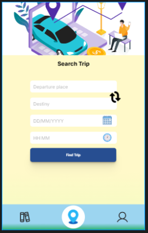
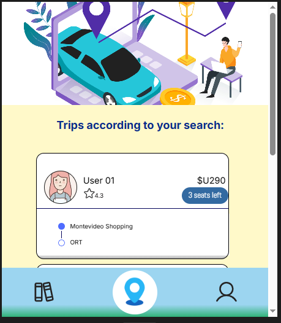

---
### Dar de baja usuarios HU 23:

En esta pantalla, se le muestra al administrador una lista con todos los usuarios registrados en el sistema (a excepción del mismo). Al lado de cada nombre de usuario se incluye un botón para eliminarlo. En caso de seleccionar dicha opción, salta una ventana pop-up en la cual se le pregunta al administrador si desea eliminar al usuario seleccionado. En caso de no ser así, el botón "Cancel" devuelve al administrador a la lista de usuarios, pero de lo contrario, se selecciona la opción "Delete" la cual confirma la baja del usuario. Una vez se elimina al usuario, se muestra un mensaje en pantalla que confirma el éxito de la operación.

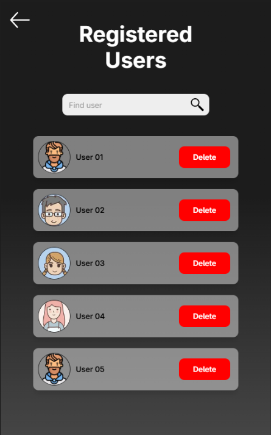
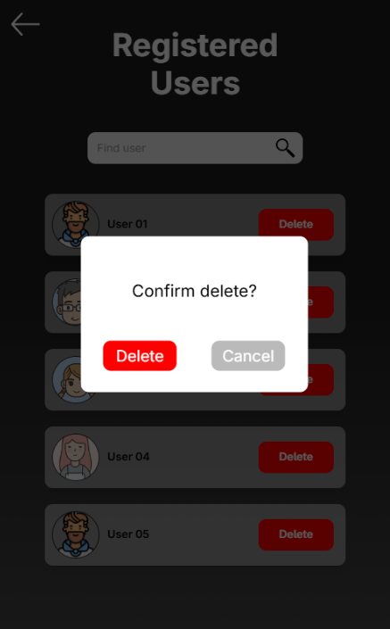
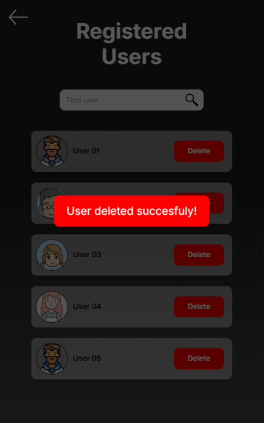

---
### Iniciar sesión como administrador HU 29:

A efectos prácticos esta pantalla es la misma que de iniciar sesión como usuario normal (pasajero / conductor), solo que redirige a un menú de administrador. Para adaptarlo aparte optamos de que fuera así. En el desarrollo final de la app será integrado a la misma ventana, con las validaciones correspondientes, al iniciar sesión el sistema se dará cuenta que es un Admin y lo mandará a su lugar correspondiente.

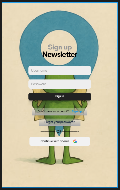

---
### Marcar estado del viaje HU 32:

Primero se parte desde una pantalla donde se ven todos los viajes activos que tiene el conductor (viajes que ya fueron confirmados y cuyos cupos están cerrados). En esta pantalla se selecciona de una lista de viajes al que se le desea cambiar el estado.
Una vez seleccionado el viaje deseado, se redirige al usuario a la siguiente pantalla. 

En esta, se muestra la información básica del viaje desde la perspectiva del conductor. En la misma, se ubica un botón en el cual es posible cambiar el estado del viaje. Si se desea marcarlo como iniciado, se presiona el botón "Start trip", el cual cambia de estado para mostrar que efectivamente el viaje está iniciado en el sistema.
También se puede seleccionar más abajo al pasajero que se quiere contactar, y rellenando la casilla de mensaje se le puede notificar de manera personalizada al pasajero seleccionado que se dirige al punto de encuentro o que se encuentra en el mismo (aunque no hay una obligación de contenido del mensaje).
De esta forma se puede cambiar el estado del viaje en función a lo que el conductor esté haciendo y seleccione en esta pantalla.

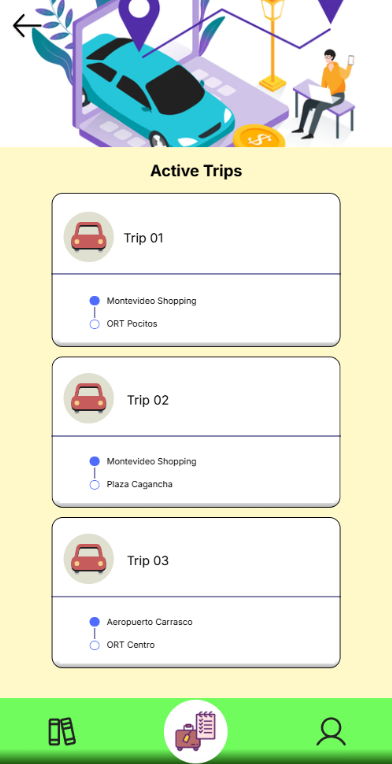
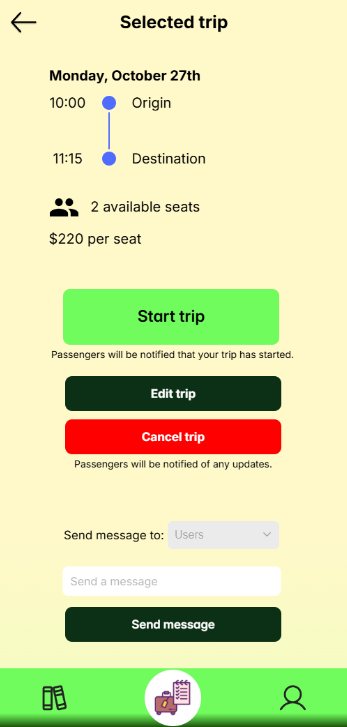

---
### Definición de políticas iniciales UI HU 39:

Pantalla de configuración para que Administración establezca las políticas base del sistema. El layout presenta tarjetas independientes por categoría, cada una con campos de entrada y un botón **Set** que guarda solo esa sección, una flecha que me redireciona al menú del Admin. Las categorías visibles son:

CANCELLATIONS:
  - Free cancel window (min) (entrada numérica).
  - Driver/Passenger penalty (%) (porcentual).
  - Nota informativa: "Those affected will be automatically notified."

SECURITY:
  - Password policy length (MIN).
  - Session timeout (Time/min).

PRICES/COMMISSIONS:
- Commission split: Admin % y Conductor %.

NOTIFICATIONS:
- Canales: SMS, Email, Push (toggles).
- Events: listado con estados (los marcados SOON no son interactivos).

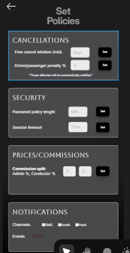
---

## Pantallas adicionales:

### Perfil del pasajero:
En la parte superior izquierda muestra el botón "Log out" y, al centro, el bloque de perfil con avatar circular, nombre, botón "Edit Profile" para editar el perfil del usuario y rating 4.3 con estrella de puntaje del usuario; debajo aparece una cuadrícula de accesos, con las opciones Driver Mode (cambia a modo conductor), Wallet (billetera), Notifications (me muestra las notificaciones) y Terms and conditions (documento de lectura); más abajo, la sección Trips ofrece dos tarjetas para Recent Trips y Active Trips; todo se apoya en un estilo limpio con fondo degradado amarillo, tarjetas azules de bordes redondeados e íconos lineales, y se completa con una barra de navegación inferior de tres pestañas donde la central (pin de ubicación) está resaltada como activa.

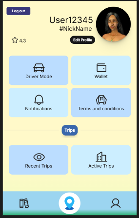

### Perfil del conductor:
Panel de perfil para el rol conductor con botón "Log out" arriba a la izquierda, avatar circular, nombre, botón "Edit Profile" y rating 4.3 con estrella; debajo, accesos rápidos con Passenger Mode (ir al modo pasajero), Car Info (información del auto y completarla), Notifications y Terms and conditions; sigue la sección Trips con dos tarjetas para Recent Trips y Active trips; el diseño usa tarjetas verdes con bordes redondeados sobre fondo crema y una barra de navegación inferior verde con tres pestañas.

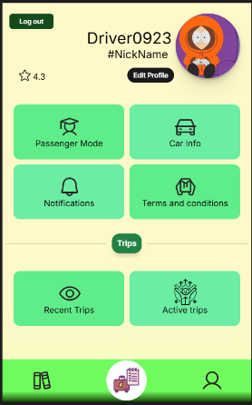
### Perfil del Admin:

Panel de administración con imagen de fondo tipo oficina, avatar circular centrado, botones "Log out" y "Edit Profile", nombre, una cuadrícula de módulos en tarjetas naranjas/rojas: User Management (gestión de usuarios), Statistics (Estadísticas de la aplicación), Add new Admin, Manage Reports, Manage comments y Manage Policies; la composición prioriza acciones de back-office con jerarquía clara y contraste alto para operaciones de administración.

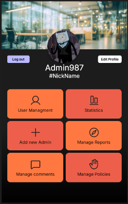

### Navbar del pasajero:
En la página de su perfil, el usuario cuenta con una navigation bar. Esta será la que le permita navegar por toda la aplicación sencillamente. Particularmente, el botón con el signo de pin o ubicación le ofrecerá la opción de buscar un nuevo viaje, los libros de ver su historial de viajes y el icono de persona para ir a su perfil:

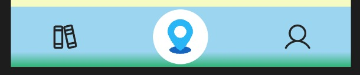

### Navbar del conductor:
En la página de su perfil, el usuario cuenta con una navigation bar. Esta será la que le permita navegar por toda la aplicación sencillamente. Particularmente, el botón con la maleta y agenda le ofrecerá la opción de publicar un nuevo viaje, los libros de ver su historial de viajes y el icono de persona para ir a su perfil:

## Criterios para el flow de la aplicación

### Flujo del Pasajero

El usuario ingresa a la aplicación y puede registrarse o iniciar sesión ingresando su nombre, contraseña y correo electrónico. Si aún no tiene cuenta, puede crearla fácilmente desde la opción “Sign up”. Luego de iniciar sesión, pasa a la pantalla Select Profile, donde elige su tipo de usuario: en este caso selecciona Passenger.

Una vez dentro, el pasajero ve su perfil personal con su nombre, foto, calificación y diferentes accesos rápidos como Driver Mode, Wallet, Notifications, Terms and Conditions, además de las secciones Recent Trips y Active Trips para revisar viajes pasados o en curso.

Desde su panel principal puede buscar un viaje en la vista Find Trip, donde completa los campos de origen, destino, fecha y hora. Al presionar el botón Find Trip, se muestra una lista de resultados con los conductores disponibles. Cada tarjeta incluye la foto, nombre, calificación, precio por asiento y cantidad de lugares restantes.

Al seleccionar un viaje, el usuario accede a los detalles completos del recorrido, incluyendo los puntos de partida y destino, el horario, el costo, los asientos disponibles, el vehículo y los datos del conductor. Desde esta misma vista puede enviar un mensaje al conductor para coordinar detalles o hacer consultas. Finalmente, el pasajero elige cuántos asientos desea reservar y confirma la acción presionando Book Trip. La aplicación muestra un mensaje de confirmación indicando que la reserva fue realizada correctamente y notifica al conductor sobre la nueva solicitud.

Si el viaje es modificado o cancelado por el conductor, el sistema envía automáticamente notificaciones al pasajero, manteniéndolo siempre informado. Cuando el viaje comienza, el pasajero recibe una alerta de inicio, y al finalizar puede visualizarlo en Recent Trips e incluso dejar una calificación o comentario.

### Flujo del Conductor

El conductor también comienza registrándose o iniciando sesión, y al elegir el perfil Driver en la pantalla Select Profile, accede a su vista personalizada. Allí se muestra su foto, nombre, calificación, y accesos a funciones específicas como Passenger Mode, Car Info, Notifications, Terms and Conditions, además de las secciones Recent Trips y Active Trips.

Desde su menú principal puede publicar un nuevo viaje en la pantalla Post Trip. Debe ingresar el punto de partida, destino, ruta, fecha, hora, costo y cantidad de asientos disponibles. Al presionar Post Trip, aparece un mensaje confirmando que el viaje fue publicado exitosamente.

En caso de necesitar realizar cambios, el conductor accede a Edit Trip, donde puede modificar cualquier dato del recorrido. Si cancela o edita un viaje, la aplicación notifica automáticamente a los pasajeros afectados.

El conductor también dispone de la vista Active Trips, donde se muestran los viajes publicados que están en curso. Al seleccionar uno, ingresa al detalle completo (Trip Info), donde puede iniciar el viaje presionando el botón verde Start Trip, editarlo o cancelarlo. También puede enviar mensajes a los pasajeros registrados en ese trayecto, informando actualizaciones o coordinando puntos de encuentro.

Una vez que el viaje comienza, la app notifica a todos los pasajeros, y al finalizar, el conductor puede revisar sus viajes completados en Recent Trips.

## Inspección y adaptación del producto

### Validación con usuarios

Con el objetivo de validar los prototipos con usuarios reales, decidimos realizar pruebas de usabilidad. Buscamos medir qué tan intuitiva es la interfaz y detectar oportunidades de mejora en la operabilidad y la navegación. Apuntamos a ofrecer una experiencia de usuario óptima (UX), clave para un MVP sólido.

Para esta instancia, organizamos sesiones con usuarios potenciales que participaron de forma voluntaria. En cada sesión, se les asignaron tareas concretas dentro de la app y se les pidió que las resolvieran sin recibir ayuda ni indicaciones. De este modo evaluamos la comprensibilidad del flujo y, cuando alguien no logra completar una acción, registramos esa fricción como área de mejora (ya sea de navegación o de usabilidad general).

En particular, pedimos a los participantes completar historias de usuario críticas de esta iteración, siendo el flujo de un pasajero para reservar viaje y para el conductor crear un nuevo viaje para el producto. Entre ellas, la que presentó mayor dificultad fue:

  - **Reservar lugar en un viaje HU 20:** Si bien en general con esta pantalla no surgieron problemas para completar su flujo, los usuarios sugirieron implementar una interfaz aparte para reservar un viaje y no incluirla en la lista de viajes. Esto es debido a que el viaje sería mejor contemplado si se expande la información dentro de este.

En resumen a los usuarios le fue fácil realizar el flujo dentro de la aplicación y les gustó mucho cómo adaptamos estilos y paleta de colores en nuestra app. Sin embargo, se lograron encontrar oportunidades de mejora que implementaremos para adaptar dichas acotaciones.

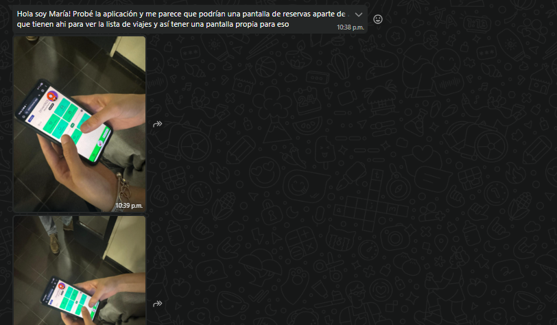

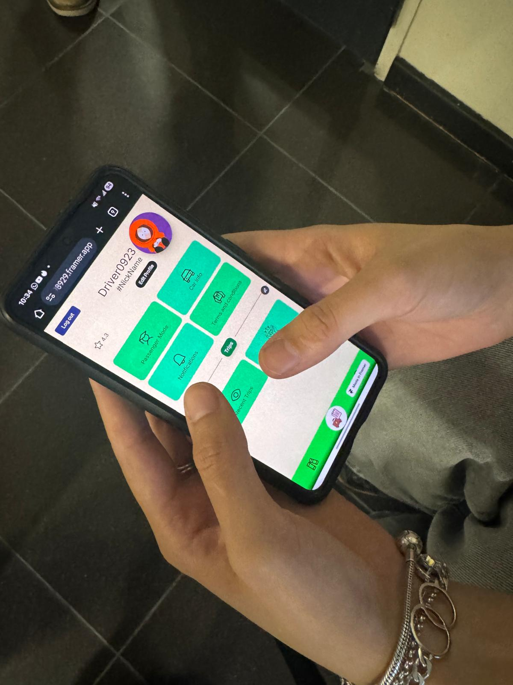
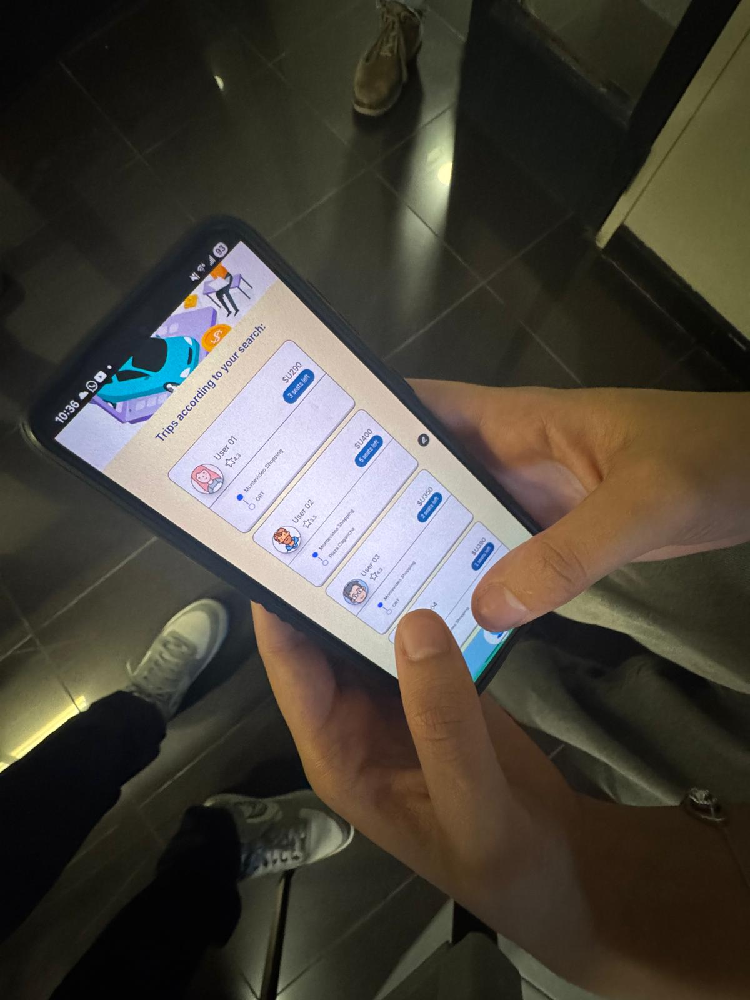

### Minuta 7: Review (25/10/2025)

Al cerrar el sprint, el equipo se reunió para revisar el desempeño y los objetivos alcanzados.
Junto con el Product Owner repasamos la Definition of Done y concluimos que se ajusta bien a nuestro flujo actual, por lo que la mantendremos.

Además, completamos todas las User Stories planificadas en tiempo y forma, lo que indica una buena estimación de esfuerzo y que la velocidad del equipo está en línea con lo esperado.

Por último, analizamos los hallazgos de usabilidad detectados en las pruebas con usuarios y acordamos implementar los ajustes necesarios en la próxima iteración.

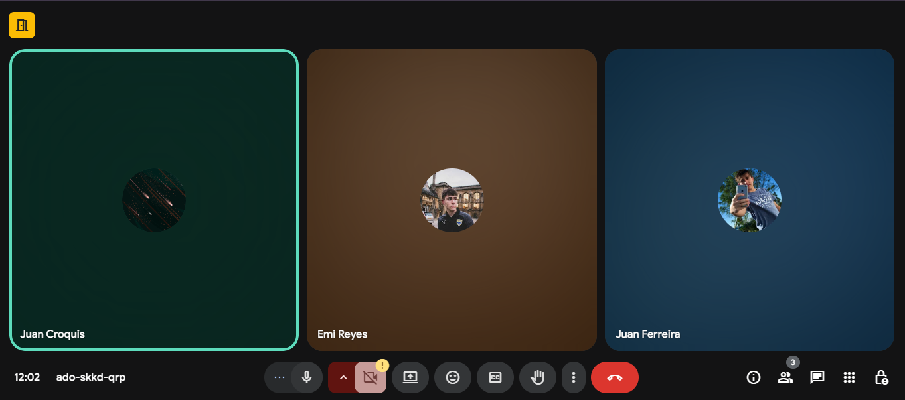

## ⌛ Registro de Horas del equipo

A continuación se muestran las horas de trabajo del equipo, registrando las grupales e individuales

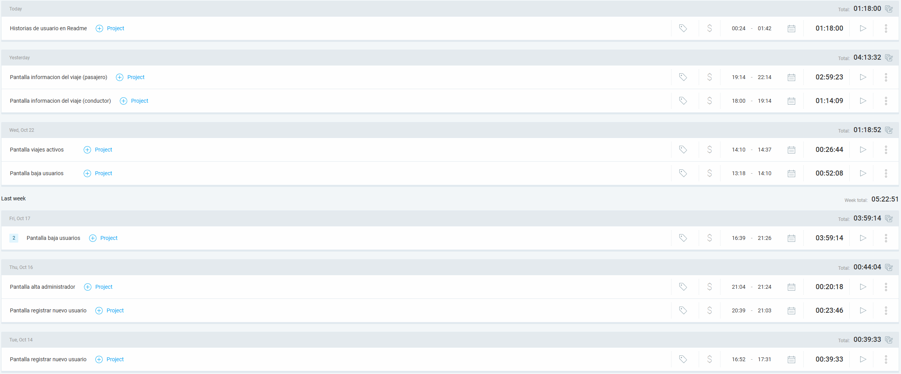

### Artefactos principales

- Minutas de sprint review.
- Evidencia de los usability testing con usuarios finales.
  - Descripción de las tareas propuestas a los usuarios finales.
  - Cobertura obtenida de validación de los usuarios de la aplicación.
- Feedback recibido de los usuarios finales con la priorización de las propuestas de cambio.
