# Indice

- [Gestión de la iteración](#gestión-de-la-iteración)
  - [Definición del marco de trabajo](#definición-del-marco-de-trabajo)
  - [Planificación de la iteración](#planificación-de-la-iteración)
  - [Seguimiento de la iteración](#seguimiento-de-la-iteración)
  - [Inspección y adaptación del proceso](#inspección-y-adaptación-del-proceso)
- [Construir y validar posibles soluciones del MVP a través de prototipos](#construir-y-validar-posibles-soluciones-del-mvp-a-través-de-prototipos)
  - [Prototipos con posibles soluciones](#prototipos-con-posibles-soluciones)
  - [Inspección y adaptación del producto](#inspección-y-adaptación-del-producto)

# Gestión de la iteración

## Definición del marco de trabajo

Siguiendo como habíamos establecido los roles con la intención de que en las siguientes iteraciones se roten, favoreciendo así la participación y el aprendizaje de todos.

- **Product Owner**: Juan Croquis

- **Scrum Master**: Juan Ferreira

- **Developer**:  Emiliano Reyes

### Artefactos principales

En el presente Sprint definimos que los eventos se establecerán de la siguiente forma:

- **Sprint Planning**: 2 días (27/10/2025 y 29/10/2025)
- **Daily Scrum**: 3 días (31/10/2025, 03/11/2025 y 05/11/2025)
- **Sprint Review**: 1 día (06/11/2025)
- **Sprint Retrospective**: 1 día (06/11/2025)

# Definition of Done y Definition of Ready – Carpool Universitario

## Definition of Done (DoD)

Un entregable (historia de usuario, funcionalidad o tarea) se considera **terminado** cuando:

- **Funcionalidad implementada**  
  Ejemplo: el registro de usuario permite crear cuenta como conductor o pasajero.  

- **Funcionalidad testeada**  
  Pruebas unitarias y funcionales confirman que el login, búsqueda de viajes, reserva y publicación funcionan según lo esperado.  

- **Criterios de aceptación cumplidos**  
  Cada historia de usuario cuenta con criterios claros (ejemplo:  
  *"Como pasajero quiero buscar un viaje por horario y zona, para elegir la mejor opción"*),  
  y deben cumplirse en su totalidad.  

---

## Definition of Ready (DoR)

Una historia de usuario o tarea se considera **lista para entrar en un Sprint** cuando:

- **Estimación de esfuerzo confirmada**  
  El equipo acordó una estimación en puntos de historia o tiempo, y está alineada con la capacidad disponible del Sprint.  

- **Recursos disponibles**  
  El equipo cuenta con acceso a las herramientas necesarias.

- **Conocimientos/capacitación suficiente**  
  Los miembros tienen claro cómo implementar la historia.

- **Diseño de UI aprobado**  
  Las pantallas necesarias para la historia (ejemplo: formulario de *Publicar viaje*, vista de *Reservar lugar*) están definidas y detalladas.  

- **Criterios de aceptación definidos**  
  Cada historia de usuario tiene escenarios claros que permitan saber cuándo está "hecha". 

## Planificación de la iteración

### Minuta 1: Planning 1 (27/10/2025)

Lunes 27 de Octubre, realizamos la primera reunión para preparar el ambiente para la iteración 3. El objetivo de esta reunión fue avanzar y planificar qué íbamos a realizar en esta iteración (Sprint). Designamos roles, validamos las herramientas a utilizar, definimos el objetivo de la iteración, buscamos consenso sobre cómo aplicar el marco de trabajo SCRUM al contexto del proyecto y qué corresponde a cada rol y dejamos preparado el **Product Backlog**. La reunión se dio en clases, duró 30 minutos y concluimos que en la siguiente reunión continuaremos con la siguiente parte del planning.

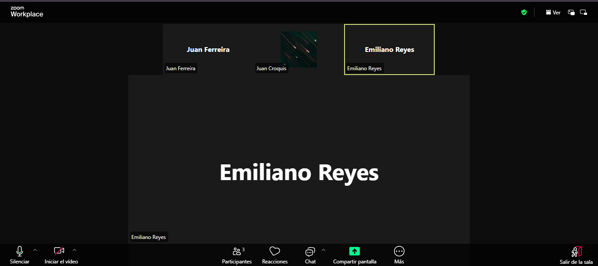

### Minuta 2: Planning 2 (29/10/2025)

Miércoles 29 de Octubre, realizamos la segunda parte de la planning. El objetivo fue terminar de coordinar las tareas y fechas para la sprint. Se hablo y discutio de los nuevos casos a agregar, siendo estos dos "Agregar una opción de chat previo al viaje" y "Permitir que un pasajero frecuente marque "favoritos" a ciertos conductores", los cuales se crearon el el board y se estimaron. Se añadio el caso de cerrar sesión, si bien estaba implementados llegamos a la desición de crearle su propia HU. Se actualizó el Story Map de la iteración 3.

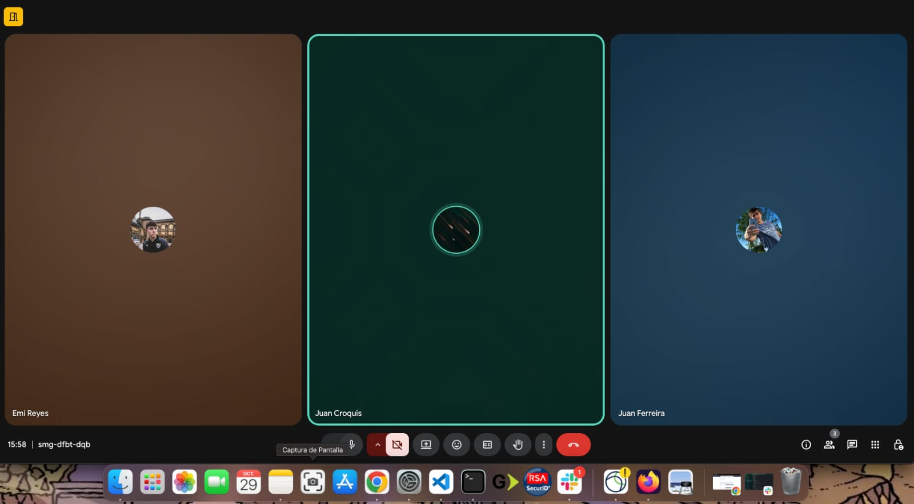

### Story Map

Story Map actualizado para reflejar las nuevas actualizaciones que el cliente pidio para ser incluidas y dado al buen ritmo del equipo se logro hacer carry in de 4 tareas más para esta iteración:

🟧 Historias nuevas solicitadas por el cliente  
🟨 Historias que hicieron carry in a la iteración  
🎀 Historias que ya estaban

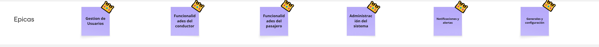
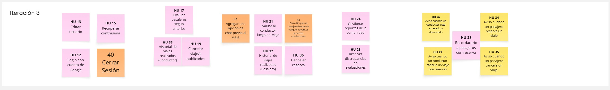

### Sprint Backlog

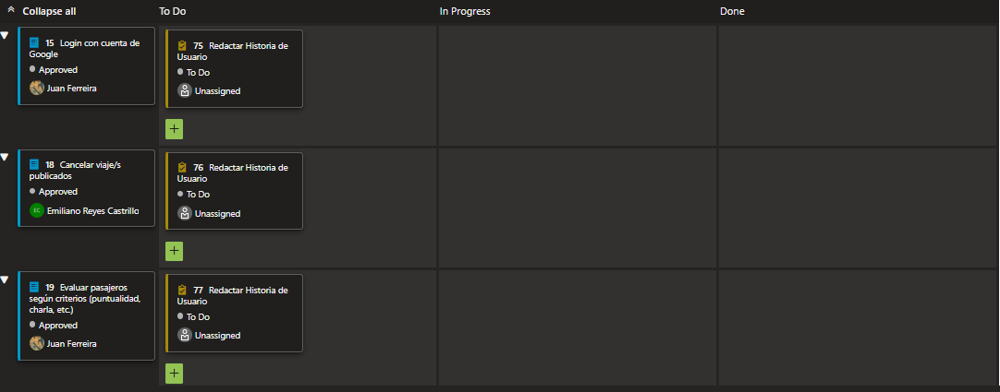
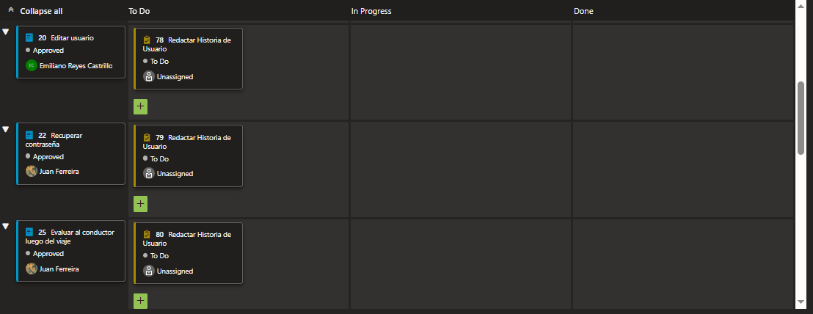
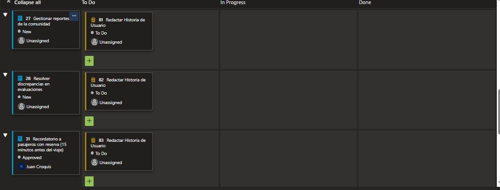
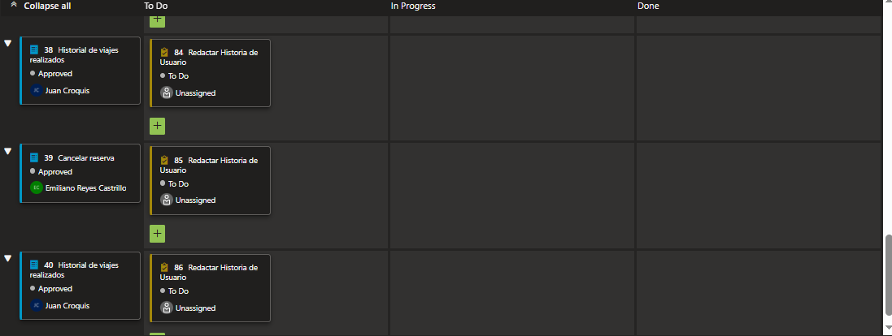
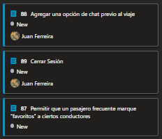

#### 👥 Asignación de tareas

Durante la **planificación** asumimos distintos roles según la necesidad, pero en la etapa de **desarrollo** trabajaremos los tres de forma colaborativa.  
Repartimos las tareas de manera **equitativa**, asegurando que cada integrante comience con una **tarea de prioridad 1**.

#### 📚 Historias de usuario

- **Historia de usuario 12**: Login con cuenta de Google
  - **Como**: Como usuario registrado (conductor o pasajero)
  - **Quiero**: Iniciar sesión con mi usuario de Google para acceder a mis viajes y reservas.
  - **Para**: Poder acceder a mis viajes publicados, reservas o búsqueda de viajes y perfil personal.
  - **Criterios de aceptación**:
    - El botón de Continuar con Google debe redirigir a un panel a parte.
    - Al iniciar sesión correctamente, se redirige al usuario a su pantalla principal donde seleccionará su perfil (conductor o pasajero).

- **Historia de usuario 13**: Editar usuario
  - **Como**: Como usuario registrado (conductor, pasajero o administrador).
  - **Quiero**: Editar la informacion de mi perfil y que se vea reflejada.
  - **Para**: Actualizar mi informacion almacenada en la aplicación.
  - **Criterios de aceptación**:
    - Que tenga los siguientes campos a modificar:
      - Foto de perfil
      - Nombre de usuario
      - Contraseña
      - Email
    - El botón de guardar cambios debe aplicar los mismos y redirigir al usuario a la pantalla de información de su perfil.
    - El botón de regreso debe redirigir al usuario a la pantalla de información de su perfil sin guardar ningun cambio realizado.

- **Historia de usuario 15**: Recuperar contraseña
  - **Como**: Usuario registrado que olvidó su contraseña
  - **Quiero**: Poder recuperar el acceso a mi cuenta mediante mi correo electrónico registrado
  - **Para**: Restablecer mi contraseña de forma segura y continuar utilizando la aplicación
  - **Criterios de aceptación**:
    - En la pantalla de inicio de sesión debe existir un enlace o botón "¿Olvidaste tu contraseña?".
    - Al seleccionarlo, el sistema debe solicitar el correo electrónico asociado a la cuenta.
    - El sistema debe enviar a un correo el código temporal para restablecer la contraseña.
    - Despues de ingresar el código el usuario restablece la contraseña
    - Al finalizar la nueva contraseña se debe redirigir a iniciar sesión

- **Historia de usuario 17**: Evaluar pasajeros según criterios
  - **Como**: Conductor que ha finalizado un viaje
  - **Quiero**: Seleccionar a cada pasajero y calificar su comportamiento o cumplimiento durante el viaje
  - **Para**: Mantener un registro de buenas prácticas, mejorar la confianza y seguridad dentro de la comunidad de usuarios
  - **Criterios de aceptación**:
    - Al finalizar un viaje, el conductor puede acceder a la pantalla de historial y ver la lista de pasajeros.
    - Debe poder seleccionar un pasajero específico y asignarle una calificación en estrellas (1 a 5).
    - Opcionalmente puede escribir una breve reseña o comentario.
    - El sistema debe permitir iniciar una disputa si el conductor tuvo un problema con un pasajero.

- **Historia de usuario 19**: Cancelar viaje/s publicados
  - **Como**: Conductor con al menos un viaje activo
  - **Quiero**: Seleccionar un viaje activo y cancelarlo
  - **Para**: Evitar que el viaje siga su curso y se notifique a los pasajeros.
  - **Criterios de adaptación**:
    - Al ver los viajes activos, el conductor debe poder acceder a la información del viaje a cancelar.
    - El botón de cancelar viaje debe validar que realmente se desea cancelar el viaje.
    - Si se presiona la opcion positiva se cancela el viaje (notificando a los pasajeros del mismo) y se redirige al conductor a la vista de sus viajes activos.
    - En caso de presionar la opcion negativa, se mantiene al conductor en la vista de la información del viaje.

- **Historia de usuario 21**: Evaluar al conductor luego del viaje
  - **Como**: Pasajero que ha finalizado un viaje
  - **Quiero**: Calificar la experiencia con mi conductor y dejar una reseña breve
  - **Para**: Contribuir a la reputación del conductor y mejorar la calidad del servicio para futuros usuarios
  - **Criterios de aceptación**:
    - Al finalizar un viaje, debe mostrarse la pantalla de historial con los datos del conductor y la opción de "Enviar reseña".
    - El pasajero puede asignar una calificación en estrellas (1 a 5).
    - Opcionalmente puede escribir una breve reseña o comentario.
    - El pasajero tendrá la opción de abrir un debate si hubo un problema.

- **Historia de usuario 24**: Gestionar reportes de la comunidad
  - **Como**: Administrador
  - **Quiero**: Visualizar, revisar y gestionar los reportes realizados por los usuarios sobre conductores, pasajeros o viajes
  - **Para**: Mantener un ambiente seguro, confiable y moderado dentro de la plataforma.
  - **Criterios de aceptación**:
    - Debe existir una sección dentro del panel del administrador llamada “Community Reports” o similar.
    - La pantalla debe mostrar una lista de reportes, indicando: usuario reportado, usuario que reportó, motivo del reporte y fecha.
    - El administrador debe poder filtrar los reportes por categoría (comportamiento, incumplimiento, fraude, etc).
    - Si el reporte se resuelve, el sistema debe marcarlo como resuelto y ya no debe aparecer en la lista de pendientes.

- **Historia de usuario 25**: Resolver discrepancias en evaluaciones
  - **Como**: Administrador
  - **Quiero**: Leer las opiniones tanto del conductor como del pasajero
  - **Para**: Poder resolver el conflicto y solucionar el caso
  - **Criterios de aceptación**:
    - Se debe enseñar una lista con todos los casos de discrepancia sin resolver.
    - El administrador debe tener acceso a un chat entre el conductor y el pasajero para cada caso.
    - El administrador debe poder enviar mensajes en dicho chat.

- **Historia de usuario 26**: Aviso cuando un conductor está atrasado o demorado
  - **Como**: Pasajero con reserva en un viaje.
  - **Quiero**: Recibir una notificación si el conductor está atrasado o demorando la salida.
  - **Para**: Poder reorganizarme y saber si el viaje comenzará más tarde de lo previsto.
  - **Criterios de aceptación**:
    - El conductor puede marcar su estado como "Demorado" desde la pantalla del viaje activo.
    - Cuando se marque el estado como “Demorado”, todos los pasajeros con reserva reciben una notificación en la aplicación.
    - La notificación debe incluir: tiempo estimado de demora (si se ingresó) y un mensaje aclaratorio.
    - El pasajero debe poder ver el estado actualizado también en la pantalla de información del viaje.

- **Historia de usuario 27**: Aviso cuando un conductor cancela un viaje con reservas
  - **Como**: Pasajero con un asiento reservado
  - **Quiero**: Recibir un aviso cuando el conductor cancele el viaje.
  - **Para**: No quedarme esperando y poder buscar otra alternativa de transporte.
  - **Criterios de aceptación**:
    - Cuando el conductor cancela un viaje que tiene al menos una reserva, el sistema debe enviar una notificación automática a todos los pasajeros que se hayan registrado.
    - En la notificación debe verse: nombre del viaje, fecha y hora, y el mensaje “Viaje cancelado”.
    - El viaje debe pasar al estado Cancelado y ya no debe aparecer como disponible en listados de búsqueda.
    - Los pasajeros deben ver el viaje cancelado en su Historial, con un indicador de cancelación.

- **Historia de usuario 28**: Recordatorio a pasajeros con reserva
  - **Como**: Pasajero que tiene una reserva confirmada en un viaje.
  - **Quiero**: Recibir un recordatorio antes del horario de salida del viaje.
  - **Para**: Asegurarme de no olvidar el viaje y llegar a tiempo al punto de encuentro.
  - **Criterios de aceptación**:
    - El sistema debe enviar una notificación automática a los pasajeros que tengan una reserva activa.
    - El recordatorio debe enviarse 15 minutos antes del horario programado del viaje.
    - La notificación debe incluir información relevante del viaje: origen, destino, conductor y horario.
    - Si el viaje es modificado por el conductor (hora o punto de encuentro), el recordatorio debe ajustarse automáticamente.
    - Si el viaje es cancelado antes del envío del recordatorio, no debe enviarse la notificación y el pasajero debe recibir una notificación de cancelación en su lugar.

- **Historia de usuario 33**: Historial de viajes realizados (Conductor)
  - **Como**: Usuario conductor registrado
  - **Quiero**: Ver un historial de los viajes que he completado como conductor.
  - **Para**: Poder llevar un registro de mis viajes ofrecidos, organizar mis ganancias y mantener control de mi actividad como conductor.
  - **Criterios de aceptación**:
    - La pantalla debe mostrar los viajes completados en los que el usuario actuó como conductor, ordenados por fecha (más reciente primero).
    - Debe mostrarse información clave del viaje: origen, destino, fecha, horario, cantidad de pasajeros, y costo total recaudado.
    - Debe existir una opción para ver más detalles del viaje como: ruta propuesta, vehículo utilizado, y evaluaciones recibidas.

- **Historia de usuario 34**: Aviso cuando un pasajero reserve un viaje
  - **Como**: Conductor que publicó un viaje
  - **Quiero**: Ser notificado cuando un pasajero reserve uno o más lugares.
  - **Para**: Estar al tanto de la ocupación del viaje y organizarme en base a los pasajeros confirmados.
  - **Criterios de aceptación**:
    - Cuando un pasajero realiza una reserva, el sistema debe enviar automáticamente una notificación al conductor.
    - La notificación debe mostrar el nombre del pasajero y la cantidad de lugares reservados.
    - El número de asientos disponibles debe actualizarse automáticamente en el viaje.

- **Historia de usuario 35**: Aviso cuando un pasajero cancele un viaje
  - **Como**: Conductor que publicó un viaje
  - **Quiero**: Ser notificado cuando un pasajero cancele su reserva.
  - **Para**: Saber que se liberaron lugares y permitir que otros pasajeros puedan reservar.
  - **Criterios de aceptación**:
    - Cuando un pasajero cancela su reserva, el sistema debe enviar automáticamente una notificación al conductor.
    - La notificación debe incluir el nombre del pasajero y la cantidad de lugares liberados.
    - La disponibilidad del viaje debe actualizarse correctamente.

- **Historia de usuario 36**: Cancelar reserva
  - **Como**: Pasajero que tiene uno o más viajes activos
  - **Quiero**: Darme de baja del viaje
  - **Para**: Liberar mi asiento y realizar un reembolso del dinero del pasaje
  - **Criterios de aceptación**:
    - Al dar de baja al pasajero del viaje, se notifica al conductor lo sucedido.
    - El pasajero debe recibir un reembolso del dinero del pasaje en caso de que se de de baja 24 o más horas antes del inicio del viaje.

- **Historia de usuario 37**: Historial de viajes realizados (Pasajero)
  - **Como**: Usuario pasajero registrado
  - **Quiero**: Poder visualizar un listado de los viajes que he realizado.
  - **Para**: Recordar con quién viajé, cuándo y hacia dónde, y poder evaluar mi experiencia.
  - **Criterios de aceptación**:
    - La pantalla debe mostrar los viajes completados por el pasajero, ordenados del más reciente al más antiguo.
    - Se debe poder ver la siguiente información básica del viaje: origen, destino, fecha, horario y conductor.
    - Debe existir una opción para ver más detalles del viaje (por ejemplo: vehículo, comentarios previamente hechos, costo pagado, cantidad de asientos reservados).

- **Historia de usuario 38**: Visualizar Estadisticas
  - **Como**: Administrador del Sistema
  - **Quiero**: Visualizar estadísticas sobre el uso del sistema de carpool universitario
  - **Para**: Analizar la actividad de la aplicación, comprender patrones de uso y conocer el impacto positivo del servicio
  - **Criterios de aceptación**:
    - Se debe mostrar un panel de estadísticas con al menos seis gráficos.
    - Cada gráfico debe representar un indicador distinto:
      - Average Ride Occupancy Rate
      - Rides by Zone or Campus
      - Peak Ride Hours
      - User Role Distribution (Drivers vs Passengers)
      - Average Satisfaction Level
      - Shared Kilometers / Estimated CO₂ Savings        
    - Las métricas deben mostrarse con colores coherentes con la identidad visual de la app.

- **Historia de usuario 40**: Cerrar Sesión
  - **Como**: Como usuario loggeado (Pasajero, Conductor o Admin)
  - **Quiero**: Cerrar la sesión de mi cuenta en la aplicación 
  - **Para**: Garantizar la seguridad de mi cuenta y evitar el acceso no autorizado a mi información personal
  - **Criterios de aceptación**:
    - Debe existir un botón o enlace visible con la opción "Cerrar sesión" en el menú o perfil del usuario.
    - El usuario puede cerrar sesión desde su perfil.
    - Al cerrar sesión, se redirige a la pantalla de inicio.

- **Historia de usuario 41**: Chat previo al viaje
  - **Como**: Pasajero o conductor con un viaje próximo
  - **Quiero**: Acceder a una opción de chat vinculada al viaje antes de que comience
  - **Para**: Poder coordinar detalles, confirmar horarios o puntos de encuentro antes del viaje
  - **Criterios de aceptación**:
    - Debe existir un botón o enlace para acceder al chat desde la pantalla del perfil del usuario (tanto para el pasajero como para el conductor).
    - El chat debe mostrar únicamente los mensajes correspondientes a ese viaje específico.
    - Solo pueden participar los usuarios involucrados en el viaje (conductor y pasajeros confirmados).
    - Una vez finalizado el viaje, el chat se desactiva o se archiva.

- **Historia de usuario 42**: Permitir que un pasajero frecuente marque "favoritos" a ciertos conductores
  - **Como**: Como usuario loggeado (Pasajero)
  - **Quiero**: Poder marcar ciertos conductores como "favoritos"
  - **Para**: Facilitar futuras reservas y priorizar viajes con conductores de confianza o con quienes tuve buenas experiencias
  - **Criterios de aceptación**:
    - Despues de haber realizado un viaje el usuario podrá revisar su historial de viajes y guardar en favoritos un conductor
    - Existe un botón de corazón para añadir a favorito a un conductor deseado.
    - El pasajero puede visualizar y gestionar su lista de conductores favoritos desde su perfil o un apartado dedicado.
    - Cuando se selecciona un conductor de la lista, se muestra todos sus proximos viajes

> **Nota:** Se añadieron las tasks de redacción de historias de usuarios correspondientes a las cards que vamos a trabajar durante esta Iteración 3, además de la creación de pantallas intermedias necesarias para conectar las pantallas creadas.
---
#### 🧮 Estimación del esfuerzo

Para estimar el esfuerzo de las historias seleccionadas aplicamos la técnica **Planning Poker** basada en **Story Points**.

Tomamos en cuenta los siguientes factores:
- **Complejidad técnica**
- **Volumen de trabajo**
- **Nivel de incertidumbre**

Utilizamos el **estimador integrado en Azure DevOps** para asignar valores dentro de cada historia elegida para el sprint.  
En los casos donde hubo diferencias de criterio, el equipo **debatió las estimaciones** y se realizó **una nueva votación** hasta llegar a un consenso.

A continuación se redactan las estimaciones puestas por el equipo correspondientes a estas Historias de Usuarios (Como definimos antes 1 SP corresponde a 30 minutos).

- **Historia de usuario 12**: Login con cuenta de Google
  - 5 SP
- **Historia de usuario 13**: Editar usuario
  - 5 SP
- **Historia de usuario 15**: Recuperar contraseña
  - 7 SP
- **Historia de usuario 17**: Evaluar pasajeros según criterios
  - 3 SP
- **Historia de usuario 19**: Cancelar viaje/s publicados
  - 4 SP
- **Historia de usuario 21**: Evaluar al conductor luego del viaje
  - 3 SP
- **Historia de usuario 24**: Gestionar reportes de la comunidad
  - 6 SP
- **Historia de usuario 25**: Resolver discrepancias en evaluaciones
  - 6 SP
- **Historia de usuario 28**: Recordatorio a pasajeros con reserva
  - 5 SP
- **Historia de usuario 33**: Historial de viajes realizados
(Conductor)
  - 4 SP
- **Historia de usuario 36**: Cancelar reserva
  - 5 SP
- **Historia de usuario 37**: Historial de viajes realizados
(Pasajero)
  - 4 SP

**Se añaden también las actualizaciones de las siguientes y nuevas Historias de Usuarios:**

- **Historia de usuario 26**: Aviso cuando un conductor está atrasado o demorado
  - 2 SP
- **Historia de usuario 27**: Aviso cuando un conductor cancela un viaje con reservas
  - 2 SP
- **Historia de usuario 34**: Aviso cuando un pasajero reserve un viaje
  - 2 SP
- **Historia de usuario 35**: Aviso cuando un pasajero cancele un viaje
  - 2 SP

- **Historia de usuario 38**: Visualizar Estadisticas
  - 2 SP

- **Historia de usuario 40**: Cerrar Sesión
  - 1 SP
- **Historia de usuario 41**: Chat previo al viaje
  - 4 SP
- **Historia de usuario 42**: Permitir que un pasajero frecuente marque "favoritos" a ciertos conductores
  - 3 SP

--- 
## Seguimiento de la iteración

### Minuta 3: Daily 1 (31/10/2025)

El viernes 31 de octubre, realizamos la primera daily de esta iteración 3, con el objetivo de coordinar el trabajo del equipo y revisar el avance, presentamos avances en cuanto a la creación de pantallas en la web de **Framer**, de las cuales llegamos a completar 10 de las 20 propuestas para esta sprint, 10 de las 20 historias de usuarios. Continuamos con el objetivo de crear las pantallas faltantes además de las Historias de Usuario pendientes.
El equipo se encuentra preparando una buena versión la cual será mostrada como prototipo a usuarios para validarlo.

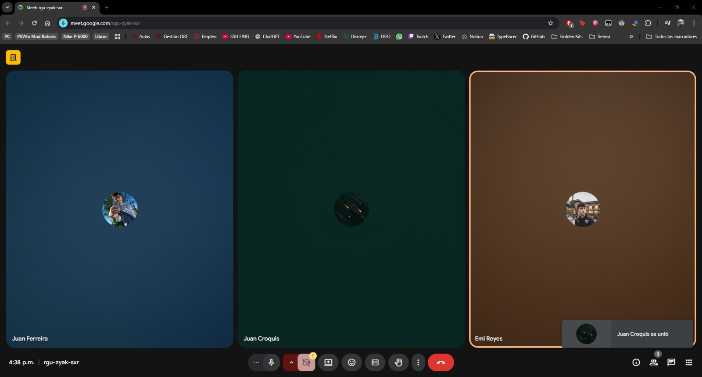

### Minuta 4: Daily 2 (03/11/2025)

El lunes 03 de noviembre, realizamos la segunda daily de esta iteración 3, con el objetivo de continuar con el trabajo del equipo y revisar el avance, presentamos avances en cuanto a la creación de pantallas en la web de **Framer**, de las cuales llegamos solo nos queda por terminar 5 para esta sprint, 14 de las 20 historias de usuarios. Continuamos con el objetivo de crear las pantallas faltantes además de las Historias de Usuario pendientes.
El equipo tiene una versión lo suficientemente estable la cual será mostrada como prototipo a usuarios para validarlo.

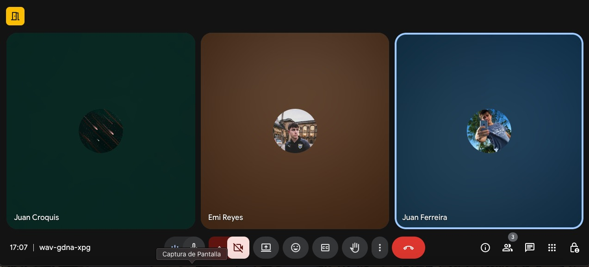

### Minuta 5: Daily 3 (05/11/2025)

El lunes 05 de noviembre, realizamos la última daily de esta iteración 3, con el objetivo de redondear con el trabajo del equipo y revisar el avance, presentamos avances en cuanto a la creación de pantallas en la web de **Framer**, de las cuales llegamos solo logramos completar todas las propuestas para esta sprint, 20 de las 20 historias de usuarios. 
El equipo ya realizó las validaciones necesarias con usuarios las cuales se estarán compartiendo en la reunión que tendremos de la Review.

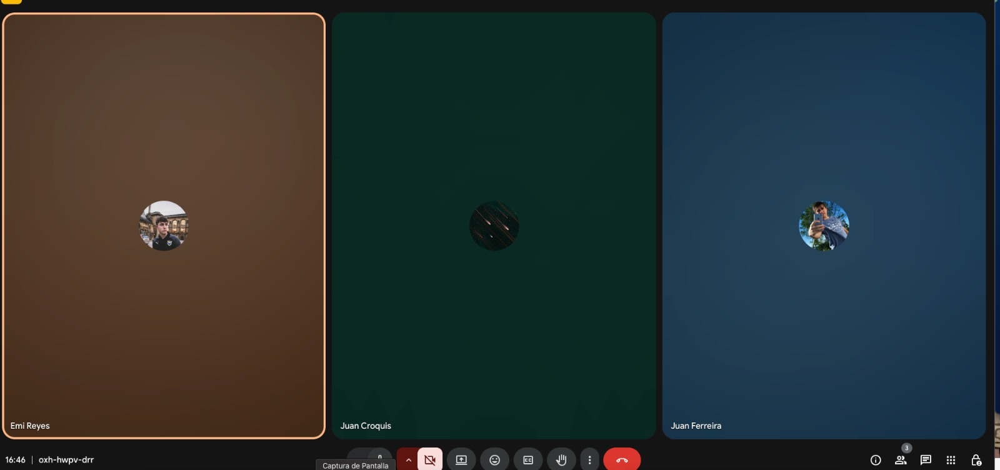

## Inspección y adaptación del proceso

### Minuta 6: Retrospective ⛵ (07/11/2025)

#### 🧩 Descripción
Durante esta retrospectiva tipo *Sailboat*, el equipo reflexionó sobre el avance del sprint, identificando los factores que impulsaron el progreso, los que lo frenaron, las referencias positivas que guiaron al grupo, los riesgos futuros y los objetivos hacia los que se navega.

---

#### 🌬️ The Winds that Move Us Forward
**Factores que nos impulsaron a avanzar:**
- Claridad en los objetivos del sprint.  
- Buena comunicación entre los miembros del equipo.  
- Colaboración efectiva entre roles.  
- Buena organización con las herramientas.  
- Compromiso del equipo y cumplimiento de tareas.  
- Mejora con el manejo de las herramientas como **Framer**.  

---

#### ⚓ The Anchors that Weigh Us Down
**Factores que nos frenaron o dificultaron el avance:**
- Dificultad para coordinar horarios entre clases, trabajo y el proyecto.  
- Dificultad con las herramientas al principio.  
- Falta de tiempo por parciales o entregas de otras materias.  

---

#### 🌟 The Stars that Lit the Way
**Factores que nos guiaron o inspiraron:**
- Buena actitud y disposición del equipo.  
- Se logró cumplir con todas las historias de usuario planificadas.  
- Reuniones efectivas y enfocadas.  
- Presentaciones o entregas bien recibidas que generaron confianza.  

---

#### 🏝️ The Treasure We’re Sailing Towards
**Objetivos y metas del equipo:**
- Se logró un buen diseño y apariencia en **Framer**.  
- Entregar el **MVP funcionando**.  
- Completar las pantallas restantes en Framer.  
- Generar una mejor experiencia para el usuario.  
- Mantener un ambiente de trabajo positivo donde todos puedan aportar ideas.  

---

#### 🦈 The Sharks Up Ahead Ready to Bite Us
**Riesgos o amenazas que podrían afectarnos:**
- Cambios de requerimientos inesperados.  
- Falta de tiempo para realizar ajustes de diseño.  
- Época de parciales y entregas de otras materias.  
- Falta de comunicación en semanas con mucha carga académica.  
- Desmotivación o cansancio hacia el final del semestre.  

---

#### 🧭 Conclusión
El equipo demostró una **gran mejora en la organización y coordinación**, junto con un **avance sólido en el uso de Framer** y en la calidad de las entregas.  
Aunque persisten desafíos vinculados al tiempo y la carga académica, se mantiene un ambiente positivo, colaborativo y enfocado en alcanzar los próximos objetivos del proyecto.

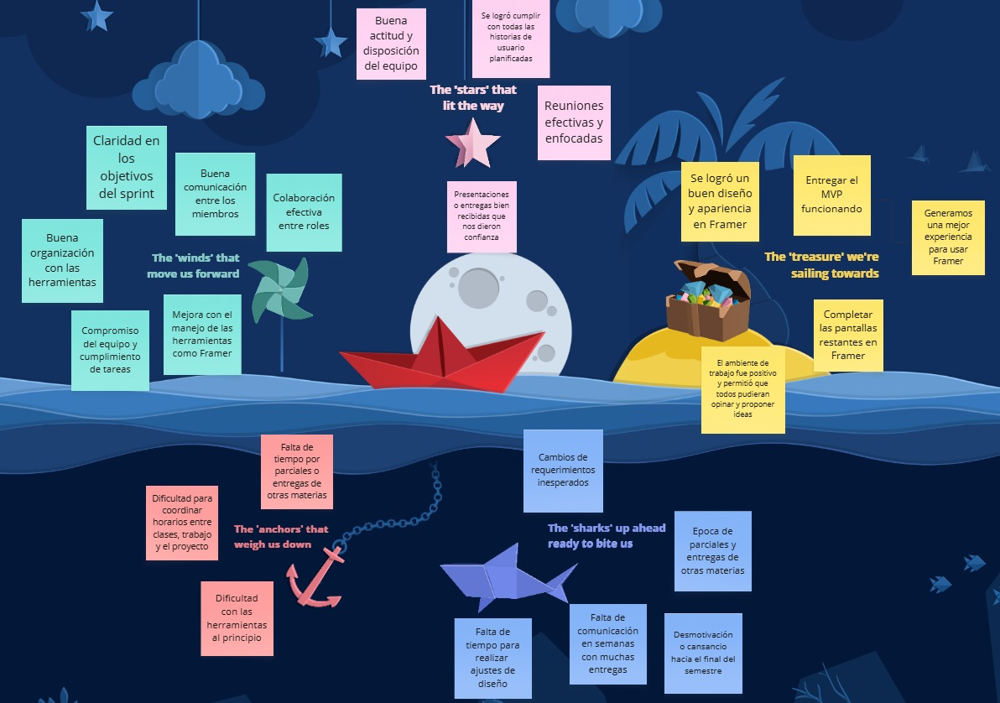

# Construir y validar posibles soluciones del MVP a través de prototipos

## Prototipos con posibles soluciones

El prototipo de esta tercera iteración incluye quince historias de usuario implementadas y sus derivados componentes para completar el caso que conectan otras pantallas, pensadas para cubrir el flujo mínimo extremo a extremo:

### Login con cuenta de Google HU 12

Esta pantalla corresponde al inicio de sesión con cuenta de Google, una funcionalidad que permite al usuario acceder rápidamente sin necesidad de crear una cuenta manualmente dentro de la aplicación. En el centro se muestra la interfaz oficial de autenticación de Google. En la parte inferior derecha se ubica el botón azul "Next", que continúa a la pantalla de seleccionar el perfil. Además, un ícono de flecha hacia la izquierda en la esquina superior izquierda permite volver a la pantalla anterior.

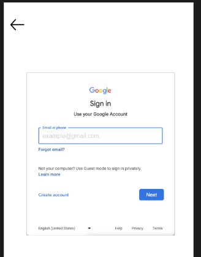

### Editar usuario HU 13

El usuario parte de la pantalla del perfil segun su rol (pasajero, conductor o administrador) y selecciona el botón de editar perfil. Una vez seleccionado el mismo, comienza el flujo de la edición del usuario. Para los 3 disitintos tipos de usuario el flujo es el mismo. En la pantalla de edición, aparecen los campos relacionados a todos los datos que pueden ser editados. Se incluye tambien un campo en el cual se puede agregar o cambiar la foto de perfil. Una vez completados los datos que se desean cambiar, el usuario debe presionar el botn de guardar cambios para que estos se vean reflejados. Una vez presionado este botón, se redirige al usuario nuevamente a la vista de su perfil. En caso de que el usuario desee volver hacia atrás sin cambiar información, solo debe presionar el botón de regresar ubicado en la esquina superior izquierda.

Para poder guardar los cambios de los datos editados, debe haber al menos un campo completo, de lo contrario no permite avanzar y se debera volver hacia atras en caso de querer abandonar esta pantalla. Asi mismo, solo se aplican los cambios de los campos que fueron completados, es decir, los campos que se dejen en blanco mantendran los datos previamente configurados.
Ademas, al momento de ingresar los nuevos valores en cada campo, se realizan las mismas validaciones que al crear un usuario.

| **Vista pasajero** | **Vista conductor** | **Vista administrador** |
| --- | --- | --- |
|  |  |  |

### Recuperar contraseña HU 15

El usuario inicia en la pantalla principal y al darle recuperar contraseña, comenzando el flujo de recuperar contraseña, este permite al usuario restablecer su acceso de forma rápida y segura. Primero, ingresa su correo o usuario para recibir un código temporal. Luego, introduce ese código en la siguiente pantalla para validar su identidad. Una vez verificado, puede crear y confirmar una nueva contraseña. Finalmente, el sistema muestra un mensaje de confirmación indicando que el cambio se realizó correctamente, volviendo asi al menu principal donde podra volver a iniciar.

  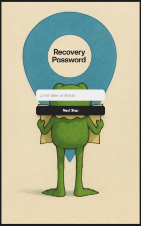
  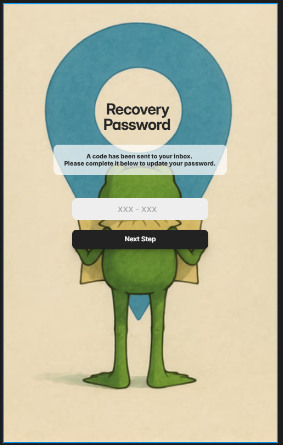

  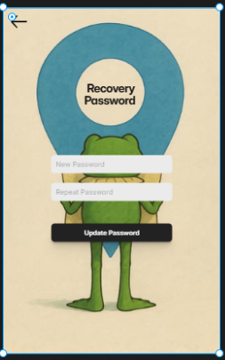
  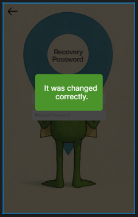

### Evaluar pasajeros según criterios HU 17

Esta pantalla de un viaje pasado hay un apartado para dejarle una review a cada pasajero, tiene un apartado que corresponde al flujo de evaluación de pasajeros según distintos criterios luego de finalizado un viaje. En la parte superior se muestra el mensaje "How was your trip? Select a passenger and give a feedback", que orienta al conductor a seleccionar a uno de los pasajeros del viaje para dejar una reseña individual. Debajo, hay un menú desplegable con la etiqueta "Users", donde el conductor elige al pasajero a evaluar. Luego, un campo de texto gris claro permite escribir comentarios específicos sobre aspectos como puntualidad, comportamiento o comunicación durante el viaje. Más abajo, se incluye un sistema de estrellas para calificar la experiencia y finalmente un botón verde oscuro con el texto "Send a review", que envía la valoración y el comentario seleccionados. La pantalla mantiene una estructura clara y funcional, permitiendo que el conductor brinde retroalimentación de forma rápida, ordenada y centrada en la calidad del viaje compartido.

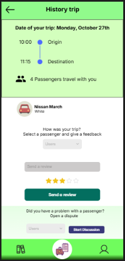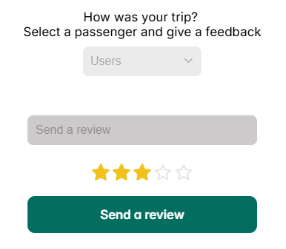

### Cancelar viaje/s publicados HU 19

Esta pantalla es parte de la vista de la información del viaje del conductor. En este caso, se selecciona el botón de cancelar viaje que se encuentra debajo de los botones de iniciar y editar viaje. Una vez presionado, este botón acciona una ventana emergente en la cual se pide la confirmación del conductor para cancelar el viaje. Si el conductor presiona que si, se le redirige a la pantalla de sus viajes activos y se notifica a todos los usuarios la cancelacion del viaje. En caso de presionar que no, se cierra la ventana emergente y se vuelve a la vista de la información del viaje.

  
  
  

### Evaluar al conductor luego del viaje HU 21

Esta pantalla de un viaje pasado hay un apartado para dejarle una review al conductor, este permite al pasajero evaluar al conductor luego de finalizar un viaje. En la parte superior se muestra una breve invitación para dejar una reseña: "How was your trip? Send a review to your driver". Debajo, aparece un componente de valoración con estrellas, donde el usuario puede seleccionar de una a cinco según su experiencia. Luego, un campo de texto gris claro con el mensaje "Send a review" permite escribir comentarios adicionales sobre el viaje o el conductor. Finalmente, un botón verde oscuro con el texto "Send a review" permite enviar la calificación y el comentario. La pantalla transmite una estética limpia, intuitiva y centrada en la acción principal, facilitando que el usuario brinde retroalimentación de forma rápida y directa.

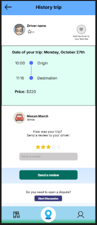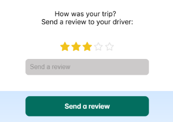

### Gestionar reportes de la comunidad HU 24

El flujo comienza en el perfil del administrador, donde se encuentra la opción “Manage Reports”.
Al seleccionarla, se accede a una pantalla con dos pestañas: reportes de conductores y reportes de pasajeros. Cada pestaña muestra una lista de usuarios que han recibido reportes, indicando la cantidad total y el motivo más frecuente.Al seleccionar un usuario, se muestra una lista con todos los reportes asociados a él, diferenciando cuáles ya fueron revisados y cuáles aún están pendientes.Cuando el administrador selecciona un reporte en particular, se despliega la descripción completa del incidente. En esta misma pantalla se encuentran las acciones disponibles:
- Notificar a los usuarios involucrados, en caso de necesitar aclaraciones.
- Marcar el reporte como revisado, si el administrador considera que ya se gestionó.
- Banear al usuario, en caso de que el incidente lo justifique.
Al realizar cualquiera de estas acciones, se aplica inmediatamente y el administrador puede volver a la lista usando el botón de retroceso en la esquina superior izquierda.

  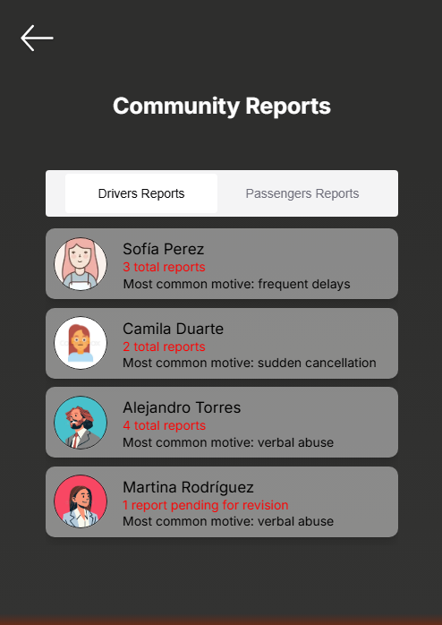
  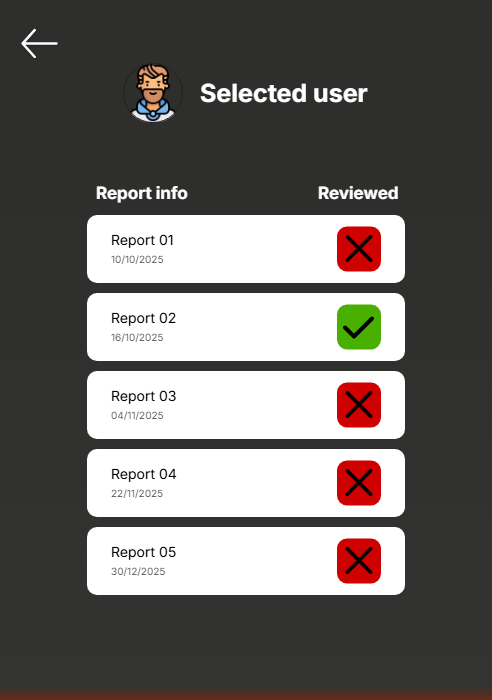
  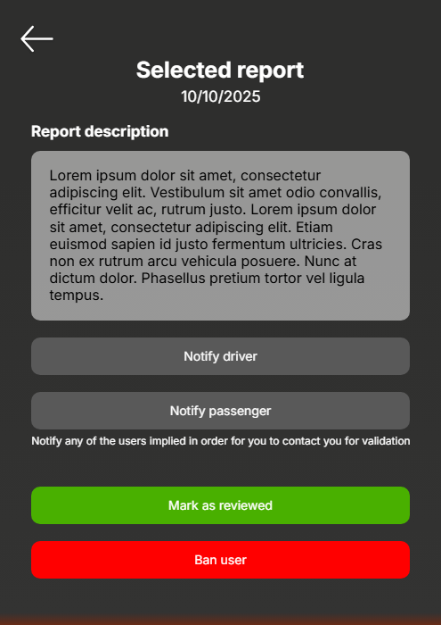

### Resolver discrepancias en evaluaciones HU 25

El flujo de este caso parte en la pantalla del perfil del administrador. En esta se encuentra un botón para gestionar las discrepancias o disputas. Una vez presionado este botón, se redirige al administrador a una pantalla que contiene una lista de todos los casos de discrepancia que hay en el sistema. En esta pantalla también se incluye una opción para filtrar según convenga los distintos casos. Una vez se ubica el caso deseado, se presiona sobre el mismo. Esto redirige al administrador a la vista propia del caso seleccionado. En esta se ve un chat entre el conductor y el pasajero. Además, en esta pantalla, se le da la opción al administrador de intervenir en la conversación, mostrando sus mensajes de una manera distintiva en un recuadro negro. 
En caso de tener decidido a quien se le da la razón, se selecciona uno de los dos botones que aparecen debajo de la conversación. Al accionar cualquiera de estos dos botones se abre una ventana emergente a modo de confirmación de la elección seleccionada. En caso de estar decidido, selecciona que si y se muestra un mensaje de éxito en la pantalla, donde tocando en cualquier lugar de la pantalla se lo redirige nuevamente a la lista de casos activos. Sin embargo, en caso de seleccionar que no, se cierra la ventana emergente y se vuelve a la vista del caso específico. Además, si el adminstrador quiere ver el caso actual pero aún no quiere resolverlo, este puede volver a la pantalla de casos activos presionando el botón de regresar ubicado en la esquina superior izquierda de la pantalla.

  
  
  

  
  
  

###  Aviso cuando un conductor está atrasado o demorado HU 26, Aviso cuando un conductor cancela un viaje con reservas HU 27 y Recordatorio a pasajeros con reserva HU 28

Estas funciones se ejecutan de manera automática sin requerir acciones directas del usuario. Cuando un pasajero tiene una reserva confirmada en un viaje, el sistema envía un recordatorio antes del horario pactado de salida. La notificación aparece tanto en la barra del dispositivo como dentro de la sección “Notifications” en el perfil del pasajero, mostrando información relevante como el nombre del conductor, destino y hora del encuentro.
Si el conductor marca el viaje como “Demorado”, el pasajero recibe una notificación informando el atraso y, si corresponde, el tiempo estimado de espera.
En caso de que el conductor cancele un viaje con reservas, el sistema envía automáticamente un aviso indicando que el viaje ha sido cancelado y el viaje deja de aparecer como disponible.
De este modo, el sistema garantiza que el pasajero se mantenga informado en tiempo real sobre cualquier cambio, evitando confusiones o esperas innecesarias y mejorando la experiencia de organización previa al viaje.

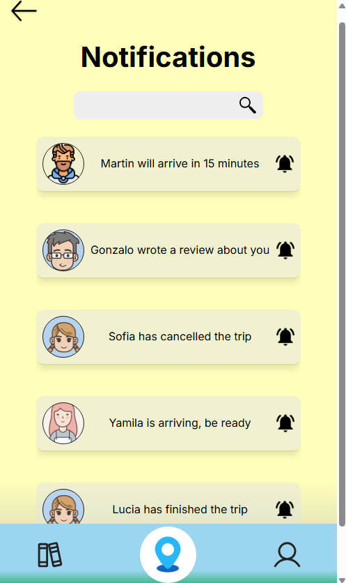

### Historial de viajes realizados (Conductor) HU 33

Esta pantalla muestra al conductor un registro de los viajes que ya han sido completados. En la cabecera se presenta el título “Recent Trips”, indicando la naturaleza retrospectiva de la vista. Debajo, se despliega una lista con cada viaje pasado, mostrando información clave: origen, destino, fecha, horario y cantidad de pasajeros transportados. Al seleccionar un viaje, el conductor accede a un detalle donde puede ver el vehículo utilizado, los nombres de los pasajeros que participaron y las calificaciones recibidas. Si el viaje aún no ha sido evaluado, se muestra un aviso que invita al conductor a revisar puntuaciones o responder comentarios. La pantalla se organiza de manera clara y cronológica, facilitando que el conductor lleve control de su actividad y del historial económico asociado a los viajes completados.

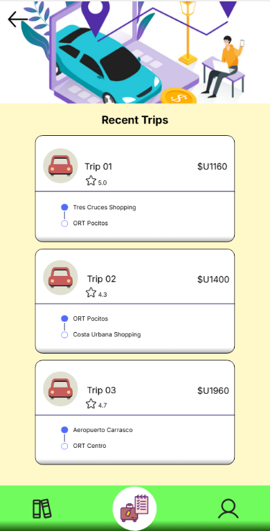

### Aviso cuando un pasajero reserve un viaje HU 34 y Aviso cuando un pasajero cancele un viaje HU 35

Estas funciones se activan automáticamente cuando un pasajero interactúa con un viaje publicado.
Cuando un pasajero reserva uno o más asientos en un viaje, el conductor recibe una notificación inmediata. Esta notificación se muestra tanto en la barra del dispositivo como dentro de la sección “Notifications” de su perfil, e incluye datos como el nombre del pasajero, cantidad de asientos reservados y el viaje al que corresponde.
Del mismo modo, si el pasajero decide cancelar su reserva, el sistema envía una notificación automática al conductor informando la cancelación, ajustando el número de asientos disponibles del viaje y reflejando el cambio en tiempo real dentro de la pantalla de viajes activos.
Así, el sistema mantiene al conductor informado sobre quién se unirá al viaje y cualquier cambio que pueda afectar la planificación, garantizando claridad, organización y una mejor coordinación entre las partes.

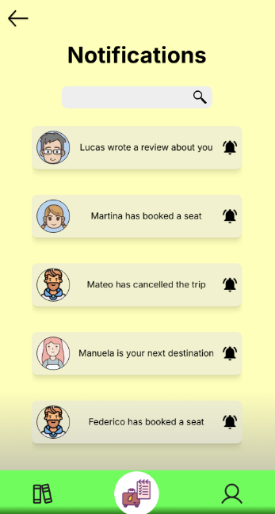

### Cancelar reserva HU 36

Esta pantalla, al igual que la de cancelar viaje, parte de la vista de viajes activos, pero en este caso del pasajero. Una vez en esta vista, se selecciona el viaje al cual se quiere dar de baja. Una vez seleccionado, se redirige al usuario a la pantalla de información del viaje. Una vez ahí, debajo del botón de enviar mensaje al conductor, se encuentra el de darse de baja. Si el usuario selecciona esta opción, salta una ventana emergente preguntando por la confirmación de la acción. En caso de seleccionar que si, el usuario es redirigido a la vista de sus viajes activos, dándolo de baja del viaje seleccionado inicialmente. En caso de que seleccione que no, la ventana emergente se cierra y se vuelve a la vista de la información del viaje.

Al momento de dar de baja al usuario, se valida que el mismo se este dando de baja al menos 24 horas antes del viaje para realizar la devolución del dinero abonado por el asiento. En caso de no cumplir con este límite de tiempo, se da de baja al usuario pero no se le reintegra el dinero. Además, contamos con un plazo de 4 días hábiles para realizar el reembolso (toda esta información está disponible en los terminos y condiciones de la aplicación).

  
  
  

### Historial de viajes realizados (Pasajero) HU 37

Esta pantalla permite al pasajero revisar los viajes en los que ha participado. El título "Recent Trips” aparece en la parte superior, seguido por un listado de viajes ordenados desde el más reciente hacia atrás. Cada tarjeta incluye la información principal: conductor, ruta, fecha y horario del viaje. Si el pasajero selecciona un viaje, accede a un detalle donde puede ver información ampliada del conductor, el vehículo, otros pasajeros que compartieron el viaje y la opción de dejar una calificación si aún no lo ha hecho.

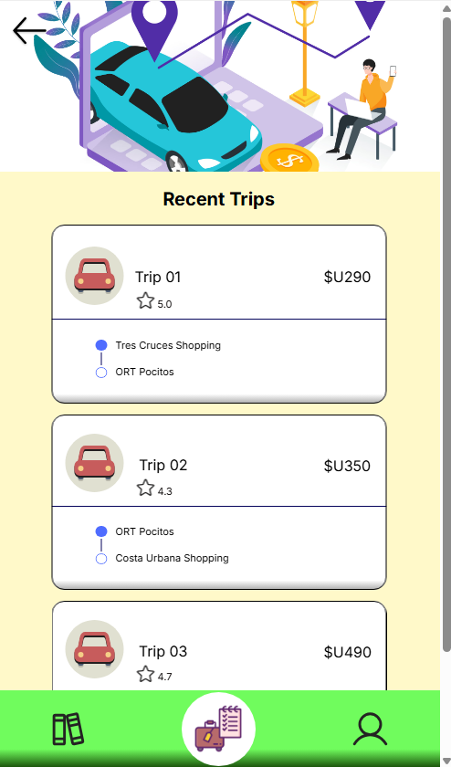

### Visualizar Estadisticas HU 38

Esta pantalla es más visual donde denotamos algunas estadisticas de uso en la aplicación de las cuales destacamos:

- #### Tasa de ocupación promedio por viaje
        Mide el promedio de pasajeros por vehículo respecto a la capacidad total, muestra qué tan bien se está aprovechando el sistema de carpool.

- #### Distribución de viajes por zonas o campus
        Mide el porcentaje de viajes iniciados o finalizados en cada zona (por ejemplo: Pocitos, Centro, Carrasco, etc.), permite identificar las zonas con mayor demanda y ajustar puntos de encuentro o incentivos.

- #### Horarios pico de viajes
        Mide la cantidad de viajes iniciados por franja horaria, permite gestionar la disponibilidad de conductores en horas críticas (ingreso y salida de clases).

- #### Relación entre rol de usuario (conductor/pasajero)
        Mide la proporción de usuarios que actúan como conductores vs. pasajeros, equilibra la comunidad y muestra si faltan más conductores o pasajeros.

- #### Nivel promedio de satisfacción
        Mide la calificación promedio de los viajes (por estrellas o puntaje 1–5), mide la calidad del servicio y la experiencia del usuario.

- #### Kilómetros compartidos / ahorro estimado de CO₂
        Mide el total de kilómetros recorridos en carpool y reducción de emisiones estimada respecto a viajes individuales, muestra el impacto ambiental positivo del sistema, ideal para reportes institucionales.
        

  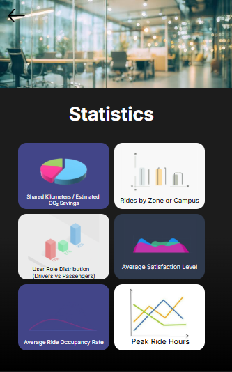

### Cerrar Sesión HU 40

En la parte superior dentro de cada perfil de usuario, siendo este conductor, pasajero o admin, posee un boton de Log out que le permitirá cerrar sesión, este me redigirá automaticamente al inicio de la pantalla, para que vuelva a iniciar sesión denuevo.

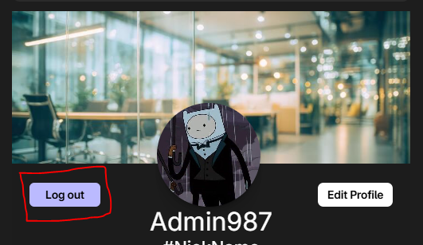
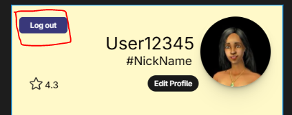
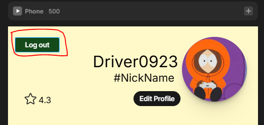

### Chat previo al viaje HU 41

En la parte de las opciónes dentro de cada perfil de usuario, siendo este conductor o pasajero, posee un boton de Chat que le permitirá ver una lista de chats de sus viajes activos.

  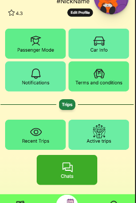
  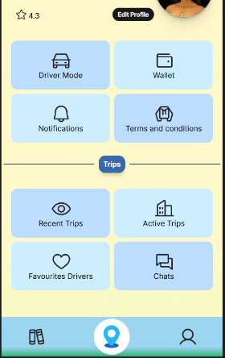

Al ingresar se lo moverá a una pantalla la cual tendrá una lista que al entrar se los redireccionará a una pantalla con un chat donde participan el conductor y sus pasajeror aceptados para ese viaje, donde podrán hablar e intercambiar ideas y coordinar su viaje para que sea lo más placentero posible.

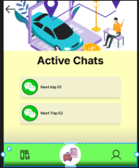
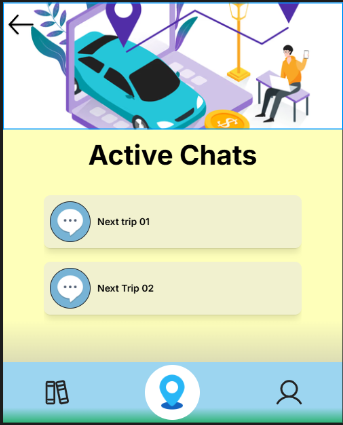
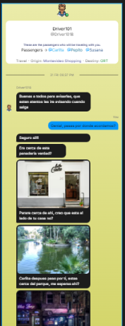

### Permitir que un pasajero frecuente marque "favoritos" a ciertos conductores HU 42

Dentro de un viaje ubicado en el historial de estos, en la parte superior nos permite que un pasajero frecuente marque a un conductor como favorito. Muestra el nombre y la calificación promedio del conductor junto a su avatar, y un botón con un ícono de corazón acompañado del texto "Add the driver to your favorites". Al seleccionarlo, el pasajero puede guardar al conductor en su lista de favoritos para facilitar futuras reservas o viajes con este.

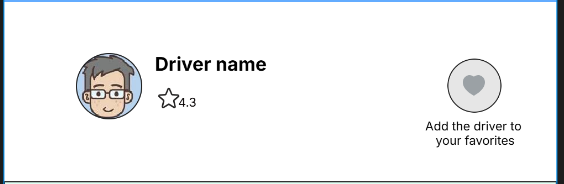

Dentro de User Profile hay un apartado donde al seleccionar conductores favoritos, se nos listarán todos los conductores y podremos ver todos sus viajes proximos. Lo cual el flujo siguiente es el previamente visto de reservar un lugar.

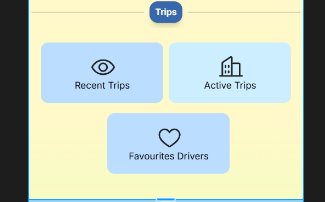
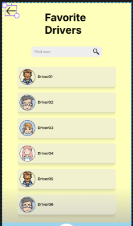

## Inspección y adaptación del producto

### Minuta 7: Review (07/11/2025)

El viernes 7 de octubre, al finalizar el sprint, el equipo se reunió para analizar el desempeño general y revisar los objetivos alcanzados.
Junto con el Product Owner repasamos la Definition of Done, confirmando que se adapta adecuadamente a nuestro flujo de trabajo actual, por lo que decidimos mantenerla sin cambios.

Durante la revisión, constatamos que se completaron todas las User Stories planificadas en tiempo y forma, reflejando una estimación de esfuerzo precisa y una velocidad de equipo alineada con lo esperado.

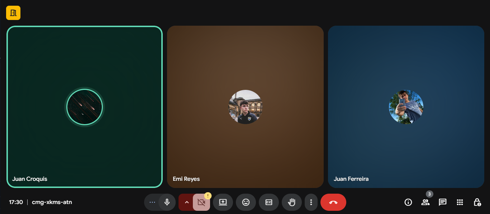

#### Validación con Usuarios

Para esta tercera iteración, al igual que en la anterior, realizamos pruebas de usabilidad a través de terceros al darles ahora una versión más completa del prototipo. En este caso también buscamos detectar posibles mejoras de usabilidad y navegación, además de validar las funcionalidades existentes y posibles a añadir.

En esta ocasión, organizamos tres sesiones con distintos usuarios potenciales, los cuales participaron de forma voluntaria. En cada sesión, le dimos completa libertad al usuario para que navegue y explore la aplicación, pudiendo así no solo verificar las funcionalidades existentes siguiendo un flujo más orgánico, sino que también aprovechando ese factor de aleatoriedad que aumenta las posibilidades de encontrar deficiencias tanto de organización como en las funcionalidades.

En resumen, la retroalimentación obtenida por los sujetos de prueba fue muy positiva, obteniendo menciones de lo completo que está el sistema en cuanto a funcionalidad y opciones.

| **Usuario** | **FeedBack** |
| --- | --- |
| 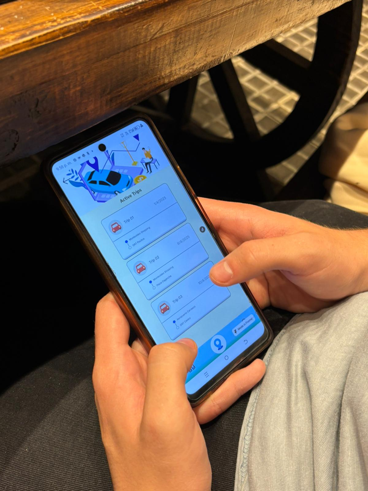 | 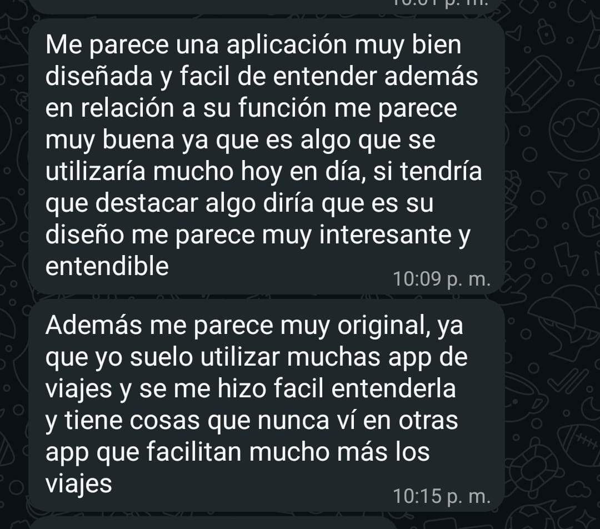 |
| 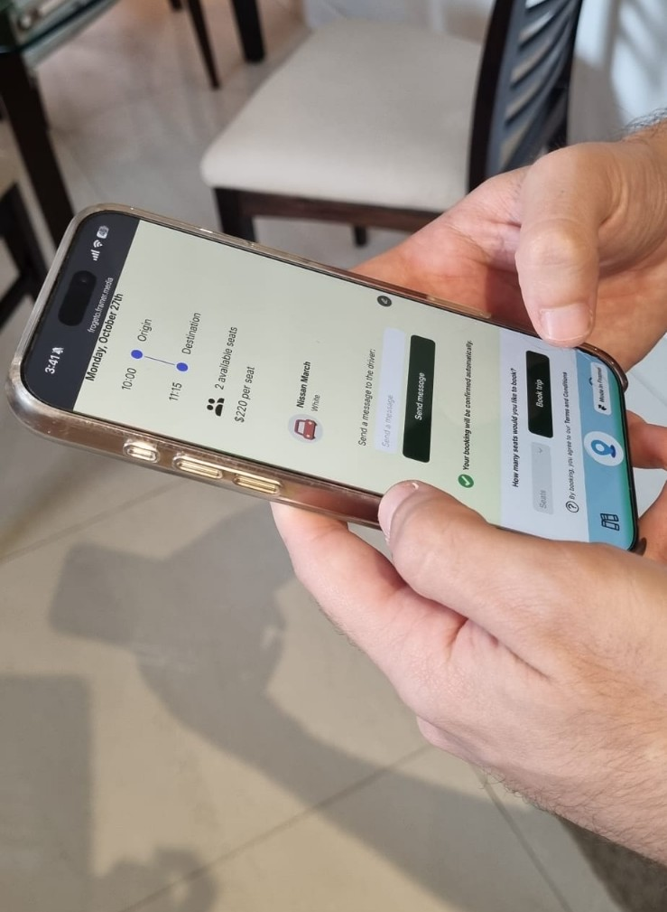 | 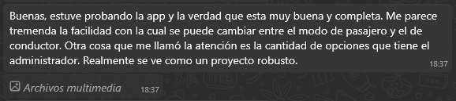 |

## ⌛ Registro de Horas del equipo

A continuación se muestran las horas de trabajo del equipo, registrando las grupales e individuales

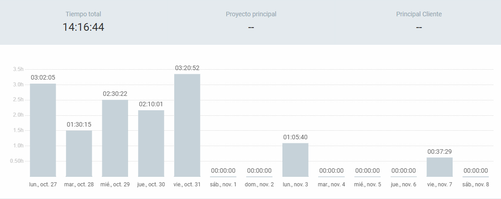
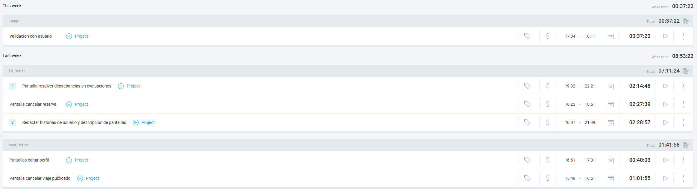

## Links a los ambientes:

### Azure DevOps:

> https://dev.azure.com/Obligatorio1/Carpooling%20universitario/_boards/board/t/Carpooling%20universitario%20Team/Backlog%20items?System.IterationPath=Carpooling%20universitario%5CSprint%202

### Framer:

> https://framer.com/projects/Proyecto-Carpool--oYH9FogtuTUVn9HgMU5H-iTRso
