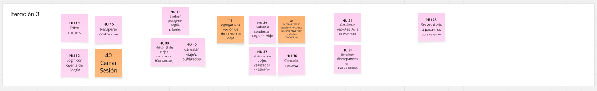

# Indice

- [Gestión de la iteración](#gestión-de-la-iteración)
  - [Definición del marco de trabajo](#definición-del-marco-de-trabajo)
  - [Planificación de la iteración](#planificación-de-la-iteración)
  - [Seguimiento de la iteración](#seguimiento-de-la-iteración)
  - [Inspección y adaptación del proceso](#inspección-y-adaptación-del-proceso)
- [Construir y validar posibles soluciones del MVP a través de prototipos](#construir-y-validar-posibles-soluciones-del-mvp-a-través-de-prototipos)
  - [Prototipos con posibles soluciones](#prototipos-con-posibles-soluciones)
  - [Inspección y adaptación del producto](#inspección-y-adaptación-del-producto)

# Gestión de la iteración

## Definición del marco de trabajo

Siguiendo como habíamos establecido los roles con la intención de que en las siguientes iteraciones se roten, favoreciendo así la participación y el aprendizaje de todos.

- **Product Owner**: Juan Croquis

- **Scrum Master**: Juan Ferreira

- **Developer**:  Emiliano Reyes

### Artefactos principales

En el presente Sprint definimos que los eventos se establecerán de la siguiente forma:

- **Sprint Planning**: 2 días (27/10/2025 y 29/10/2025)
- **Daily Scrum**: 3 días (31/10/2025, 03/11/2025 y 05/11/2025)
- **Sprint Review**: 1 día (06/11/2025)
- **Sprint Retrospective**: 1 día (06/11/2025)

# Definition of Done y Definition of Ready – Carpool Universitario

## Definition of Done (DoD)

Un entregable (historia de usuario, funcionalidad o tarea) se considera **terminado** cuando:

- **Funcionalidad implementada**  
  Ejemplo: el registro de usuario permite crear cuenta como conductor o pasajero.  

- **Funcionalidad testeada**  
  Pruebas unitarias y funcionales confirman que el login, búsqueda de viajes, reserva y publicación funcionan según lo esperado.  

- **Criterios de aceptación cumplidos**  
  Cada historia de usuario cuenta con criterios claros (ejemplo:  
  *"Como pasajero quiero buscar un viaje por horario y zona, para elegir la mejor opción"*),  
  y deben cumplirse en su totalidad.  

---

## Definition of Ready (DoR)

Una historia de usuario o tarea se considera **lista para entrar en un Sprint** cuando:

- **Estimación de esfuerzo confirmada**  
  El equipo acordó una estimación en puntos de historia o tiempo, y está alineada con la capacidad disponible del Sprint.  

- **Recursos disponibles**  
  El equipo cuenta con acceso a las herramientas necesarias.

- **Conocimientos/capacitación suficiente**  
  Los miembros tienen claro cómo implementar la historia.

- **Diseño de UI aprobado**  
  Las pantallas necesarias para la historia (ejemplo: formulario de *Publicar viaje*, vista de *Reservar lugar*) están definidas y detalladas.  

- **Criterios de aceptación definidos**  
  Cada historia de usuario tiene escenarios claros que permitan saber cuándo está "hecha". 

## Planificación de la iteración

### Minuta 1: Planning 1 (27/10/2025)

Lunes 27 de Octubre, realizamos la primera reunión para preparar el ambiente para la iteración 3. El objetivo de esta reunión fue avanzar y planificar qué íbamos a realizar en esta iteración (Sprint). Designamos roles, validamos las herramientas a utilizar, definimos el objetivo de la iteración, buscamos consenso sobre cómo aplicar el marco de trabajo SCRUM al contexto del proyecto y qué corresponde a cada rol y dejamos preparado el **Product Backlog**. La reunión se dio en clases, duró 30 minutos y concluimos que en la siguiente reunión continuaremos con la siguiente parte del planning.

### Minuta 2: Planning 2 (29/10/2025)

Miércoles 29 de Octubre, realizamos la segunda parte de la planning. El objetivo fue terminar de coordinar las tareas y fechas para la sprint. Se hablo y discutio de los nuevos casos a agregar, siendo estos dos "Agregar una opción de chat previo al viaje" y "Permitir que un pasajero frecuente marque "favoritos" a ciertos conductores", los cuales se crearon el el board y se estimaron. Se añadio el caso de cerrar sesión, si bien estaba implementados llegamos a la desición de crearle su propia HU. Se actualizó el Story Map de la iteración 3.

### Story Map

Story Map actualizado para reflejar las nuevas actualizaciones que el cliente pidio para ser incluidas:

### Sprint Backlog

#### 👥 Asignación de tareas

Durante la **planificación** asumimos distintos roles según la necesidad, pero en la etapa de **desarrollo** trabajaremos los tres de forma colaborativa.  
Repartimos las tareas de manera **equitativa**, asegurando que cada integrante comience con una **tarea de prioridad 1**.

#### 📚 Historias de usuario

- **Historia de usuario 12**: Login con cuenta de Google
  - **Como**: Como usuario registrado (conductor o pasajero)
  - **Quiero**: Iniciar sesión con mi usuario de Google para acceder a mis viajes y reservas.
  - **Para**: Poder acceder a mis viajes publicados, reservas o búsqueda de viajes y perfil personal.
  - **Criterios de aceptación**:
    - El botón de Continuar con Google debe redirigir a un panel a parte.
    - Al iniciar sesión correctamente, se redirige al usuario a su pantalla principal donde seleccionará su perfil (conductor o pasajero).

- **Historia de usuario 13**: Editar usuario
  - **Como**: Como usuario registrado (conductor, pasajero o administrador).
  - **Quiero**: Editar la informacion de mi perfil y que se vea reflejada.
  - **Para**: Actualizar mi informacion almacenada en la aplicación.
  - **Criterios de aceptación**:
    - Que tenga los siguientes campos a modificar:
      - Foto de perfil
      - Nombre de usuario
      - Contraseña
      - Email
    - El botón de guardar cambios debe aplicar los mismos y redirigir al usuario a la pantalla de información de su perfil.
    - El botón de regreso debe redirigir al usuario a la pantalla de información de su perfil sin guardar ningun cambio realizado.

- **Historia de usuario 15**: Recuperar contraseña
  - **Como**: Usuario registrado que olvidó su contraseña
  - **Quiero**: Poder recuperar el acceso a mi cuenta mediante mi correo electrónico registrado
  - **Para**: Restablecer mi contraseña de forma segura y continuar utilizando la aplicación
  - **Criterios de aceptación**:
    - En la pantalla de inicio de sesión debe existir un enlace o botón "¿Olvidaste tu contraseña?".
    - Al seleccionarlo, el sistema debe solicitar el correo electrónico asociado a la cuenta.
    - El sistema debe enviar a un correo el código temporal para restablecer la contraseña.
    - Despues de ingresar el código el usuario restablece la contraseña
    - Al finalizar la nueva contraseña se debe redirigir a iniciar sesión

- **Historia de usuario 17**: Evaluar pasajeros según criterios
  - **Como**: Conductor que ha finalizado un viaje
  - **Quiero**: Seleccionar a cada pasajero y calificar su comportamiento o cumplimiento durante el viaje
  - **Para**: Mantener un registro de buenas prácticas, mejorar la confianza y seguridad dentro de la comunidad de usuarios
  - **Criterios de aceptación**:
    - Al finalizar un viaje, el conductor puede acceder a la pantalla de historial y ver la lista de pasajeros.
    - Debe poder seleccionar un pasajero específico y asignarle una calificación en estrellas (1 a 5).
    - Opcionalmente puede escribir una breve reseña o comentario.
    - El sistema debe permitir iniciar una disputa si el conductor tuvo un problema con un pasajero.

- **Historia de usuario 19**: Cancelar viaje/s publicados
  - **Como**: Conductor con al menos un viaje activo
  - **Quiero**: Seleccionar un viaje activo y cancelarlo
  - **Para**: Evitar que el viaje siga su curso y se notifique a los pasajeros.
  - **Criterios de adaptación**:
    - Al ver los viajes activos, el conductor debe poder acceder a la información del viaje a cancelar.
    - El botón de cancelar viaje debe validar que realmente se desea cancelar el viaje.
    - Si se presiona la opcion positiva se cancela el viaje (notificando a los pasajeros del mismo) y se redirige al conductor a la vista de sus viajes activos.
    - En caso de presionar la opcion negativa, se mantiene al conductor en la vista de la información del viaje.

- **Historia de usuario 21**: Evaluar al conductor luego del viaje
  - **Como**: Pasajero que ha finalizado un viaje
  - **Quiero**: Calificar la experiencia con mi conductor y dejar una reseña breve
  - **Para**: Contribuir a la reputación del conductor y mejorar la calidad del servicio para futuros usuarios
  - **Criterios de aceptación**:
    - Al finalizar un viaje, debe mostrarse la pantalla de historial con los datos del conductor y la opción de "Enviar reseña".
    - El pasajero puede asignar una calificación en estrellas (1 a 5).
    - Opcionalmente puede escribir una breve reseña o comentario.
    - El pasajero tendrá la opción de abrir un debate si hubo un problema.

- **Historia de usuario 40**: Cerrar Sesión
  - **Como**: Como usuario loggeado (Pasajero, Conductor o Admin)
  - **Quiero**: Cerrar la sesión de mi cuenta en la aplicación 
  - **Para**: Garantizar la seguridad de mi cuenta y evitar el acceso no autorizado a mi información personal
  - **Criterios de aceptación**:
    - Debe existir un botón o enlace visible con la opción "Cerrar sesión" en el menú o perfil del usuario.
    - El usuario puede cerrar sesión desde su perfil.
    - Al cerrar sesión, se redirige a la pantalla de inicio.

- **Historia de usuario 42**: Permitir que un pasajero frecuente marque "favoritos" a ciertos conductores
  - **Como**: Como usuario loggeado (Pasajero)
  - **Quiero**: Poder marcar ciertos conductores como "favoritos"
  - **Para**: Facilitar futuras reservas y priorizar viajes con conductores de confianza o con quienes tuve buenas experiencias
  - **Criterios de aceptación**:
    - Despues de haber realizado un viaje el usuario podrá revisar su historial de viajes y guardar en favoritos un conductor
    - Existe un botón de corazón para añadir a favorito a un conductor deseado.
    - El pasajero puede visualizar y gestionar su lista de conductores favoritos desde su perfil o un apartado dedicado.
    - Cuando se selecciona un conductor de la lista, se muestra todos sus proximos viajes

> **Nota:** Se añadieron las tasks de redacción de historias de usuarios correspondientes a las cards que vamos a trabajar durante esta Iteración 3, además de la creación de pantallas intermedias necesarias para conectar las pantallas creadas.
---
#### 🧮 Estimación del esfuerzo

Para estimar el esfuerzo de las historias seleccionadas aplicamos la técnica **Planning Poker** basada en **Story Points**.

Tomamos en cuenta los siguientes factores:
- **Complejidad técnica**
- **Volumen de trabajo**
- **Nivel de incertidumbre**

Utilizamos el **estimador integrado en Azure DevOps** para asignar valores dentro de cada historia elegida para el sprint.  
En los casos donde hubo diferencias de criterio, el equipo **debatió las estimaciones** y se realizó **una nueva votación** hasta llegar a un consenso.

A continuación se redactan las estimaciones puestas por el equipo correspondientes a estas Historias de Usuarios (Como definimos antes 1 SP corresponde a 30 minutos).

- **Historia de usuario 12**: Login con cuenta de Google
  - 5 SP
- **Historia de usuario 13**: Editar usuario
  - 5 SP
- **Historia de usuario 15**: Recuperar contraseña
  - 7 SP
- **Historia de usuario 17**: Evaluar pasajeros según criterios
  - 3 SP
- **Historia de usuario 19**: Cancelar viaje/s publicados
  - 4 SP
- **Historia de usuario 21**: Evaluar al conductor luego del viaje
  - 3 SP
- **Historia de usuario 24**: Gestionar reportes de la comunidad
  - 6 SP
- **Historia de usuario 25**: Resolver discrepancias en evaluaciones
  - 6 SP
- **Historia de usuario 28**: Recordatorio a pasajeros con reserva
  - 5 SP
- **Historia de usuario 33**: Historial de viajes realizados
(Conductor)
  - 4 SP
- **Historia de usuario 36**: Cancelar reserva
  - 5 SP
- **Historia de usuario 37**: Historial de viajes realizados
(Pasajero)
  - 4 SP

**Se añaden también las actualizaciones de las siguientes y nuevas Historias de Usuarios:**

- **Historia de usuario 40**: Cerrar Sesión
  - 1 SP
- **Historia de usuario 41**: Agregar una opción de chat previo al viaje
  - 4 SP
- **Historia de usuario 42**: Permitir que un pasajero frecuente marque "favoritos" a ciertos conductores
  - 3 SP

--- 
### Artefactos principales

- Minuta de la sprint planning con su agenda, actividades y resultados.
- Objetivos de la iteración.
- Sprint backlog con historias de usuarios y tareas asociadas.
- Planificación de acuerdo a la capacidad del equipo.
- Técnicas de priorización y estimación utilizadas.
- Uso de métricas relevantes para la planificación como la velocidad y productividad.

## Seguimiento de la iteración

_[Existe evidencia sobre el registro de actividades y horas de cada integrante del equipo con el seguimiento general de cada iteración del proyecto sobre lo planificado inicialmente.]_

### Artefactos principales

- Minuta de daily scrum describiendo la coordinación del trabajo de cada integrante del equipo.
  - ¿Que logramos hacer?
  - ¿Qué planificamos hacer?
  - ¿Qué impedimentos tenemos?
- Registro y reporte de horas de cada integrante del equipo con sus actividades principales.
- Seguimiento visual de la iteración con burndown y/o burnup charts.

## Inspección y adaptación del proceso

_[Existe evidencia sobre la inspección del proceso con aprendizajes principales y acciones de mejora implementadas durante el desarrollo del proyecto.]_

### Artefactos principales

- Minuta de la retrospectiva con la dinámica utilizada y sus principales resultados.
- Planificación y seguimiento de las acciones de mejora.

# Construir y validar posibles soluciones del MVP a través de prototipos

## Prototipos con posibles soluciones

El prototipo de esta tercera iteración incluye quince historias de usuario implementadas y sus derivados componentes para completar el caso que conectan otras pantallas, pensadas para cubrir el flujo mínimo extremo a extremo:

### Login con cuenta de Google HU 12

Esta pantalla corresponde al inicio de sesión con cuenta de Google, una funcionalidad que permite al usuario acceder rápidamente sin necesidad de crear una cuenta manualmente dentro de la aplicación. En el centro se muestra la interfaz oficial de autenticación de Google. En la parte inferior derecha se ubica el botón azul "Next", que continúa a la pantalla de seleccionar el perfil. Además, un ícono de flecha hacia la izquierda en la esquina superior izquierda permite volver a la pantalla anterior.

### Editar usuario HU 13

### Recuperar contraseña HU 15

El usuario inicia en la pantalla principal y al darle recuperar contraseña, comenzando el flujo de recuperar contraseña, este permite al usuario restablecer su acceso de forma rápida y segura. Primero, ingresa su correo o usuario para recibir un código temporal. Luego, introduce ese código en la siguiente pantalla para validar su identidad. Una vez verificado, puede crear y confirmar una nueva contraseña. Finalmente, el sistema muestra un mensaje de confirmación indicando que el cambio se realizó correctamente, volviendo asi al menu principal donde podra volver a iniciar.

  
  

  
  

### Evaluar pasajeros según criterios HU 17

Esta pantalla de un viaje pasado hay un apartado para dejarle una review a cada pasajero, tiene un apartado que corresponde al flujo de evaluación de pasajeros según distintos criterios luego de finalizado un viaje. En la parte superior se muestra el mensaje "How was your trip? Select a passenger and give a feedback", que orienta al conductor a seleccionar a uno de los pasajeros del viaje para dejar una reseña individual. Debajo, hay un menú desplegable con la etiqueta "Users", donde el conductor elige al pasajero a evaluar. Luego, un campo de texto gris claro permite escribir comentarios específicos sobre aspectos como puntualidad, comportamiento o comunicación durante el viaje. Más abajo, se incluye un sistema de estrellas para calificar la experiencia y finalmente un botón verde oscuro con el texto "Send a review", que envía la valoración y el comentario seleccionados. La pantalla mantiene una estructura clara y funcional, permitiendo que el conductor brinde retroalimentación de forma rápida, ordenada y centrada en la calidad del viaje compartido.

### Cancelar viaje/s publicados HU 19

### Evaluar al conductor luego del viaje HU 21

Esta pantalla de un viaje pasado hay un apartado para dejarle una review al conductor, este permite al pasajero evaluar al conductor luego de finalizar un viaje. En la parte superior se muestra una breve invitación para dejar una reseña: "How was your trip? Send a review to your driver". Debajo, aparece un componente de valoración con estrellas, donde el usuario puede seleccionar de una a cinco según su experiencia. Luego, un campo de texto gris claro con el mensaje "Send a review" permite escribir comentarios adicionales sobre el viaje o el conductor. Finalmente, un botón verde oscuro con el texto "Send a review" permite enviar la calificación y el comentario. La pantalla transmite una estética limpia, intuitiva y centrada en la acción principal, facilitando que el usuario brinde retroalimentación de forma rápida y directa.

### Gestionar reportes de la comunidad HU 24

### Resolver discrepancias en evaluaciones HU 25

### Recordatorio a pasajeros con reserva HU 28

### Historial de viajes realizados (Conductor) HU 33

### Cancelar reserva HU 36

### Historial de viajes realizados (Pasajero) HU 37

### Cerrar Sesión HU 40

En la parte superior dentro de cada perfil de usuario, siendo este conductor, pasajero o admin, posee un boton de Log out que le permitirá cerrar sesión, este me redigirá automaticamente al inicio de la pantalla, para que vuelva a iniciar sesión denuevo.

### Agregar una opción de chat previo al viaje HU 41

### Permitir que un pasajero frecuente marque "favoritos" a ciertos conductores HU 42

Dentro de un viaje ubicado en el historial de estos, en la parte superior nos permite que un pasajero frecuente marque a un conductor como favorito. Muestra el nombre y la calificación promedio del conductor junto a su avatar, y un botón con un ícono de corazón acompañado del texto "Add the driver to your favorites". Al seleccionarlo, el pasajero puede guardar al conductor en su lista de favoritos para facilitar futuras reservas o viajes con este.

Dentro de User Profile hay un apartado donde al seleccionar conductores favoritos, se nos listarán todos los conductores y podremos ver todos sus viajes proximos. Lo cual el flujo siguiente es el previamente visto de reservar un lugar.

## Inspección y adaptación del producto

_[Existe evidencia de instancias de inspección y validación del producto con usuarios y la recolección de su feedback con ajustes finales a los prototipos.]_

### Artefactos principales

- Minutas de sprint review.
- Evidencia de los usability testing con usuarios finales.
  - Descripción de las tareas propuestas a los usuarios finales.
  - Cobertura obtenida de validación de los usuarios de la aplicación.
- Feedback recibido de los usuarios finales con la priorización de las propuestas de cambio.

## ⌛ Registro de Horas del equipo

A continuación se muestran las horas de trabajo del equipo, registrando las grupales e individuales

## Links a los ambientes:

### Azure DevOps:

> https://dev.azure.com/Obligatorio1/Carpooling%20universitario/_boards/board/t/Carpooling%20universitario%20Team/Backlog%20items?System.IterationPath=Carpooling%20universitario%5CSprint%202

### Framer:

> https://framer.com/projects/Proyecto-Carpool--oYH9FogtuTUVn9HgMU5H-iTRso