# Índice

- [Gestión de la iteración](#gestión-de-la-iteración)
  - [Definición del marco de trabajo](#definición-del-marco-de-trabajo)
  - [Planificación de la iteración](#planificación-de-la-iteración)
  - [Seguimiento de la iteración](#seguimiento-de-la-iteración)
  - [Inspección y adaptación del proceso](#inspección-y-adaptación-del-proceso)
- [Construir y validar posibles soluciones del MVP a través de prototipos.](#construir-y-validar-posibles-soluciones-del-mvp-a-través-de-prototipos)
  - [Prototipos finales](#prototipos-finales)

# Gestión de la iteración

## Definición del marco de trabajo

Siguiendo lo que habíamos establecido, los roles se mantienen con la intención de que en las siguientes iteraciones se roten, favoreciendo así la participación y el aprendizaje de todos.

- **Product Owner**: Juan Ferreira

- **Scrum Master**: Emiliano Reyes

- **Developer**: Juan Croquis

### Artefactos principales

En el presente Sprint definimos que los eventos se establecerán de la siguiente forma:

- **Sprint Planning**: 1 día (11/11/2025)
- **Daily Scrum**: 3 días (14/11/2025, 19/11/2025 y 21/11/2025)
- **Sprint Review**: 1 día (22/11/2025)
- **Sprint Retrospective**: 1 día (22/11/2025)

# Definition of Done y Definition of Ready – Carpool Universitario

## Definition of Done (DoD)

Un entregable (historia de usuario, funcionalidad o tarea) se considera **terminado** cuando:

- **Funcionalidad implementada**  
  Ejemplo: el registro de usuario permite crear cuenta como conductor o pasajero.  

- **Funcionalidad testeada**  
  Pruebas unitarias y funcionales confirman que el login, búsqueda de viajes, reserva y publicación funcionan según lo esperado.  

- **Criterios de aceptación cumplidos**  
  Cada historia de usuario cuenta con criterios claros (ejemplo:  
  *"Como pasajero quiero buscar un viaje por horario y zona, para elegir la mejor opción"*),  
  y deben cumplirse en su totalidad.  

---

## Definition of Ready (DoR)

Una historia de usuario o tarea se considera **lista para entrar en un Sprint** cuando:

- **Estimación de esfuerzo confirmada**  
  El equipo acordó una estimación en puntos de historia o tiempo, y está alineada con la capacidad disponible del Sprint.  

- **Recursos disponibles**  
  El equipo cuenta con acceso a las herramientas necesarias.

- **Conocimientos/capacitación suficiente**  
  Los miembros tienen claro cómo implementar la historia.

- **Diseño de UI aprobado**  
  Las pantallas necesarias para la historia (ejemplo: formulario de *Publicar viaje*, vista de *Reservar lugar*) están definidas y detalladas.  

- **Criterios de aceptación definidos**  
  Cada historia de usuario tiene escenarios claros que permitan saber cuándo está "hecha". 

## Planificación de la iteración

### Minuta 1: Planning (11/11/2025)

Martes 11 de noviembre, realizamos la primera reunión para preparar el ambiente para la iteración 4. El objetivo de esta reunión fue avanzar y planificar qué íbamos a realizar en esta iteración (Sprint). Designamos roles, validamos las herramientas a utilizar, definimos el objetivo de la iteración, buscamos consenso sobre cómo aplicar el marco de trabajo SCRUM al contexto del proyecto y qué corresponde a cada rol. Armamos las herramientas a usar. Como esta es la etapa final de documentación, generación del video del prototipo y conclusiones finales.

### Sprint Backlog

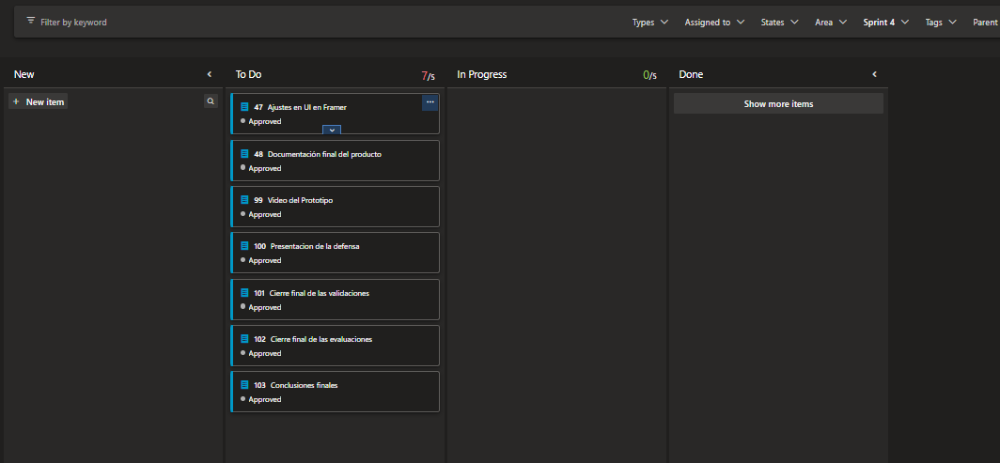

### Story Map

Aquí se reflejan las tareas finales de cierre de proyecto en esta iteración 4.

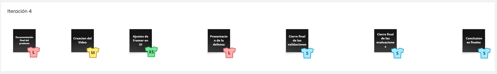

#### 👥 Asignación de tareas

Durante la **planificación** asumimos distintos roles según la necesidad, pero en la etapa de **desarrollo** trabajaremos los tres de forma colaborativa.  
Como en esta iteración se basaba más en documentación y cierre del proyecto, en todas las tareas participamos todos como equipo.

#### 📚 Tareas de la iteración 4

##### 1. 🗂️ Documentación Final

- **Descripción:**  
  Redactar un documento completo del proyecto incluyendo problema identificado, proceso de ideación, validaciones, prototipos y conclusiones. Debe seguir una estructura clara con títulos, imágenes y referencias a experimentos y entrevistas.

- **Objetivo:**  
  Consolidar toda la información clave del proyecto en un solo documento para permitir su comprensión por parte de evaluadores, docentes y futuros desarrolladores.

---

##### 2. 🎨 Ajustes Finales de la UI en Framer

- **Descripción:**  
  Revisar y pulir el diseño del prototipo interactivo en Framer. Esto incluye mejoras visuales, corrección de errores en la navegación, ajustes en botones, íconos, texto, y colores. Agregar animaciones si es necesario.

- **Objetivo:**  
  Asegurar que el prototipo tenga una apariencia profesional, funcionalidad fluida y que represente fielmente el flujo real del producto final.

---

##### 3. 📹 Video del Prototipo

- **Descripción:**  
  Grabar un video breve (6 minutos) donde se muestre el uso completo del prototipo: login, búsqueda de viajes, selección, chat, favoritos y evaluación post-viaje.

- **Objetivo:**  
  Mostrar de forma clara y resumida cómo funcionaría el producto si estuviera desarrollado. Sirve como demostración en la presentación y para evaluación externa.

---

##### 4. 🧑‍🏫 Presentación de la Defensa

- **Descripción:**  
  Preparar una presentación oral o visual (PPT, PDF, Canva, etc.) con los puntos clave del proyecto: problema, solución, validaciones, prototipo, aprendizajes. Duración sugerida: 15 minutos.

- **Objetivo:**  
  Defender el proyecto ante docentes y/o jurado, comunicando el valor de la solución de forma clara y profesional.

---

##### 5. ✅ Cierre Final de las Validaciones

- **Descripción:**  
  Documentar todos los experimentos y pruebas de validación: encuestas, grupos de WhatsApp, publicaciones en redes, entrevistas, etc. Incluir resultados y métricas recolectadas.

- **Objetivo:**  
  Demostrar que la solución fue testeada con usuarios reales y que responde a una necesidad concreta. Validar que hay demanda/interés.

---

##### 6. 📊 Cierre Final de las Evaluaciones

- **Descripción:**  
  Mostrar cómo se implementa (o simula) la evaluación del conductor y del pasajero en el prototipo. Incluir pantallas con estrellas, comentarios, botones, etc.

- **Objetivo:**  
  Agregar una funcionalidad clave para la confianza y mejora continua del servicio, reforzando la propuesta de valor del producto.

---

##### 7. 🧠 Conclusiones Finales

- **Descripción:**  
  Redactar un bloque final que sintetice lo aprendido: validación del problema, ajustes durante el proceso, valor del prototipo, limitaciones, y posibles próximos pasos.

- **Objetivo:**  
  Reflexionar sobre el proceso y dejar un cierre formal del proyecto, útil tanto para autoevaluación como para futuros desarrollos o presentaciones externas.

#### 🧮 Estimación del esfuerzo

Para estimar el esfuerzo de las historias seleccionadas aplicamos la técnica **T-Shirts Sizes** basada en **Talles de camisetas**.

Tomamos en cuenta los siguientes factores:
- **Complejidad técnica**
- **Volumen de trabajo**
- **Nivel de incertidumbre**

A continuación se detalla la estimación de cada actividad clave:

| Tarea                                     | Estimación (T-Shirt Size) | Equivalente numérico |
|------------------------------------------|----------------------------|-----------------------|
| Documentación final del producto         | L                          | 5                     |
| Creación del video                       | M                          | 3                     |
| Ajustes de Framer en UI                  | XS                         | 1                     |
| Presentación para la defensa             | L                          | 5                     |
| Cierre final de las validaciones         | S                          | 2                     |
| Cierre final de las evaluaciones         | S                          | 2                     |
| Conclusiones finales                     | S                          | 2                     |

### 🔢 Total estimado (en unidades relativas): `20`

> ⚠️ **Nota:** Las equivalencias son subjetivas y definidas por el equipo. En este caso:
> - XS = 1  
> - S = 2  
> - M = 3  
> - L = 5  

## Seguimiento de la iteración

### Minuta 2: Daily 1 (14/11/2025)

El viernes 14 de noviembre, realizamos la primera daily de esta iteración 4, con el objetivo de coordinar el trabajo del equipo y revisar el avance. Presentamos avances en cuanto a la redacción del informe de la defensa, establecimos algunas dificultades de las tareas, cambiando la estimación para una más adaptable a esta iteración. También acordamos qué herramientas usar para la presentación final y comenzamos a preparar las cosas para el video del prototipo.

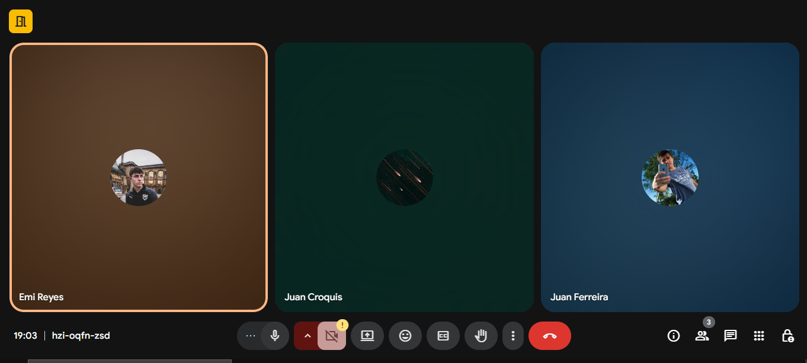

### Minuta 3: Daily 2 (19/11/2025)

El miércoles 19 de noviembre, realizamos la segunda daily de esta iteración 4, con el objetivo de verificar el trabajo del equipo y revisar el avance. Presentamos avances en cuanto a la redacción del informe de la defensa, completamos objetivos, conclusiones y gráficas. También añadimos información académica en el README general, así como datos extras.
Para finalizar, ya tenemos todo listo para comenzar a grabar el video del prototipo final, el cual lo haremos en la siguiente sesión.

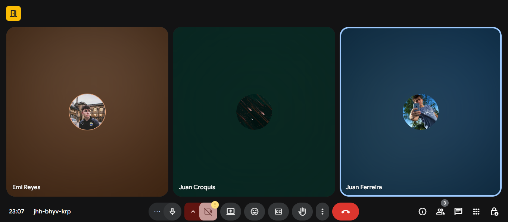

### Minuta 4: Daily 3 (21/11/2025)

El viernes 21 de noviembre, realizamos la tercera y última daily de la iteración 4, con el objetivo de verificar el trabajo del equipo y revisar el avance. Terminamos gran parte del informe final, tenemos casi terminada la defensa para presentar el lunes, completamos el resumen de las gráficas y varias tareas quedaron culminadas.
Para finalizar, grabamos el video que demuestra el flujo realizado de nuestro prototipo, pasando por todas las capas requeridas.

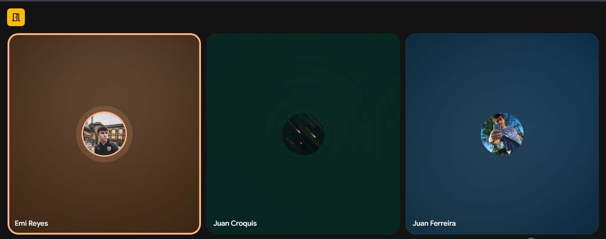

## Inspección y adaptación del proceso

### Minuta 5: Review (22/11/2025)

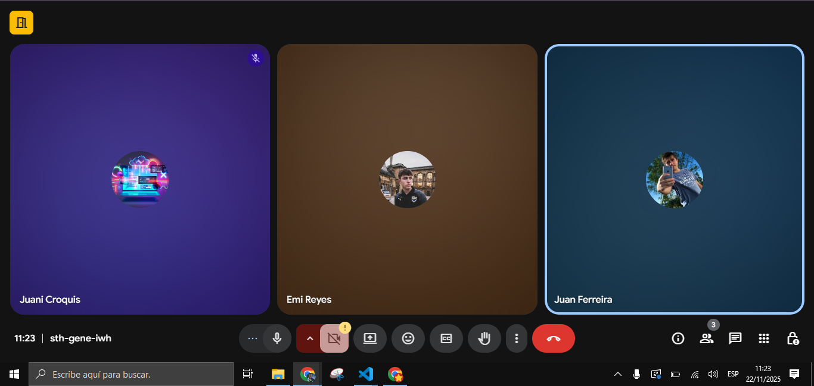

### Minuta 6: Retrospective 🎪 (22/11/2025)

#### 🧩 Descripción
Para cerrar el sprint, el equipo realizó una retrospectiva con temática de *Festival*, donde se destacaron los logros, los aprendizajes y las oportunidades de mejora del proceso.  
Se trabajó de forma colaborativa, reflexionando sobre lo que funcionó bien, lo que podría mejorarse y los conocimientos que hubiesen sido útiles desde el inicio.

---

#### 🎤 Main Stage – The Highlights of This Sprint
**Cosas que salieron bien y disfrutamos del proceso:**
- Comunicación fluida con el equipo.  
- Reuniones efectivas y enfocadas.  
- Aprendimos a trabajar muy bien en **Framer**.  
- Claridad en los objetivos de la iteración.  
- Buena estimación de tareas.  
- Colaboración efectiva entre los roles.  
- Buen manejo de la documentación.  
- Se logró cumplir con todos los objetivos de la iteración.

---

#### 🔮 Fortune Teller – Things We Wish We Knew at the Start
**Aprendizajes que hubiéramos querido saber desde el comienzo:**
- Que **Framer** tenía ciertas limitaciones o configuraciones que era mejor entender desde el inicio.  
- Que los **parciales y entregas de otras materias** afectarían el ritmo del equipo y convenía preverlo.  
- Que usar un **repositorio compartido y organizado** desde el principio facilita el seguimiento del proyecto.  
- Que realizar **revisiones semanales rápidas** es más efectivo que esperar al final del sprint para detectar problemas.

---

#### ⛑️ First Aid Tent – Things That Didn’t Go as Well as We’d Hoped
**Aspectos que podrían mejorar o que presentaron dificultades:**
- Iniciamos las tareas de la iteración más tarde de lo ideal.  
- Al haber pocas tareas, no hubo demasiado margen para detectar desvíos.  
- Fue un mes con muchas pruebas y entregas, lo cual nos jugó en contra en la planificación.

---

#### 🧭 Conclusión
El equipo demostró una **excelente coordinación y progreso técnico**, destacándose especialmente en el uso de **Framer** y en la claridad de los objetivos.  
A pesar de los desafíos académicos externos, se logró mantener una buena comunicación, estimación de tareas y cumplimiento de metas.  
Los aprendizajes obtenidos permitirán mejorar la organización y la anticipación en los próximos sprints.

---

📸 **Imagen de la retro:**

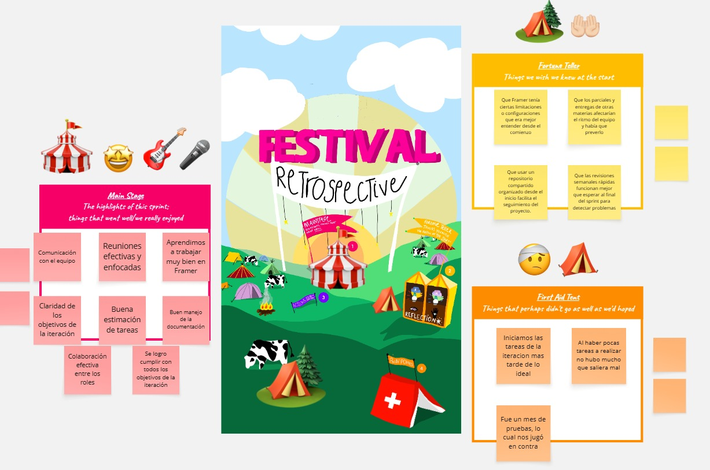

# Construir y validar la solución final del MVP a través de prototipos

## Conclusiones finales de las validaciones

Cada validación realizada en las distintas iteraciones nos fue de gran ayuda para obtener opiniones desde distintos enfoques y lugares.

La encuesta que realizamos en la primera iteración fue de gran ayuda al momento de orientarnos en el inicio del proyecto. Obtuvimos una visibilidad del amplio espectro de contextos en los cuales se ubican los posibles consumidores del producto y cuáles son sus motivos para utilizarlo.

Luego, al momento de validar nuestros prototipos tanto en la iteración 2 como en la 3, recibimos comentarios que nos sirvieron para poder terminar de encaminarnos tanto en cuanto al diseño como en cuanto a las funcionalidades aplicadas.

## Conclusiones finales del prototipo

El prototipo final fue desarrollado en Framer, donde armamos todas las pantallas principales y conectamos los flujos completos de pasajero, conductor y administrador. Durante las iteraciones 2 y 3 dejamos listas las versiones finales de cada vista, ajustando diseño, navegación y validaciones hasta lograr un prototipo coherente y funcional.

El prototipo incluye los casos esenciales del MVP: búsqueda y reserva de viajes, publicación y edición de viajes, visualización de viajes activos y finalizados, gestión de usuarios y manejo de reportes. Todas las pantallas quedaron conectadas entre sí, permitiendo recorrer el flujo completo como lo haría un usuario real.

También definimos algunos casos extra que no llegaron a implementarse en esta entrega, como el sistema de pagos, la billetera virtual y la gestión completa de datos del auto. Estos quedaron documentados como posibles mejoras futuras.

En general, el prototipo final refleja de manera clara cómo funcionaría la aplicación e integra todas las funcionalidades planificadas para esta fase del proyecto.

- [Iteración 2](../iteración-2/README.md)
- [Iteración 3](../iteración-3/README.md)

 

---
 

# Iteración final - Evaluaciones

## Conclusiones finales (Gráficas):

### Burndown chart Iteración 1:

  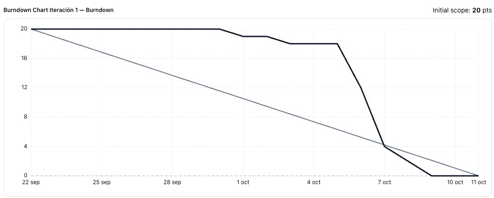

En esta primera iteración podemos notar en la gráfica que no tuvimos un progreso tan lineal en cuanto a la realización de las tareas designadas como sería lo ideal, ya que los tres integrantes del equipo estuvimos realizando otras tareas académicas en paralelo al proyecto.

### Burndown chart Iteración 2:

  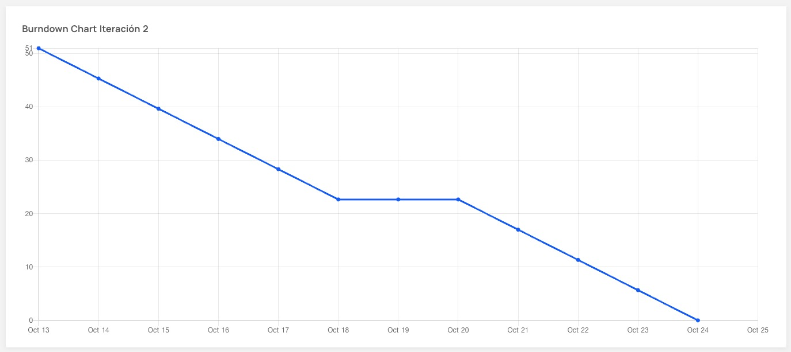

A diferencia de la iteración 1, en esta pudimos mantener un ritmo de trabajo mucho más constante, más allá de un pequeño estancamiento de unos días, debido a la complejidad de las tareas que estábamos realizando en ese momento.

### Burndown chart Iteración 3:

  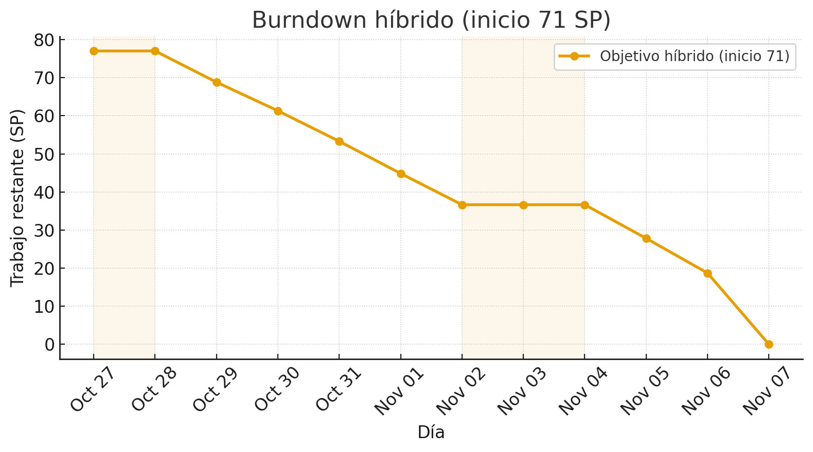

Al igual que en la iteración 2, pudimos mantener un progreso bastante constante, aunque no tan estrictamente lineal. En este caso, hubo algunas ocasiones tanto por tiempo como por complejidad en las cuales completar ciertas tareas nos llevó más de un día.

### Burndown chart Iteración 4:

  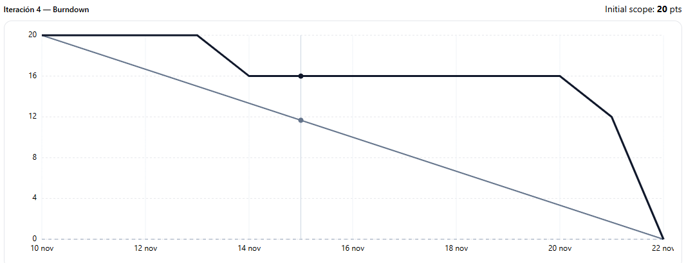

En esta iteración final se puede observar un avance similar al de la iteración 1. Esto está directamente relacionado, al igual que en la primera iteración, con el periodo en el que se realizó la cuarta iteración, ya que nuevamente fue un momento con distintas entregas de demás materias. Además, influyó también la menor cantidad de tareas a realizar, no siendo necesario un ritmo tan constante.

## ⌛ Registro de Horas del equipo

A continuación se muestran las horas de trabajo del equipo, registrando las grupales e individuales.

## Links a los ambientes:

### Azure DevOps:

> https://dev.azure.com/Obligatorio1/Carpooling%20universitario/_boards/board/t/Carpooling%20universitario%20Team/Backlog%20items?System.IterationPath=Carpooling%20universitario%5CSprint%202

### Framer:

> https://framer.com/projects/Proyecto-Carpool--oYH9FogtuTUVn9HgMU5H-iTRso
