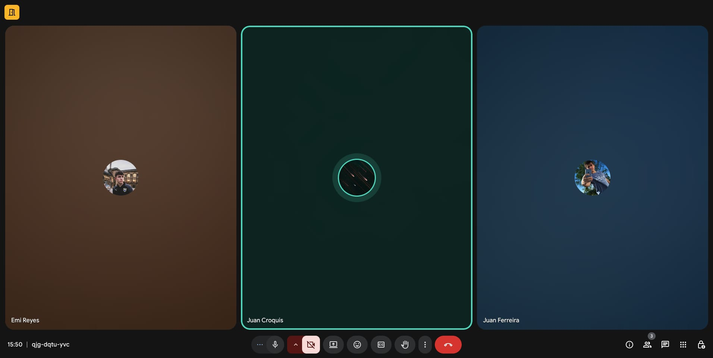

# Indice

- [Gestión de la iteración](#gestión-de-la-iteración)
  - [Definición del marco de trabajo](#definición-del-marco-de-trabajo)
  - [Planificación de la iteración](#planificación-de-la-iteración)
  - [Seguimiento de la iteración](#seguimiento-de-la-iteración)
  - [Inspección y adaptación del proceso](#inspección-y-adaptación-del-proceso)
- [Construir y validar posibles soluciones del MVP a través de prototipos.](#construir-y-validar-posibles-soluciones-del-mvp-a-través-de-prototipos)
  - [Prototipos finales](#prototipos-finales)

# Gestión de la iteración

## Definición del marco de trabajo

Siguiendo como habíamos establecido los roles con la intención de que en las siguientes iteraciones se roten, favoreciendo así la participación y el aprendizaje de todos.

- **Product Owner**: Juan Ferreira

- **Scrum Master**: Emiliano Reyes

- **Developer**: Juan Croquis

### Artefactos principales

En el presente Sprint definimos que los eventos se establecerán de la siguiente forma:

- **Sprint Planning**: 1 días (11/11/2025)
- **Daily Scrum**: 3 días (14/11/2025, 19/11/2025 y 21/11/2025)
- **Sprint Review**: 1 día (22/11/2025)
- **Sprint Retrospective**: 1 día (22/11/2025)

# Definition of Done y Definition of Ready – Carpool Universitario

## Definition of Done (DoD)

Un entregable (historia de usuario, funcionalidad o tarea) se considera **terminado** cuando:

- **Funcionalidad implementada**  
  Ejemplo: el registro de usuario permite crear cuenta como conductor o pasajero.  

- **Funcionalidad testeada**  
  Pruebas unitarias y funcionales confirman que el login, búsqueda de viajes, reserva y publicación funcionan según lo esperado.  

- **Criterios de aceptación cumplidos**  
  Cada historia de usuario cuenta con criterios claros (ejemplo:  
  *"Como pasajero quiero buscar un viaje por horario y zona, para elegir la mejor opción"*),  
  y deben cumplirse en su totalidad.  

---

## Definition of Ready (DoR)

Una historia de usuario o tarea se considera **lista para entrar en un Sprint** cuando:

- **Estimación de esfuerzo confirmada**  
  El equipo acordó una estimación en puntos de historia o tiempo, y está alineada con la capacidad disponible del Sprint.  

- **Recursos disponibles**  
  El equipo cuenta con acceso a las herramientas necesarias.

- **Conocimientos/capacitación suficiente**  
  Los miembros tienen claro cómo implementar la historia.

- **Diseño de UI aprobado**  
  Las pantallas necesarias para la historia (ejemplo: formulario de *Publicar viaje*, vista de *Reservar lugar*) están definidas y detalladas.  

- **Criterios de aceptación definidos**  
  Cada historia de usuario tiene escenarios claros que permitan saber cuándo está "hecha". 

## Planificación de la iteración

### Minuta 1: Planning (11/11/2025)

Martes 11 de Noviembre, realizamos la primera reunión para preparar el ambiente para la iteración 4. El objetivo de esta reunión fue avanzar y planificar qué íbamos a realizar en esta iteración (Sprint). Designamos roles, validamos las herramientas a utilizar, definimos el objetivo de la iteración, buscamos consenso sobre cómo aplicar el marco de trabajo SCRUM al contexto del proyecto y qué corresponde a cada rol. Armamos las herramientas a usar, como esta es la etapa final de documentación, generación del video del prototipo y conclusiones finales.

### Artefactos principales

- Minuta de la sprint planning con su agenda, actividades y resultados.
- Objetivos de la iteración.
- Sprint backlog con historias de usuarios y tareas asociadas.
- Planificación de acuerdo a la capacidad del equipo.
- Técnicas de priorización y estimación utilizadas.
- Uso de métricas relevantes para la planificación como la velocidad y productividad.

## Seguimiento de la iteración

_[Existe evidencia sobre el registro de actividades y horas de cada integrante del equipo con el seguimiento general de cada iteración del proyecto sobre lo planificado inicialmente.]_

### Artefactos principales

- Minuta de daily scrum describiendo la coordinación del trabajo de cada integrante del equipo.
  - ¿Que logramos hacer?
  - ¿Qué planificamos hacer?
  - ¿Qué impedimentos tenemos?
- Registro y reporte de horas de cada integrante del equipo con sus actividades principales.
- Seguimiento visual de la iteración con burndown y/o burnup charts.

## Inspección y adaptación del proceso

_[Existe evidencia sobre la inspección del proceso con aprendizajes principales y acciones de mejora implementadas durante el desarrollo del proyecto.]_

### Artefactos principales

- Minuta de la retrospectiva con la dinámica utilizada y sus principales resultados.
- Planificación y seguimiento de las acciones de mejora.

# Construir y validar posibles soluciones del MVP a través de prototipos

## Prototipos finales

_[Se evidencian los prototipos finales con las validaciones de los usuarios. Los prototipos deberán ser exportados en algún formato de imagen (como png o jpg) a efectos de poder ser visualizados fácilmente dentro del propio repo de github.]_

### Artefactos principales

- Prototipos interactivos finales con el feedback de las validaciones.
- Prototipos asociados como bocetos a las historias de usuario.
- Lista de mejoras sugeridas de las validaciones con usuarios finales.
  - Se explicita que mejoras fueron implementadas en los prototipos y cuales quedaron fuera del alcance del proyecto.

## ⌛ Registro de Horas del equipo

A continuación se muestran las horas de trabajo del equipo, registrando las grupales e individuales

## Links a los ambientes:

### Azure DevOps:

> https://dev.azure.com/Obligatorio1/Carpooling%20universitario/_boards/board/t/Carpooling%20universitario%20Team/Backlog%20items?System.IterationPath=Carpooling%20universitario%5CSprint%202

### Framer:

> https://framer.com/projects/Proyecto-Carpool--oYH9FogtuTUVn9HgMU5H-iTRso
